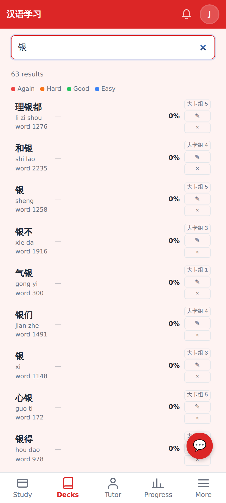
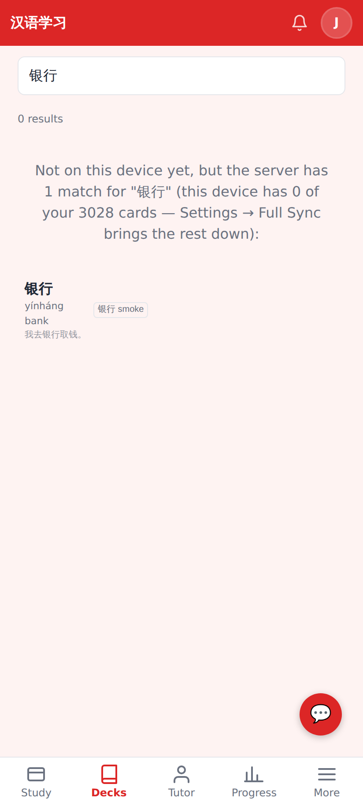
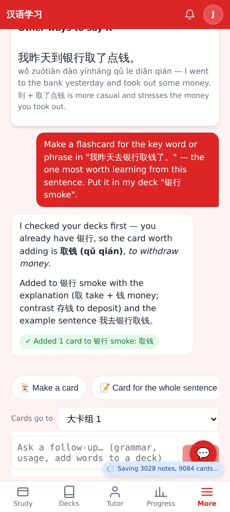
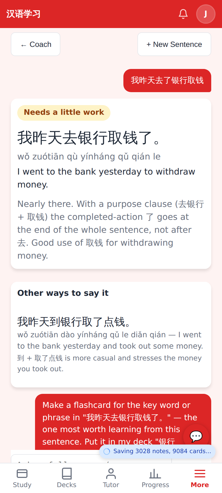

# Card search at scale · Sentence Coach quick actions

Phone viewport 412×915 @2×. Local account seeded with 3,028 notes / 9,084 cards.

Decks tab search on the 3,000-note account: results render in well under a second; cards and recent ratings are loaded only for the notes on screen.

A device whose local notes are missing (here: cleared on purpose) no longer shows a bare "0 results": the search asks the server, shows the matches, and says how many of the account's cards this device holds and that Settings → Full Sync brings the rest down.

Sentence Coach conversation: the quick-action chips (Make a card · Card for the whole sentence · More examples · Other ways to say it · Explain the grammar) and the "Cards go to" deck picker. "Make a card" sent the prepared prompt; Claude checked for duplicates and added 取钱 with explanation and example sentence.

The first reply is short — correction, a brief critique, other ways to say it — with no per-item "+ Add" buttons (those made bare cards with the critique as fun facts).
