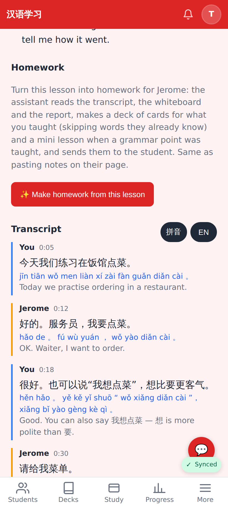
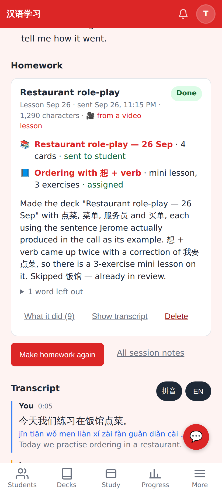
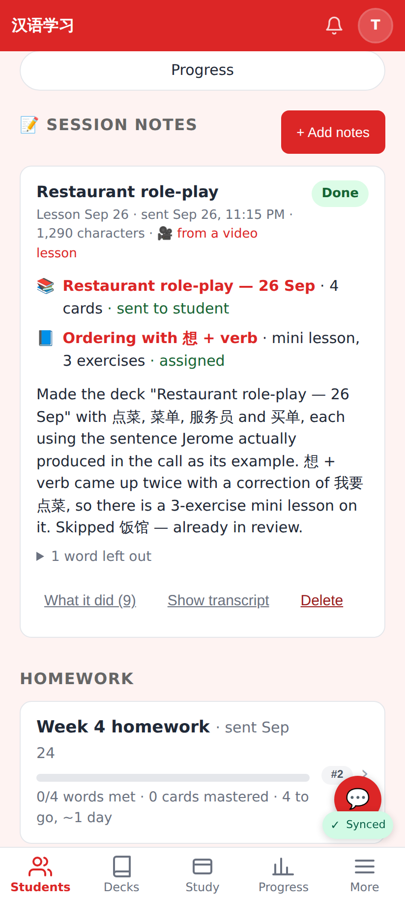

# Session notes → homework agent

Phone viewport 412×915 @2×, tutor account "Tutor Li" on the student page of "Jerome". Jobs seeded in the local D1 to show every state; the running job's steps are the lines the agent writes as it works.

The new **Session notes** section on the tutor's student page: **+ Add notes**, a job that is still working (live progress line + the last steps, polled every 3 s, Cancel), and a finished one with what it made — the deck (4 cards, sent to the student) and the mini lesson it decided the notes warranted (assigned), each linking to the tutor's own copy.

"What it did" on a finished job: the full step list — words checked against the student's cards, the deck created, a card rejected by the card standard and fixed, the reasoning for writing a lesson on 想 + verb, sharing and assigning — followed by the results and the assistant's summary.

The sheet: paste any amount of raw notes (or attach a text file), optional title and lesson date, and the delivery choice — send automatically (Core = top of the student's queue / Non-urgent = bottom) or keep it in the library to review first; also log the lesson so Insights counts "since last lesson" from it.

`/connections/:relId/session-notes` lists every job (the student page shows the latest three).

A failed job keeps its steps and shows a readable error; **Retry** resumes from the last checkpoint. Below the summary, "2 words left out" opens the list of words the agent deliberately skipped with the reason.

On a recorded video lesson's review page (`/calls/:id/review`, tutor only) a **Homework** section with **✨ Make homework from this lesson**: the transcript, whiteboard text, in-call chat and lesson report become the notes of the same agent job.

The job card lives on the review page too — here finished, with the deck and mini lesson it made and its summary; "Show transcript" opens the exact text the agent read.

The same job under *Session notes* on the student page, marked "🎥 from a video lesson" with a link back to the review page.
