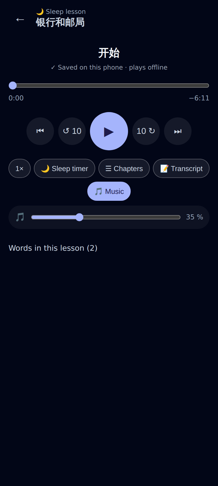
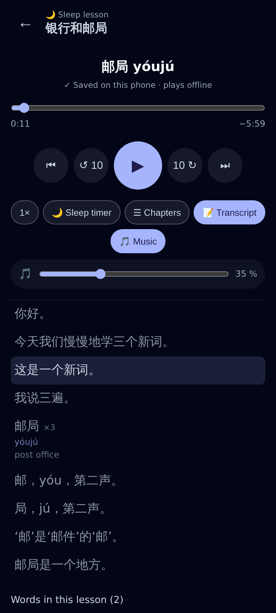
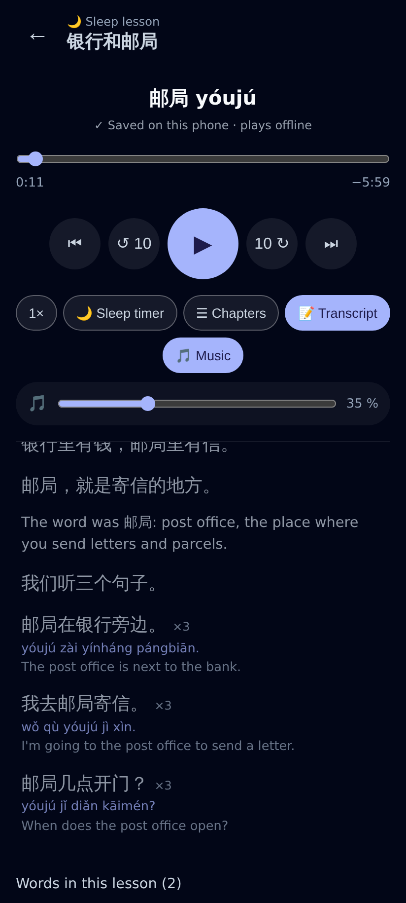
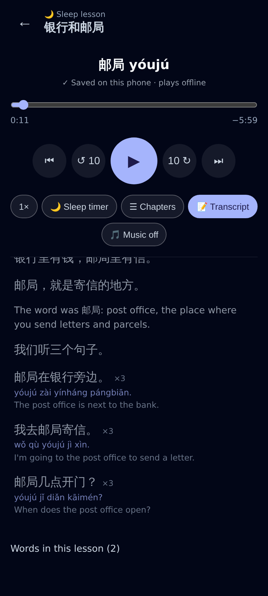
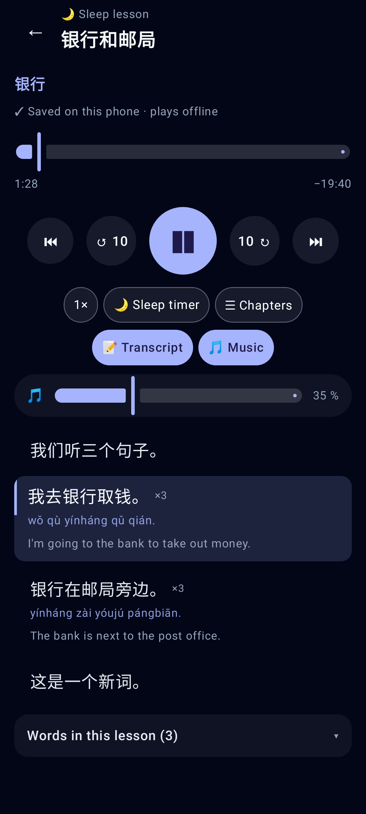
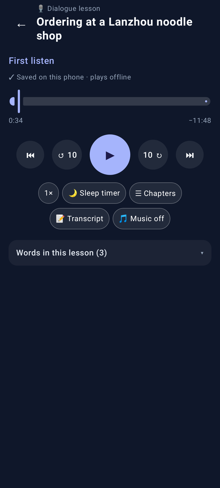
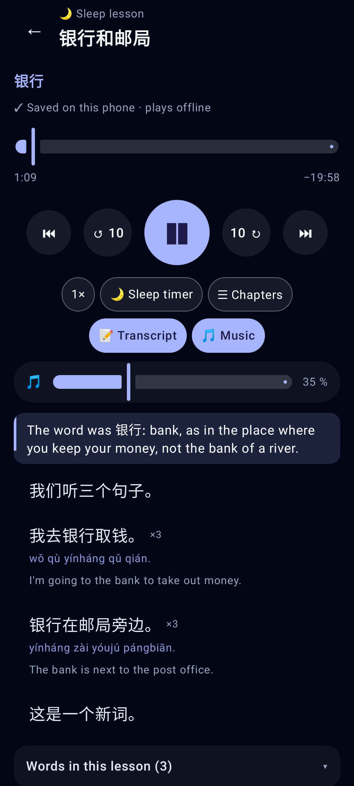

# Sleep lessons, round 3 — new word order, slower voice, music bed

Phone viewport (412×915, 2×) for the web; Lab app (Roborazzi, Pixel Fold folded).

Web: a sleep lesson — 🎵 Music on by default, its volume slider under the chips (35 %).

Web: the new per-word order — intro + the word ×3 (one row), its tones, then the 5–8 sentence meaning.

Web: the English recap now comes before the example sentences; each sentence ×3 + its spoken English is one row.

Web: Music turned off (remembered per format on this device).

Lab app: the same 🎵 chip + volume slider; sentence rows "×3" with their translation.

Lab app: a dialogue lesson — music off unless asked for.

Lab app: the recap row ("The word was 银行: …") after the meaning, before the sentences.
