# Say the answer on typing cards (🎤)

Phone viewport (412×915, 2×). Web = the PWA (Playwright, fake Soniox stream), Lab = the native app (Roborazzi).

## Web

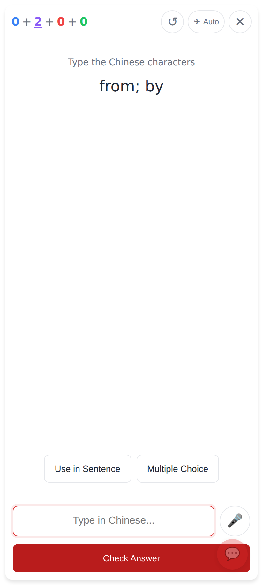
A meaning → hanzi card: the 🎤 sits beside the answer box.

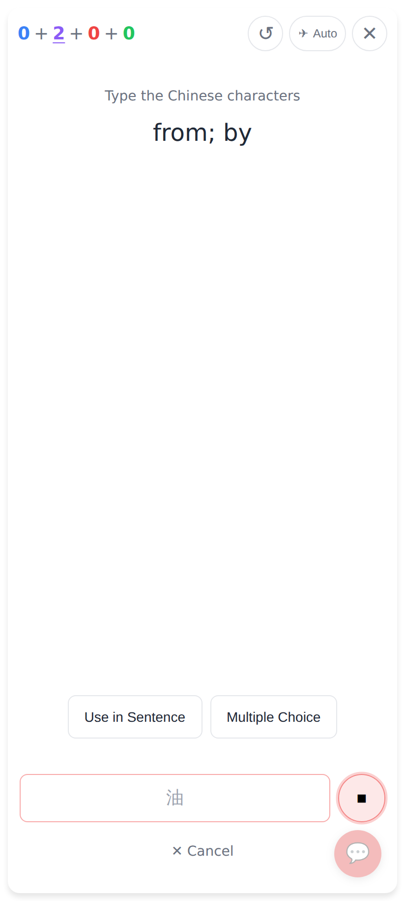
While speaking: the transcript appears in the box (provisional text grey), ⏹ stops, ✕ Cancel throws the take away.

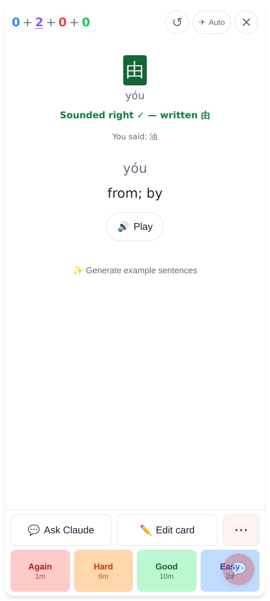
Auto-submitted. 油 was heard for 由: same pinyin with tones → "Sounded right ✓ — written 由".

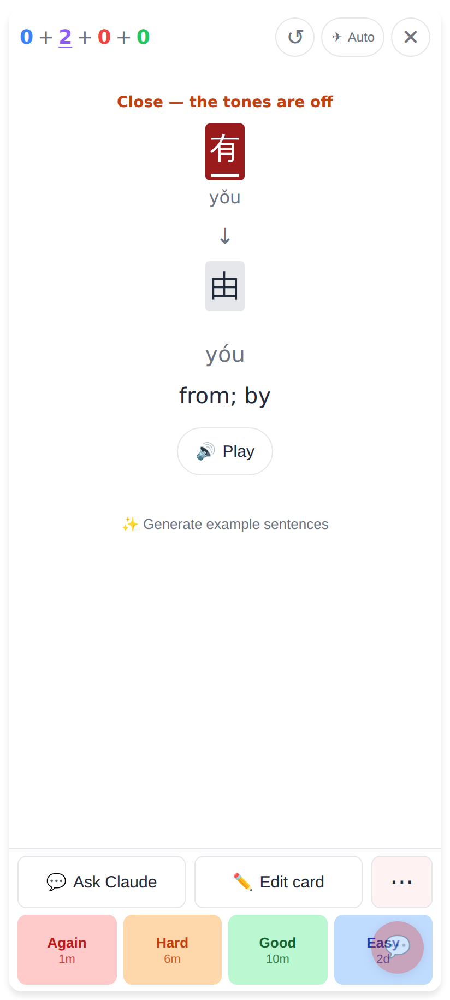
有 (yǒu) for 由 (yóu): same syllable, other tone → still wrong, with "Close — the tones are off".

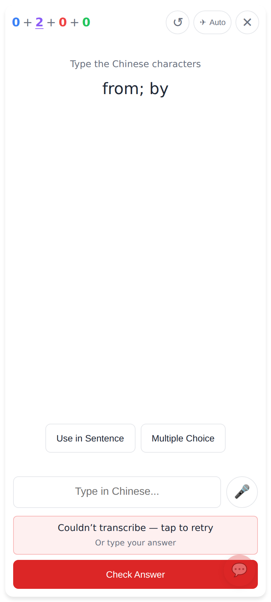
Live AND upload failed: nothing submitted, the box stays editable, "Couldn’t transcribe — tap to retry".

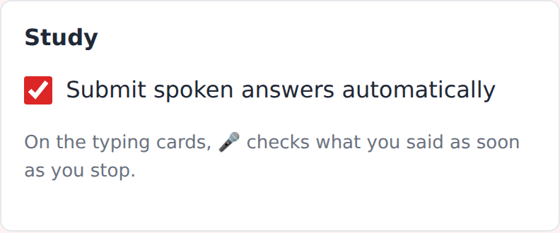
Settings → Study → "Submit spoken answers automatically" (on by default).

## Lab app

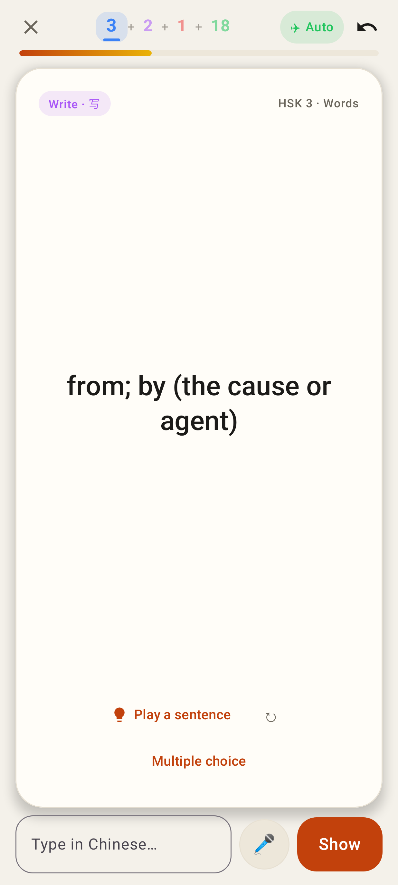
The typing row: box · 🎤 · Show / Check.

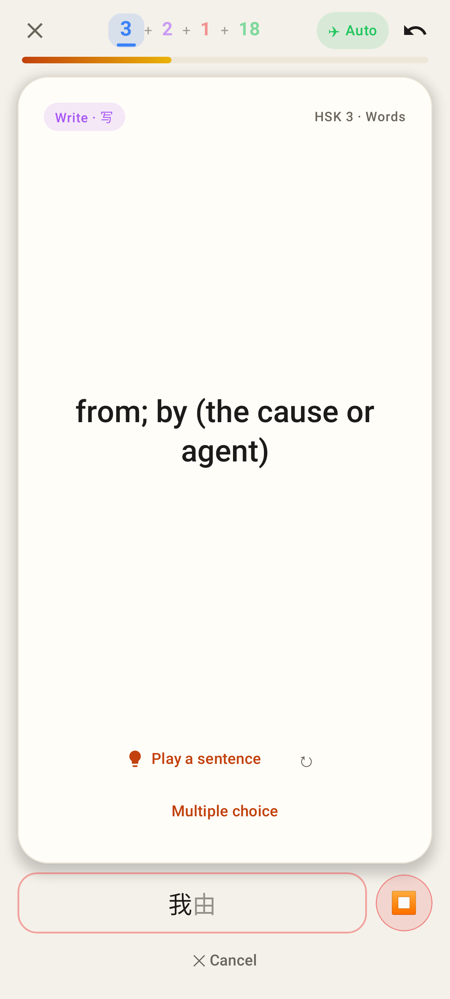
Live transcript (我 confirmed, 由 provisional), ⏹, ✕ Cancel.

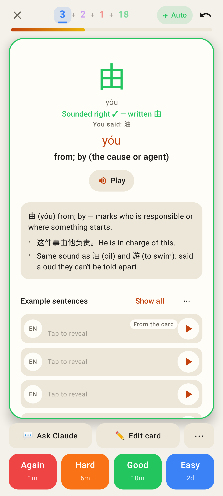
Homophone accepted by sound.

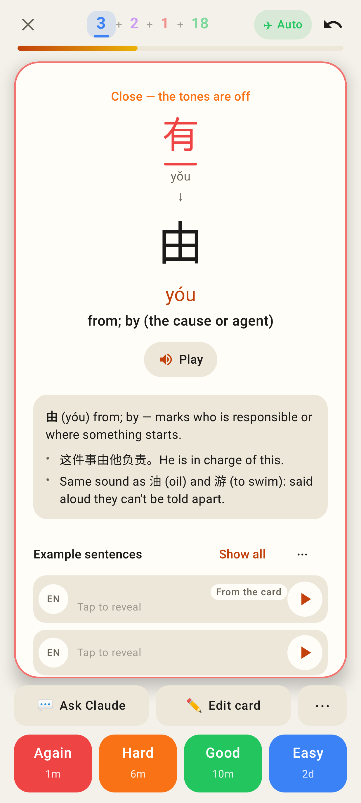
Other tone: the diff plus "Close — the tones are off".

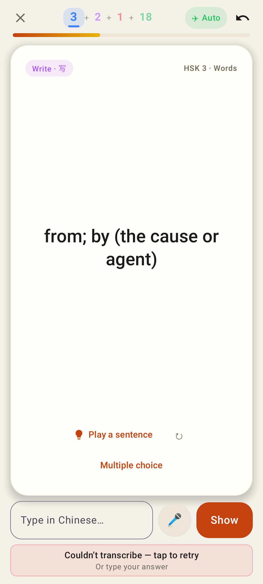
Both paths failed: retry line, nothing submitted.

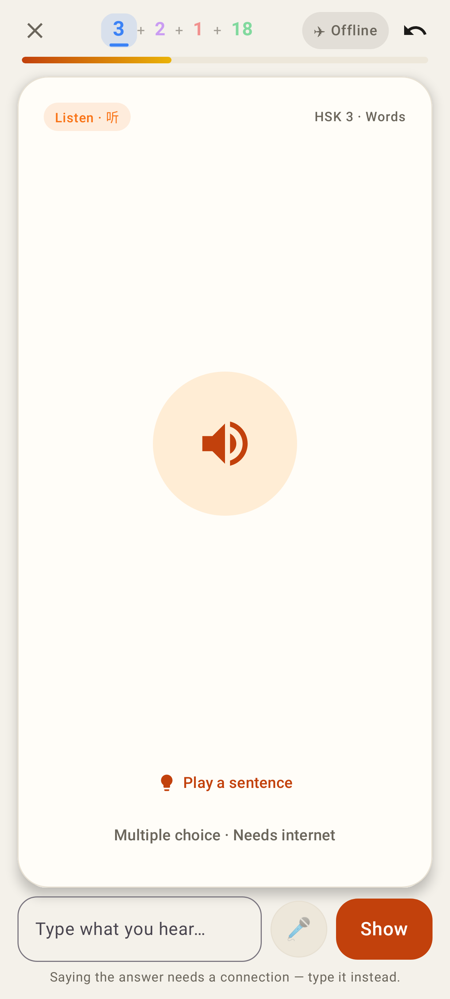
Offline (listen card): the dimmed 🎤 says why on tap; typing still works.

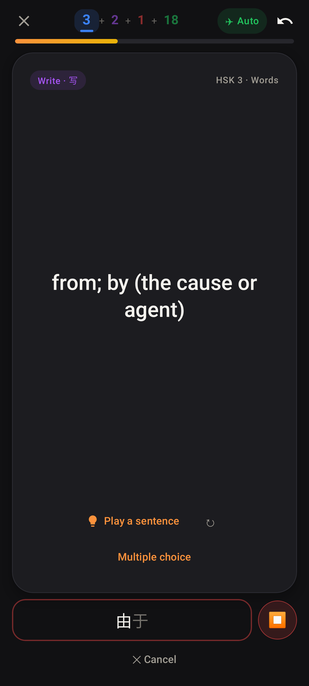
Dark theme.

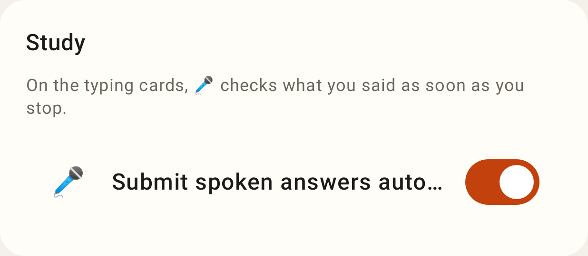
Settings → Study → "Submit spoken answers automatically".
