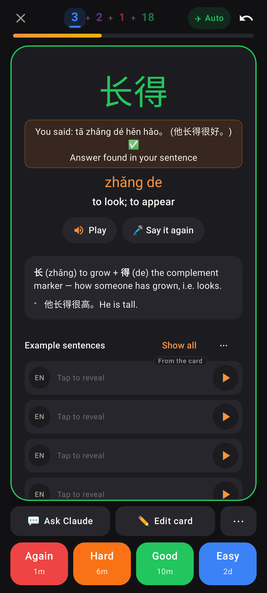
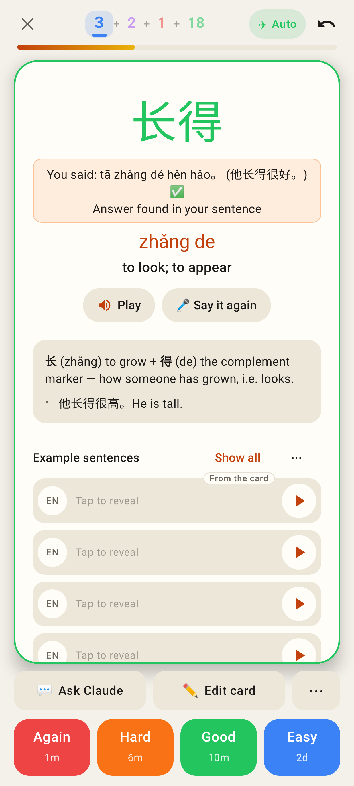
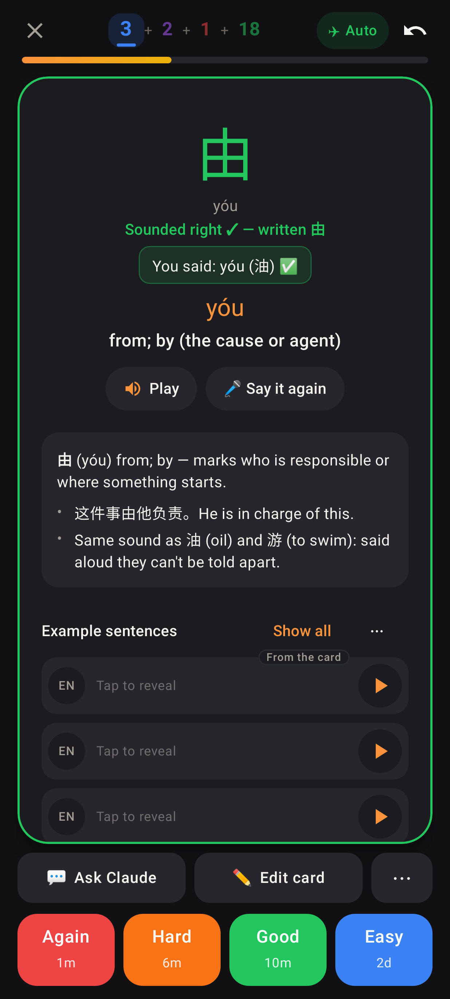
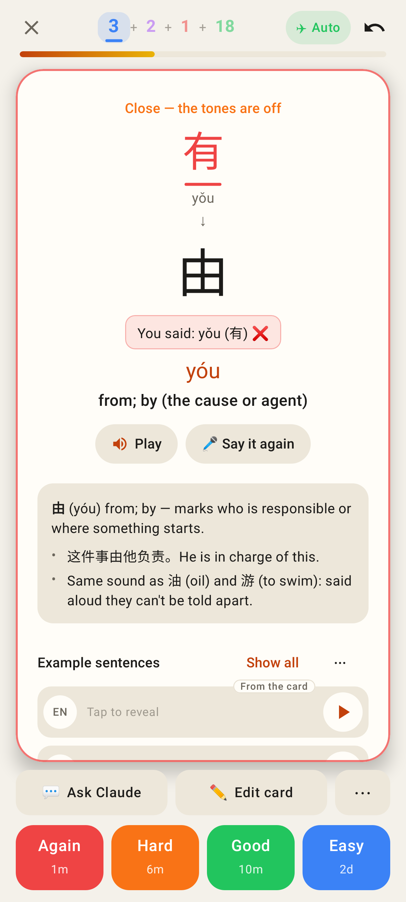
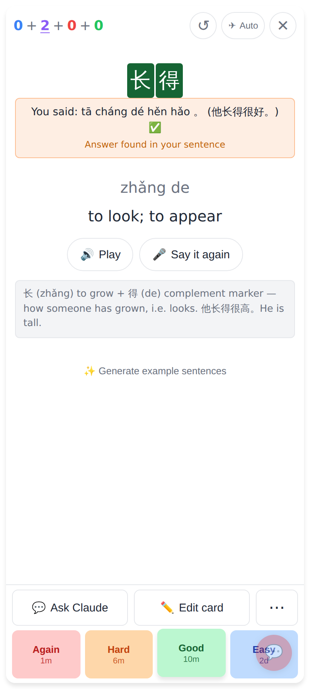
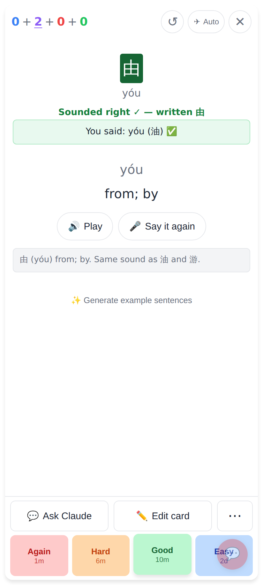
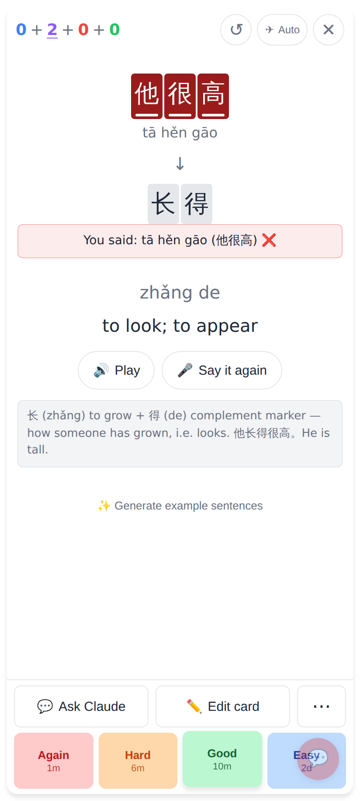

# Spoken answer said inside a sentence — screenshots

Before (Jerome's report): on the Lab typing card for 长得, saying 他长得很好。 was marked wrong with
every character underlined red. Now the typing cards follow the read card's rule and show the
read card's own "You said" box.

## Lab app (412 × 915 dp, Roborazzi)

Lab, dark: the answer 长得 green, the read card's orange "You said … ✅ · Answer found in your sentence", nothing red.

Lab, light: the same card.

Lab, dark: a homophone — "Sounded right ✓ — written 由" and the green "You said" box.

Lab: other tones — still wrong, the diff and the red "You said … ❌" box.

## Web (412 × 915, 2×)

Web: the answer green, the same orange "Answer found in your sentence" box as on the read card.

Web: a homophone — "Sounded right ✓" and the green box.

Web: the word not said (他很高 for 长得) — wrong, red box.
