# Voice first + 🎤 Say it again (typing cards)

Phone viewport (412×915). Web at 2×, Lab from Roborazzi.

## Web

Question side of a listen card: the big 🎤 is the main button. ✏️ Type is on the left and 👁 Show answer on the right. No answer box and no keyboard.

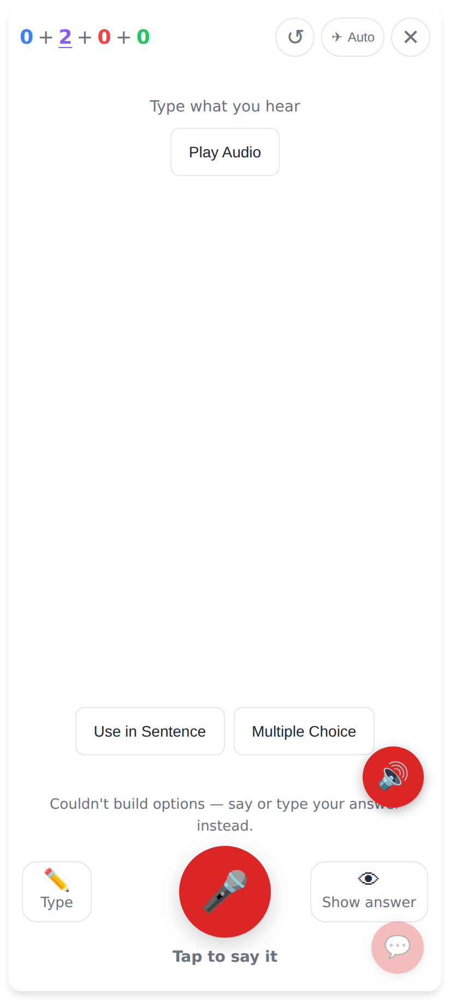
The same screen in dark mode.

While he speaks, the live transcript sits above ⏹ "Tap to stop" and ✕ Cancel. The floating 🔊 is hidden.

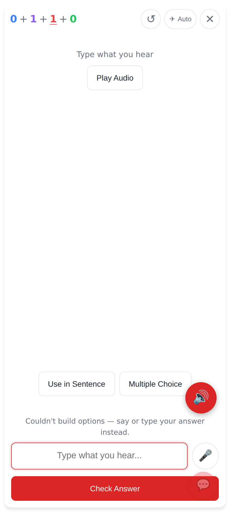
After ✏️ Type: the focused box appears with the small 🎤 next to it. This applies to this card only.

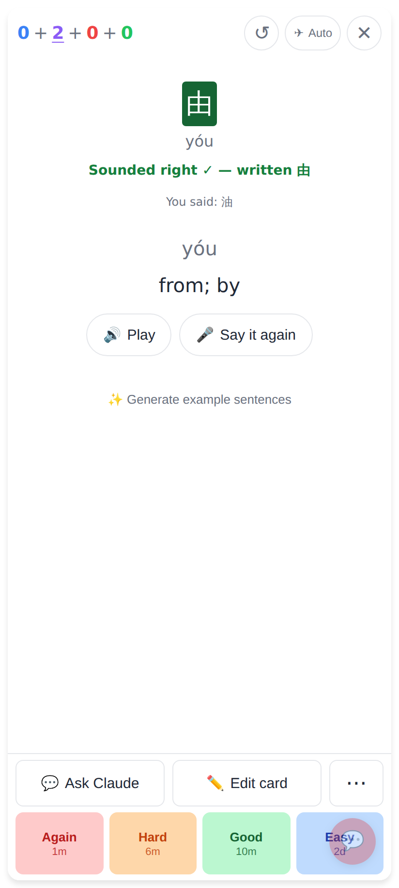
The answer was spoken. 油 is accepted as right by sound, and 🎤 Say it again sits next to Play.

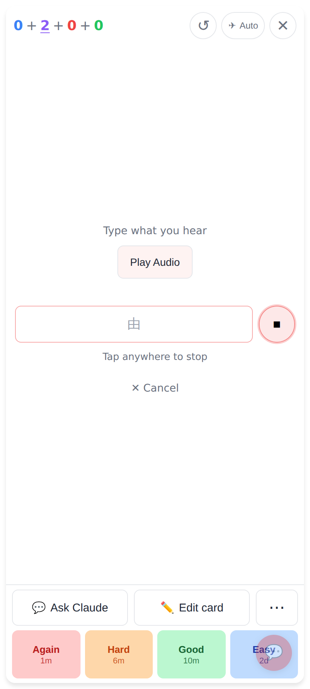
After 🎤 Say it again the card turns back to the question with the live transcript. The old verdict is hidden.

The same screen in dark mode.

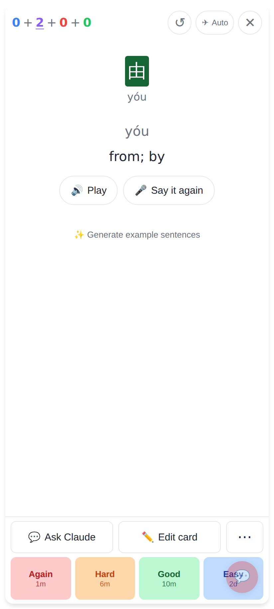
The new answer 由 is checked again. The verdict is now exact, so the "Sounded right" note is gone.

## Lab app

Question side of a write card: the big 🎤 between ✏️ Type and 👁 Show answer.

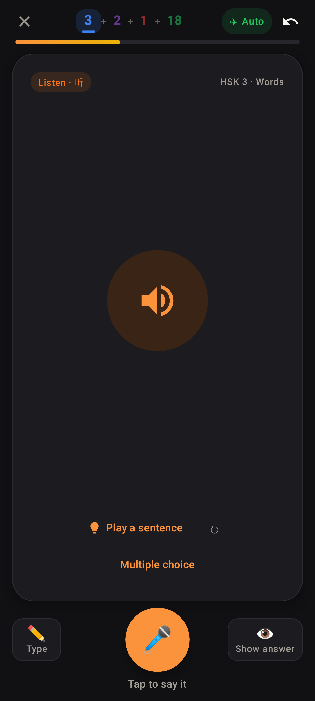
A listen card in dark mode.

The live transcript (我 confirmed, 由 provisional) above ⏹ "Tap to stop" and ✕ Cancel.

After ✏️ Type: the box with the small 🎤 and Show.

Offline, the box comes first and the 🎤 is dimmed, as before.

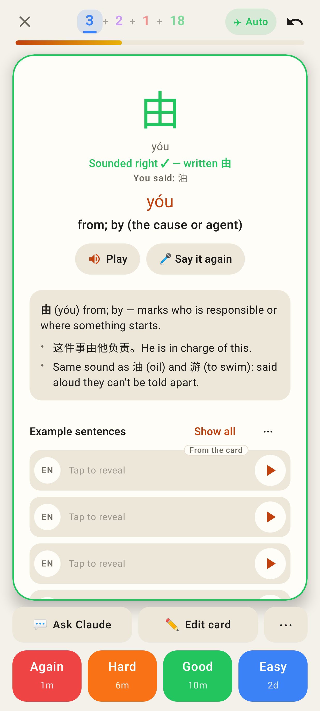
The answer was spoken ("Sounded right ✓ — written 由"), and 🎤 Say it again sits next to Play.

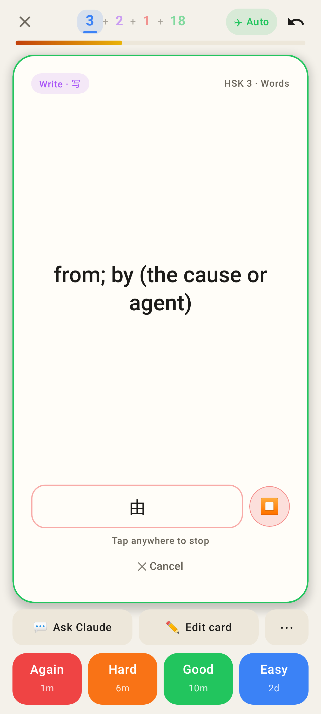
The question side with the live transcript, "Tap anywhere to stop", ⏹ and ✕ Cancel.

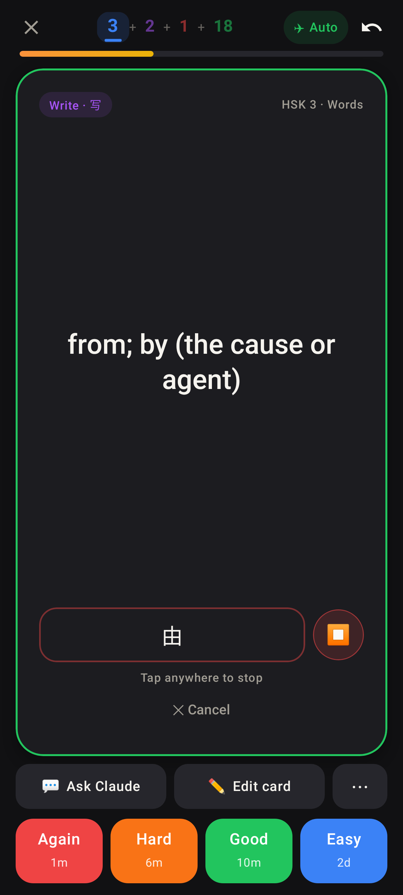
The same screen in dark mode.

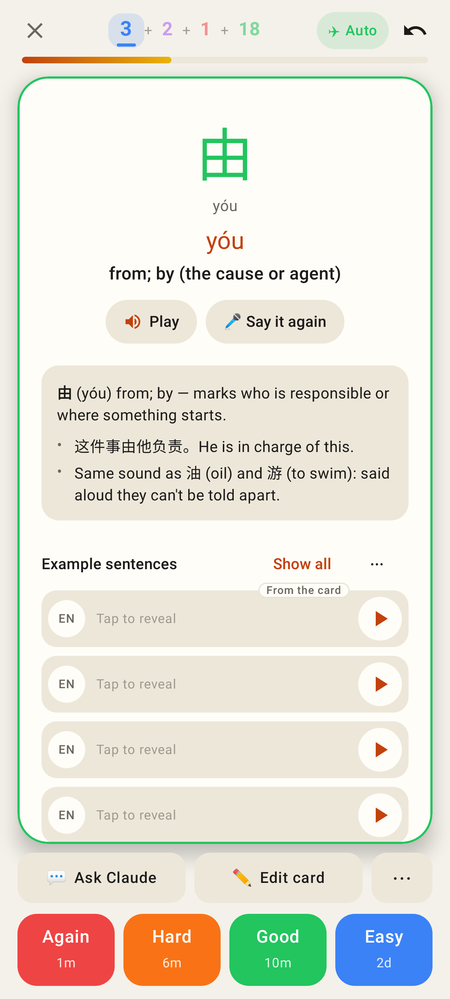
The answer side again, with the new verdict (由, exact).

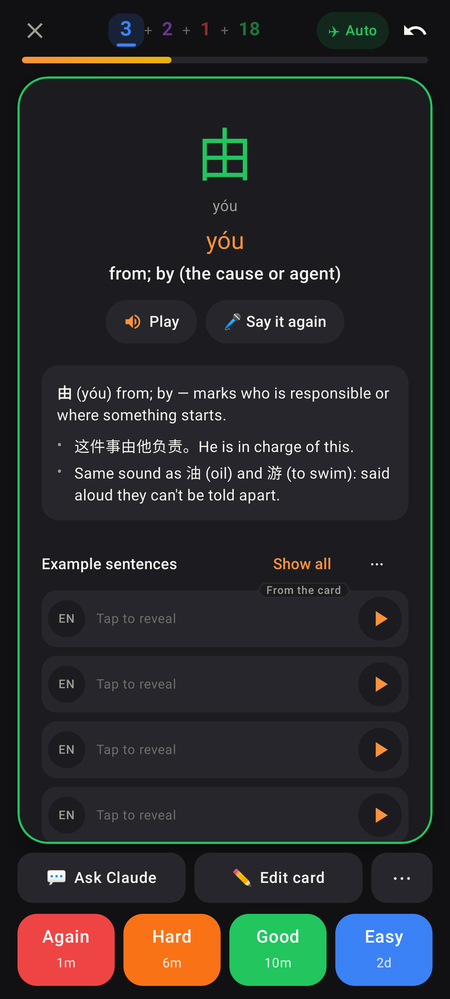
The same screen in dark mode.

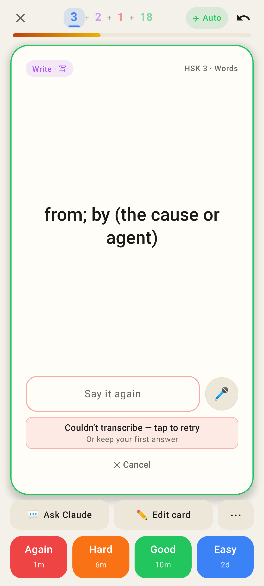
The take gave nothing. The card stays on the question and offers "tap to retry · Or keep your first answer", 🎤 and ✕ Cancel.
