# Spoken answers: a review step before submit

On the typing cards (English → hanzi, audio → hanzi), ⏹ Stop no longer goes straight to the
answer. The card stays on the question and shows what was said: the transcript in large hanzi,
with the device's pinyin under it. It is read-only text, so the keyboard stays down. The bottom row
uses the same buttons as the voice-first row: **🔁 Retry** and **✏️ Edit** on the left, and the wide
**✓ Submit** on the right. "Say it again" on the answer side goes through the same step. Phone
shots are 412×915.

Before (PR #582): [the voice-first row](../voice-answer-bar-restyle/README.md). ⏹ submitted the
answer at once.

## Lab app

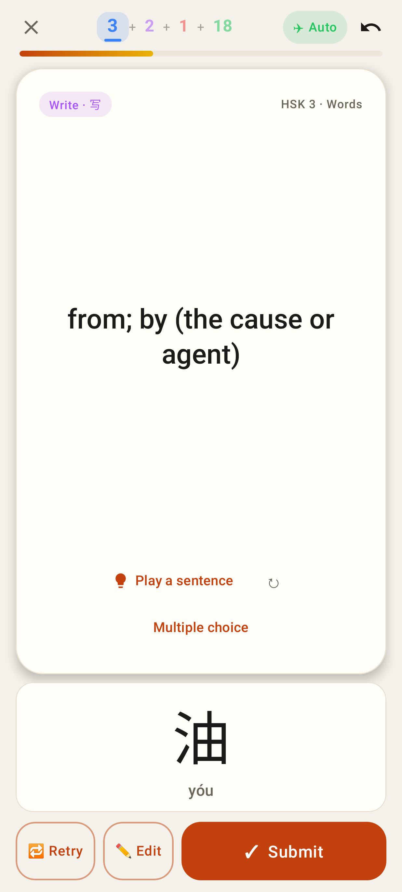
English → hanzi after ⏹: 油 (yóu) on the review, with Retry · Edit · Submit.

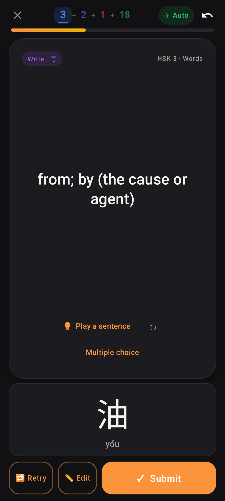
The same in dark mode.

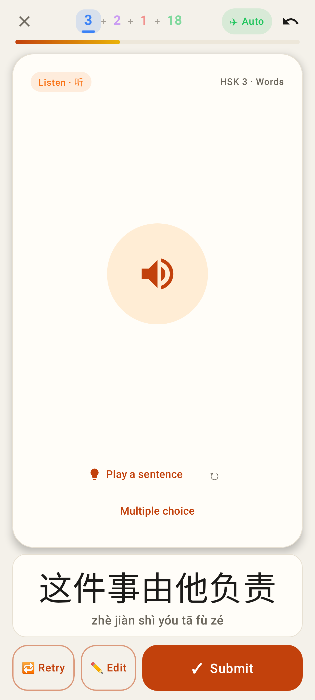
Audio → hanzi with a whole sentence. The hanzi size steps down with length.

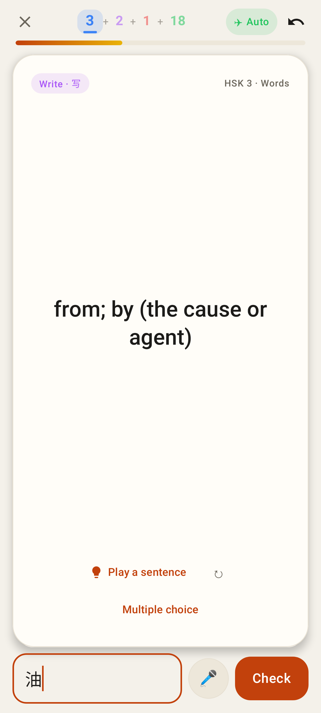
✏️ Edit: the transcript in the box, focused, with the cursor at the end. Check submits it. An answer that was changed is checked as typed.

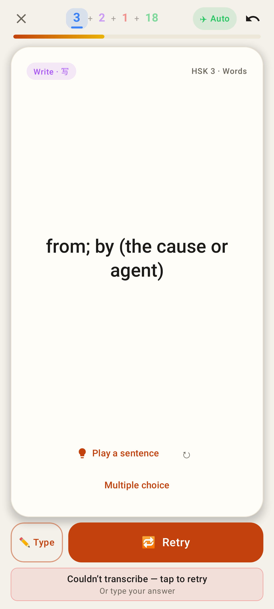
Couldn't transcribe: ✏️ Type and a wide 🔁 Retry, with no Submit. "Tap to retry" still uploads the same take again.

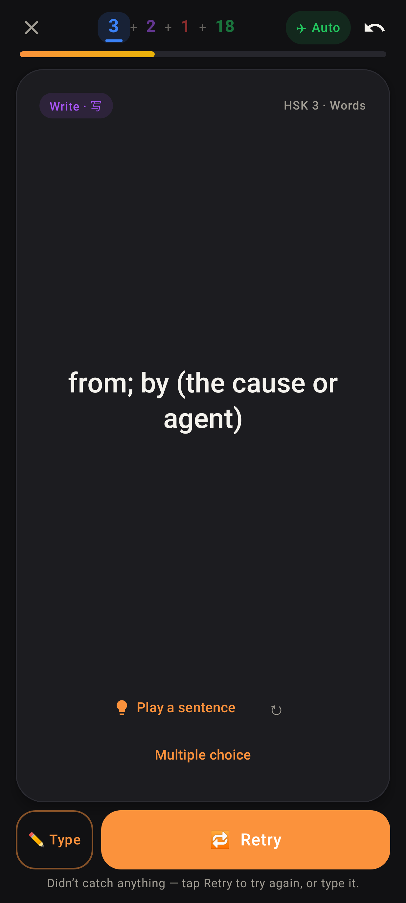
Nothing heard, in dark mode.

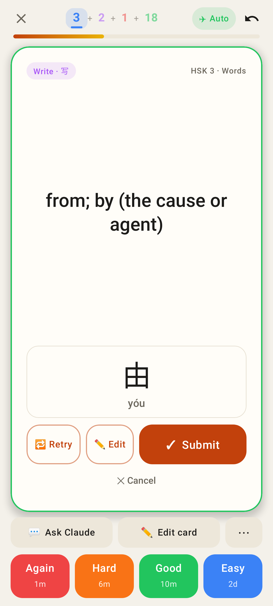
Say it again: the review is on the question side. ✕ Cancel keeps the first answer.

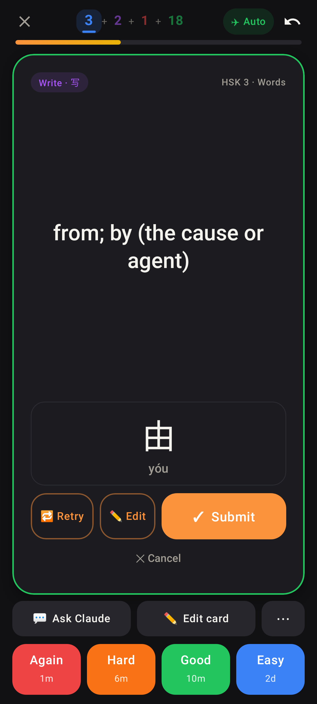
The same in dark mode.

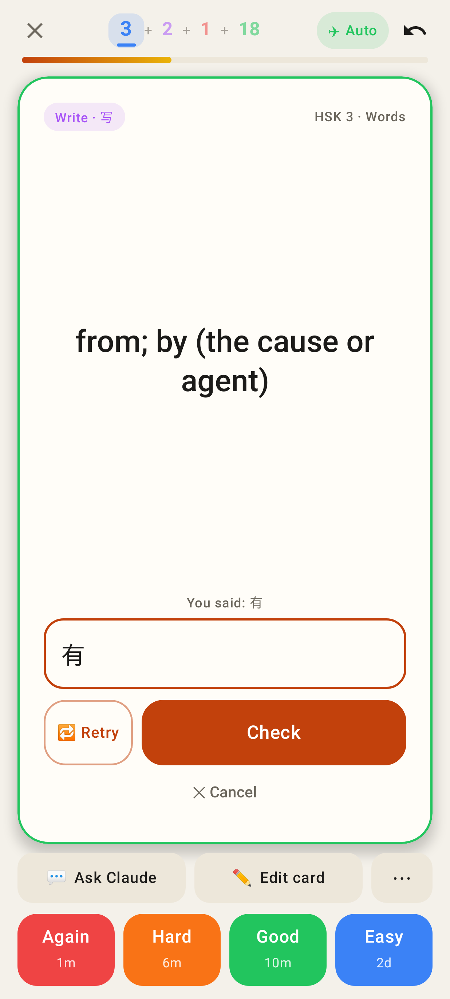
✏️ Edit during a Say it again: a box on the question side, then Check.

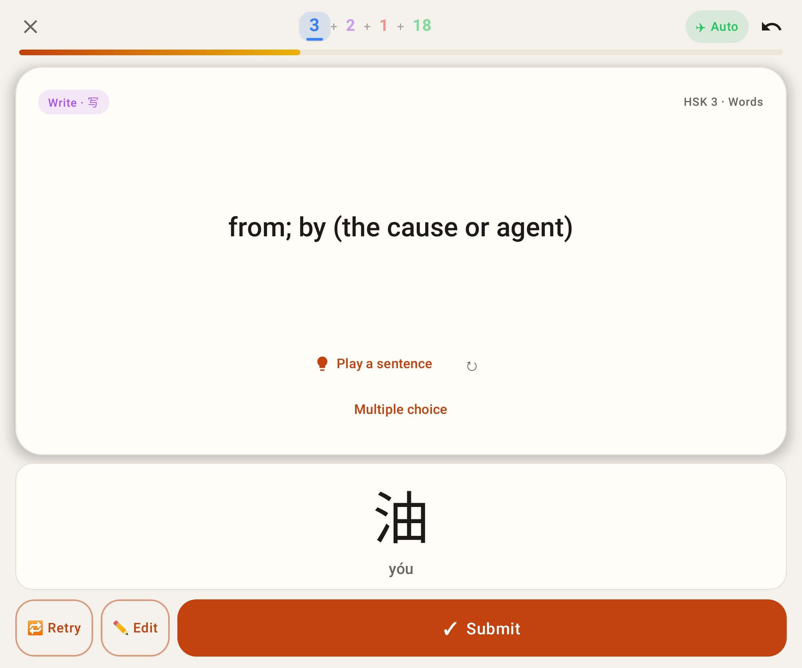
The review on the unfolded Fold.

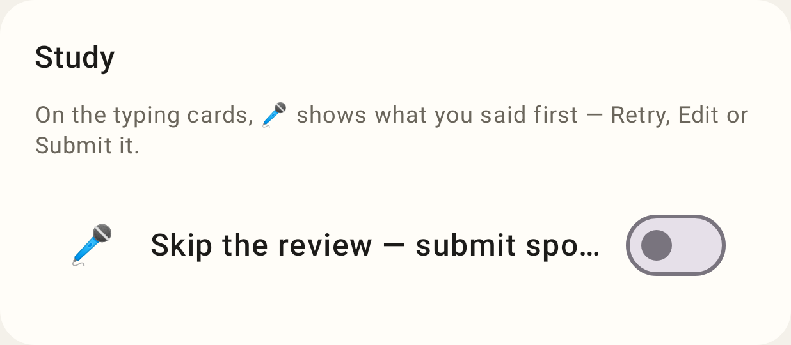
Settings: "Skip the review — submit spoken answers as soon as I stop", off by default.

## Web

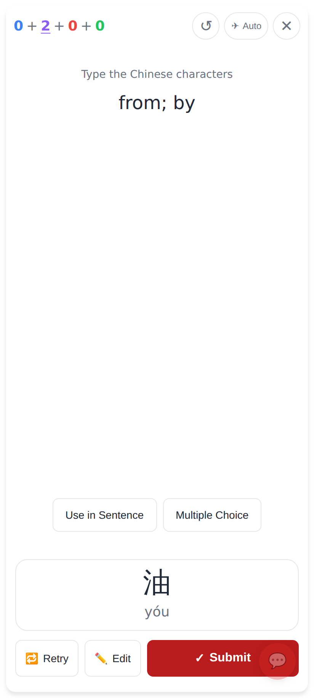
English → hanzi after ⏹: 油 (yóu) with Retry · Edit · Submit.

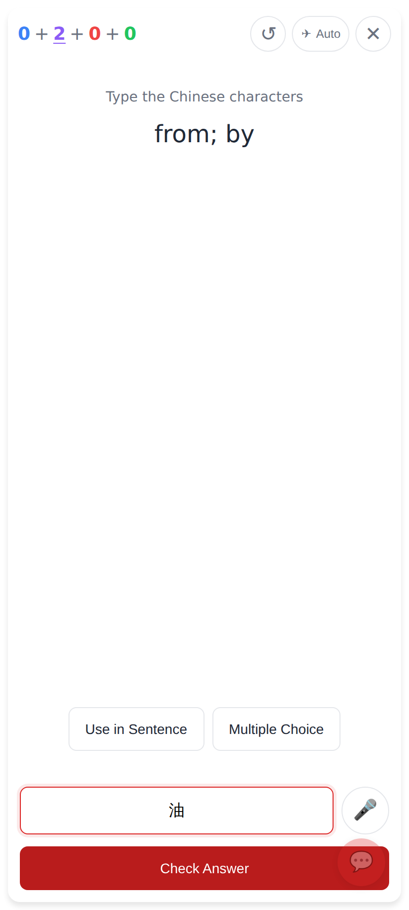
✏️ Edit: the transcript in the box, focused.

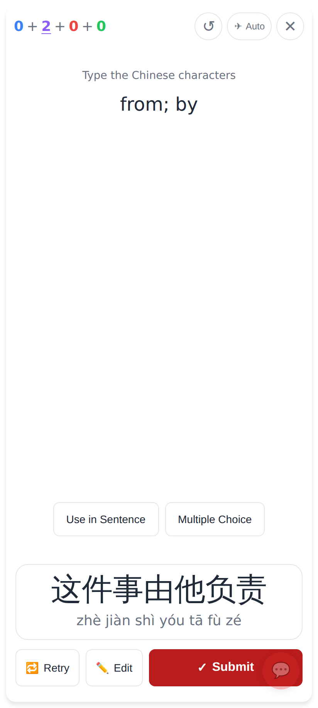
A whole sentence on the review.

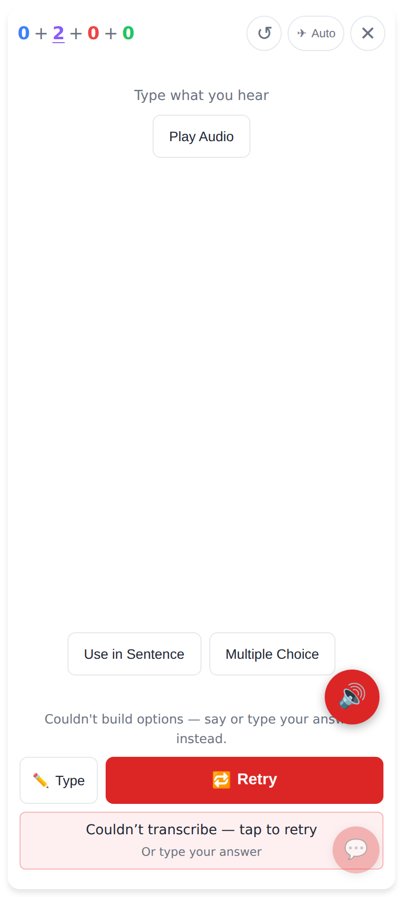
Couldn't transcribe: ✏️ Type and a wide 🔁 Retry, with no Submit.

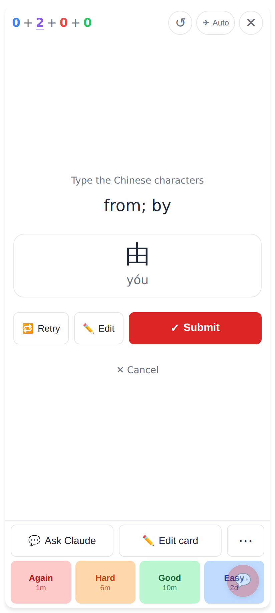
Say it again: the review on the question side, with the ratings still up.

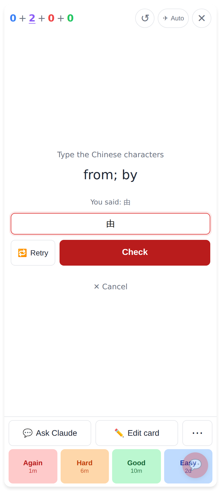
✏️ Edit during a Say it again.

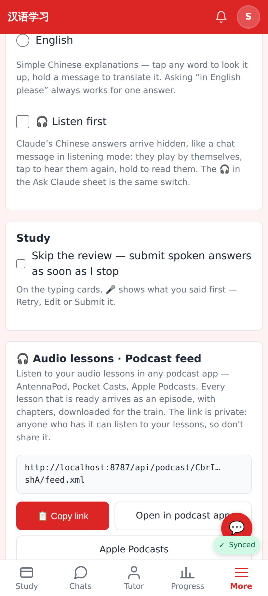
Settings → Study: the reworded switch, off.

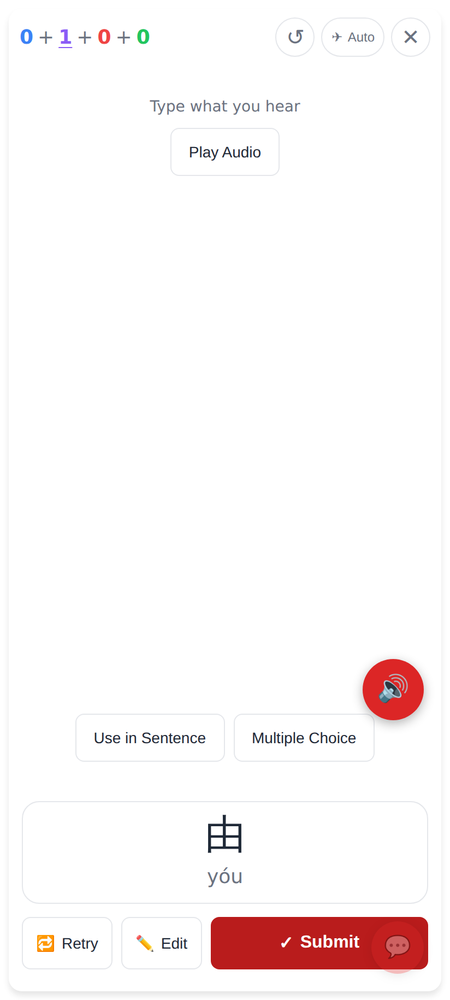
Audio → hanzi: the floating 🔊 moves above the review.
