# Handwriting with stroke-order feedback (preview)

Phone viewport 412×915 @2×. Strokes were drawn by a Playwright script moving the pointer along
each stroke's centre line (the same way a finger would), including deliberate mistakes.

**How it feels (it's gesture-heavy):** you draw a stroke; the moment you lift your finger it is
judged. A right stroke vanishes into the real stroke, painted in quickly with a green bloom, a
soft pluck and a haptic tick. A wrong one shakes red and fades while the line above the pad says
what went wrong — *"That's stroke 2 — stroke 1 comes first."*, *"Right stroke, other direction —
start from the dot."*, *"Keep going…"*. After two misses a pulsing blue dot + arrow shows where to
start, after three the stroke is painted in blue on a loop, after five it's filled in for you.
A finished character makes the pad glow and plays a short chord, then the next character comes up.

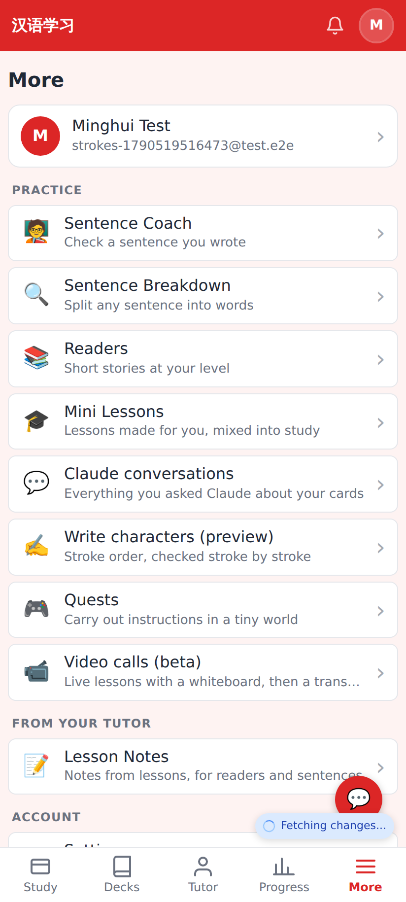
**More → Practice → Write characters (preview).**

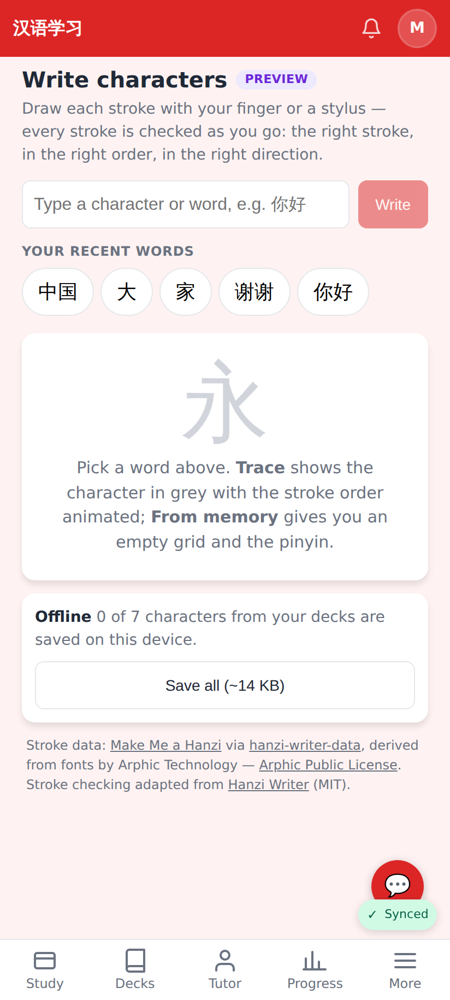
**/practice/strokes** — type any character or word, or tap one of your recently studied words; offline status + "Save all" for your decks; licence credit.

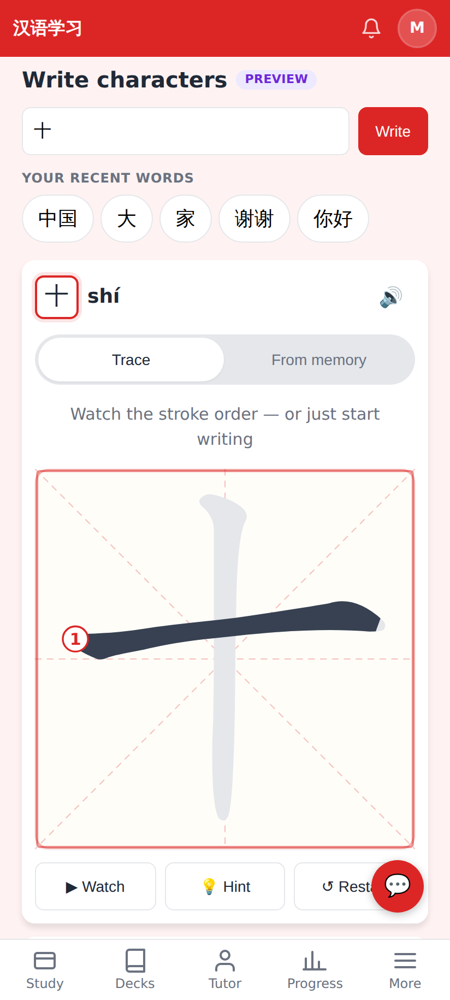
**Trace** — the stroke order animates first (numbered); start writing any time to skip it.

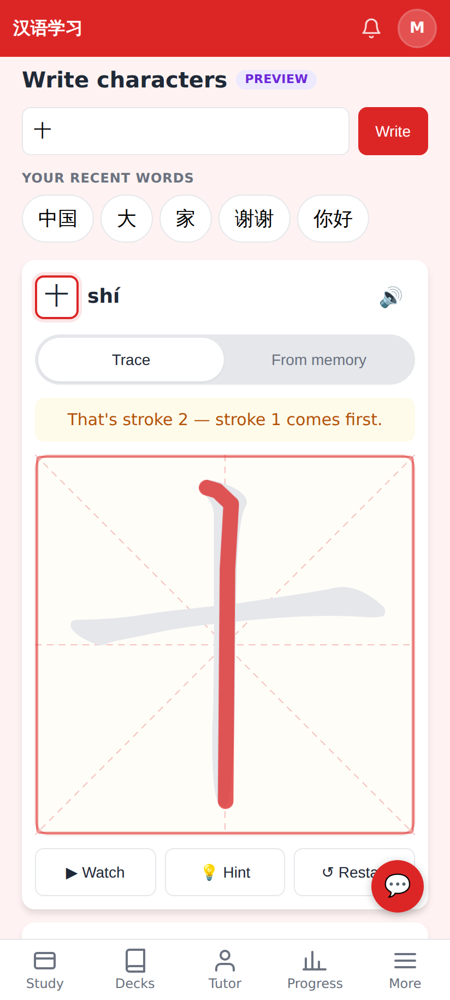
Vertical drawn first: rejected in red, and the app names the stroke — *stroke 2, stroke 1 comes first*.

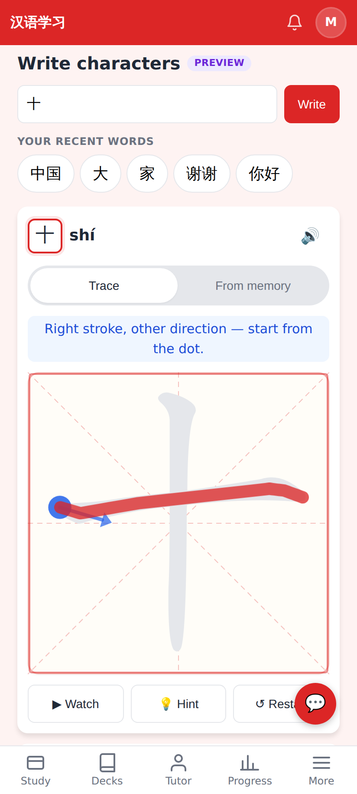
Horizontal drawn right-to-left: *right stroke, other direction* — the second miss brings the start dot + arrow.

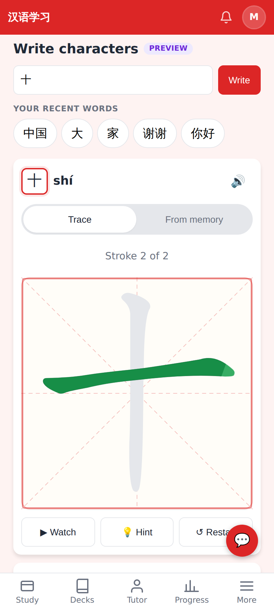
Drawn correctly: the real stroke is painted in with a green bloom.

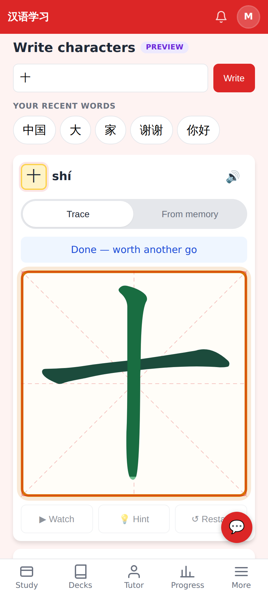
Both strokes in — the pad glows (amber here: 2 mistakes on a 2-stroke character).

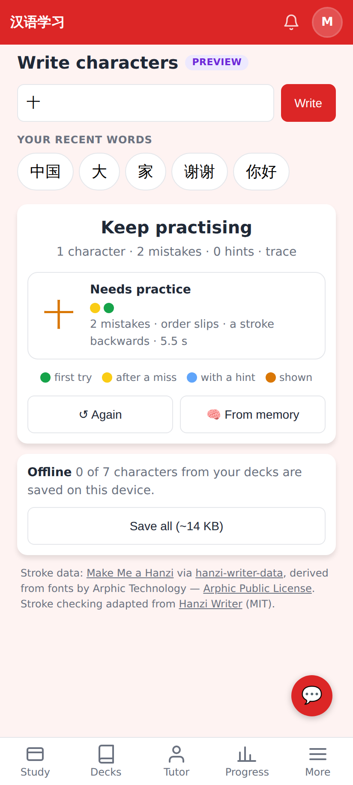
Summary: one dot per stroke (first try / after a miss / with a hint / shown), mistakes, time.

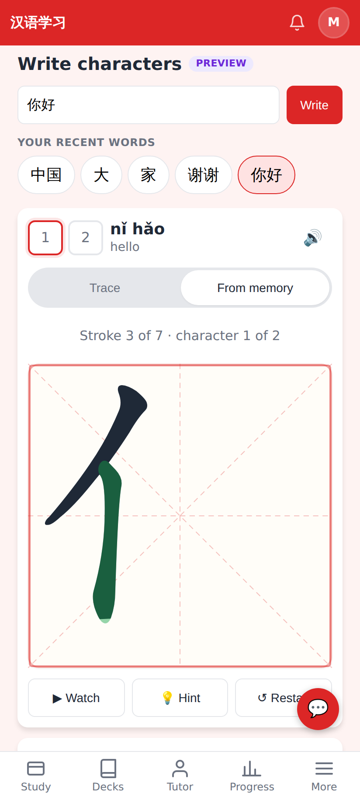
**From memory** — blank 米字格 grid, pinyin + English as the prompt, characters hidden until written.

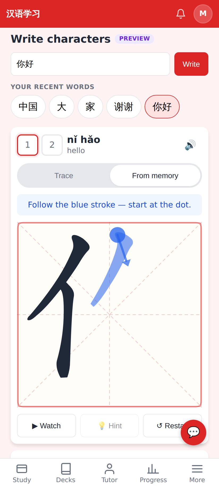
💡 Hint: the next stroke is painted in blue on a loop with a start dot + direction arrow.

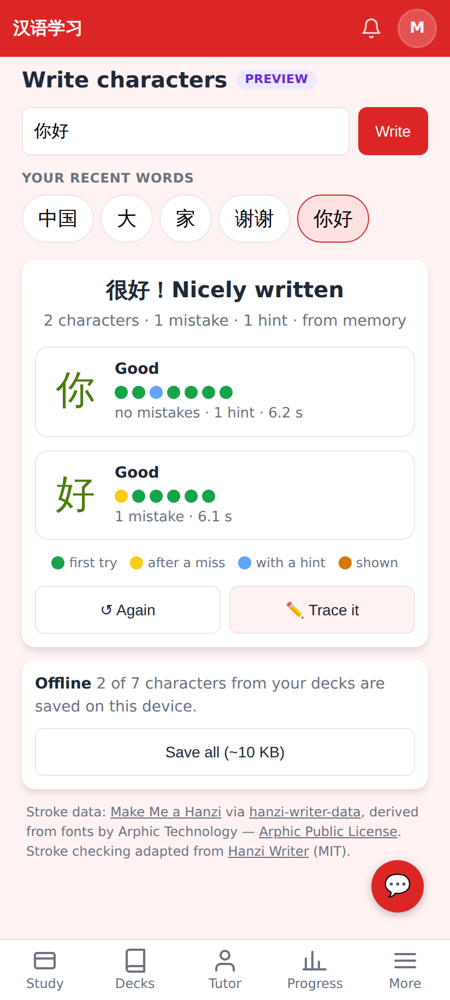
你好 from memory — per-character grades; "Trace it" to switch mode.

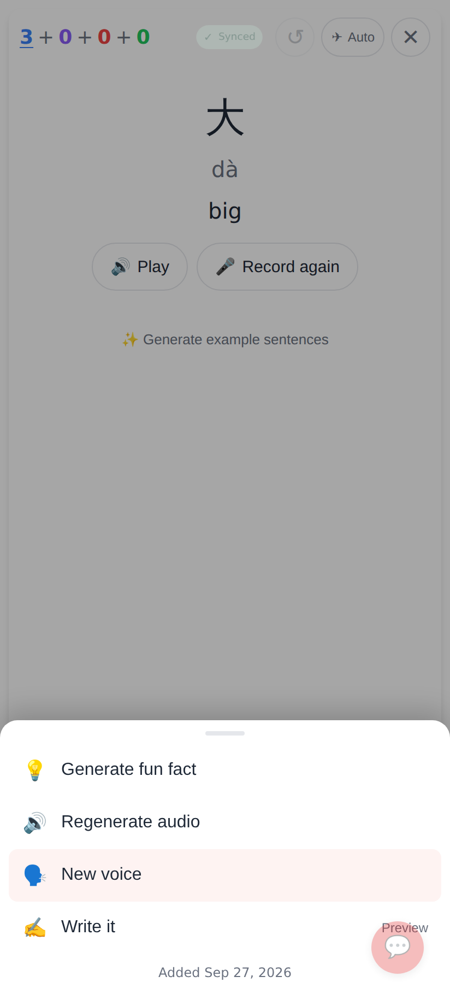
On any study card: **⋯ → Write it** (marked Preview).

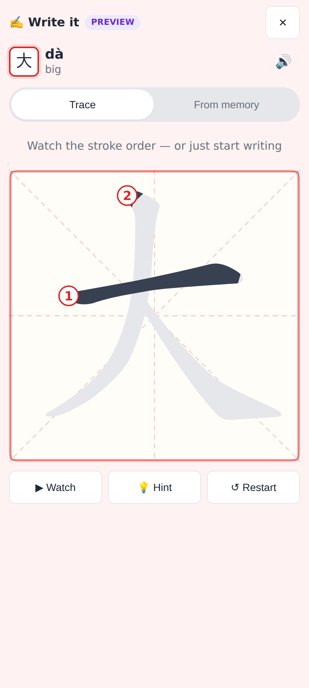
Full-screen writing sheet over the card (the session keeps its place); Done returns to the card.
