# Student profile — the tutor's private note on each student

Web (phone 412×915 @2x unless noted):

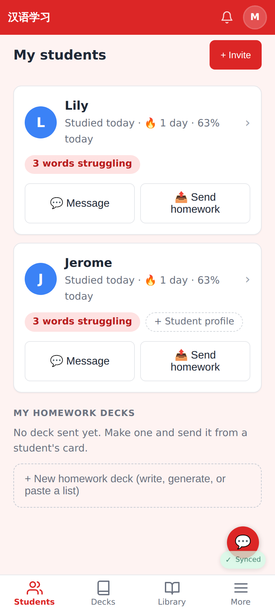
A quiet dashed "+ Student profile" pill on a student card with no profile yet (Lily already has one).

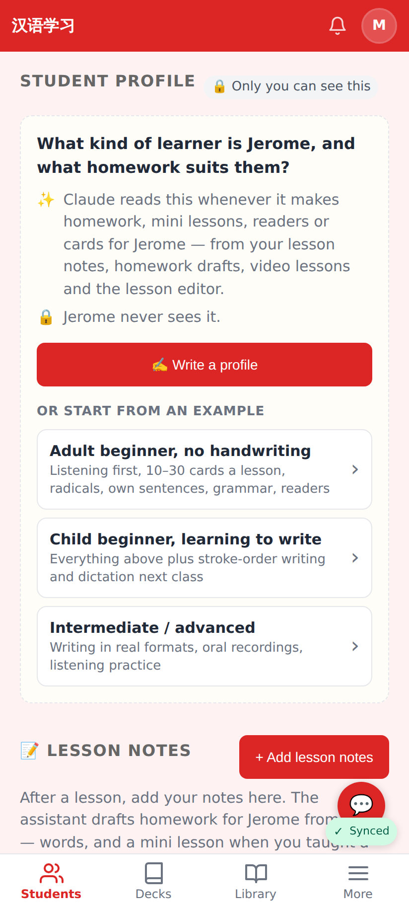
The student page before a profile exists: how Claude uses it, that the student never sees it, and three examples to start from.

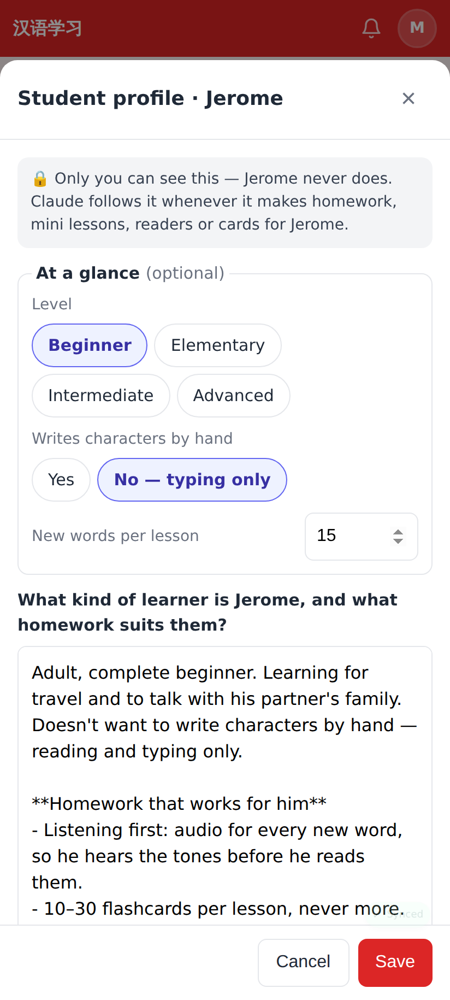
The editor started from "Adult beginner, no handwriting": level, handwriting, words per lesson, the text.

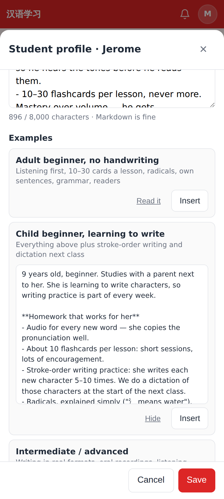
Further down: the examples (Read it / Insert once something is written) and what else is useful to include.

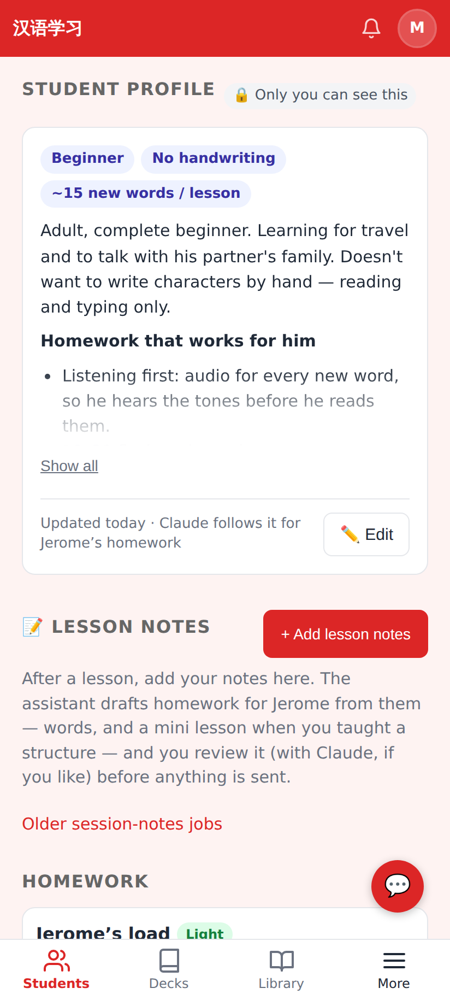
The saved profile: short facts, the text (clamped with Show all), Edit.

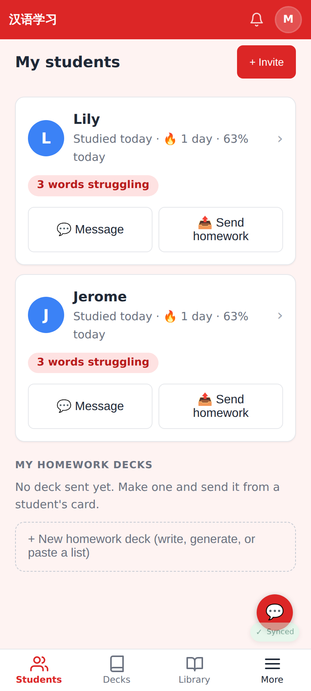
Both students have a profile — no hint.

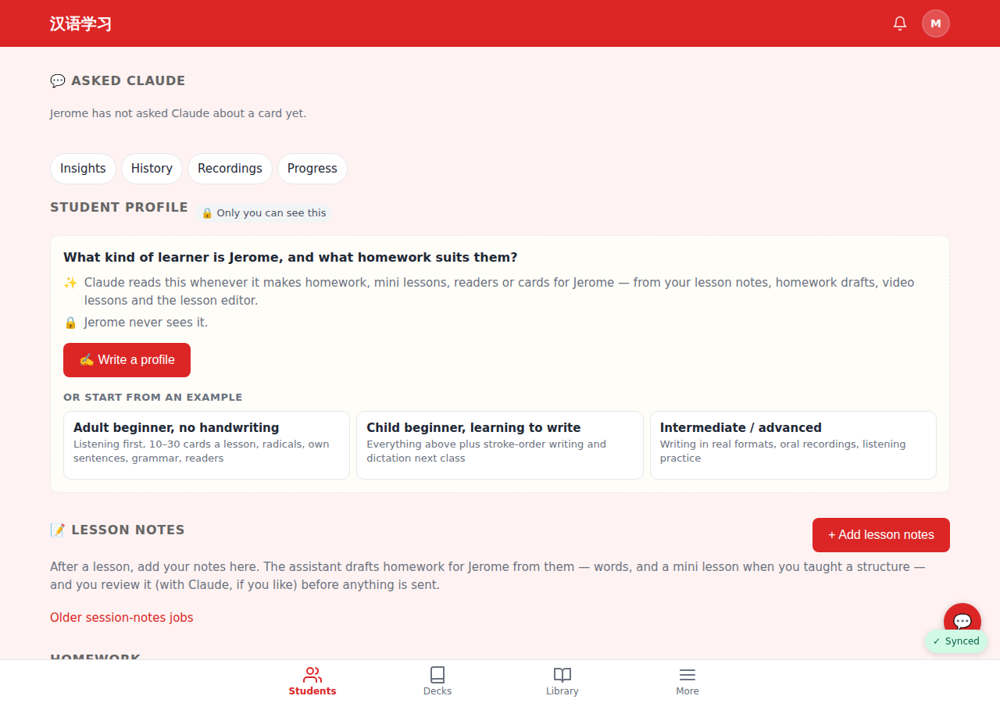
1280px: the examples sit side by side.

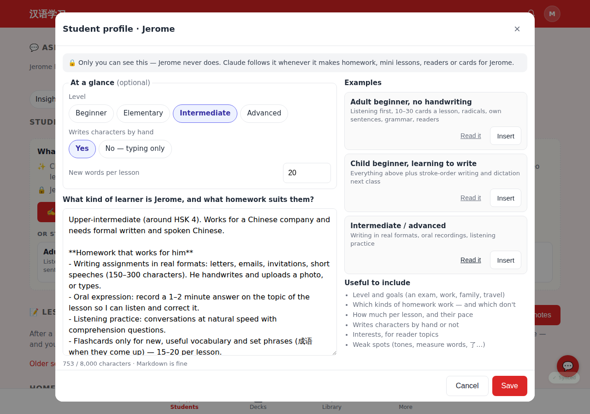
1280px: editor and examples in two columns.

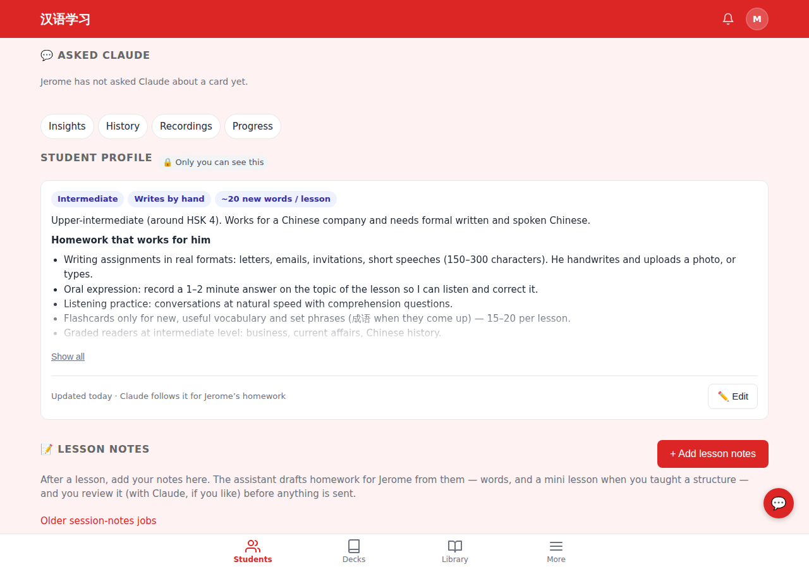
1280px: the saved profile on the student page.

Lab app (Roborazzi):

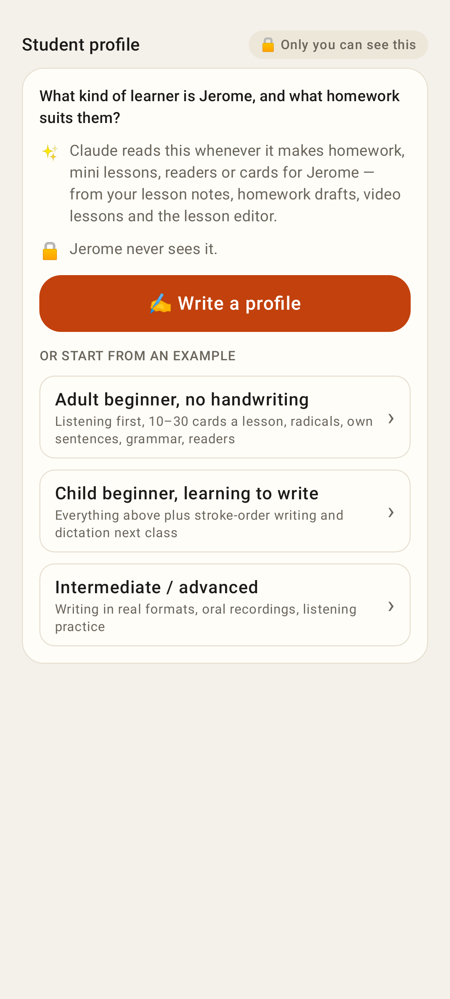
The same empty state in the native app.

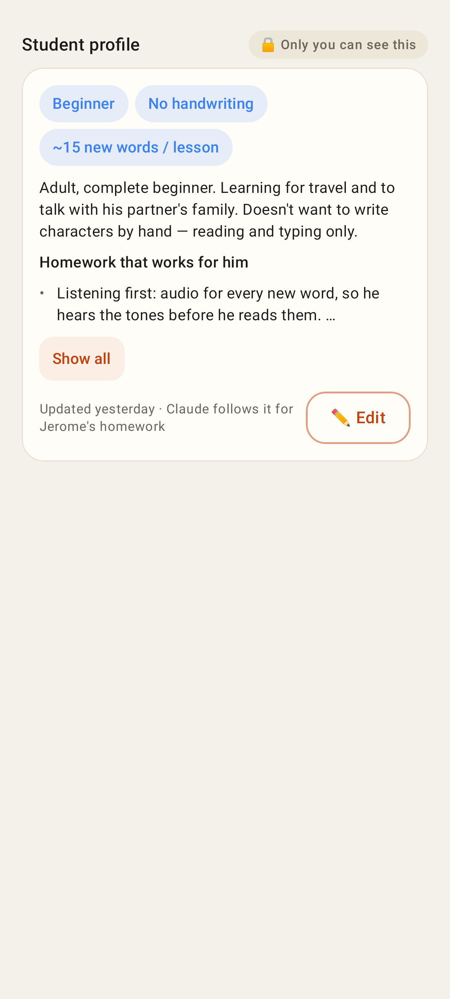
The written profile card.

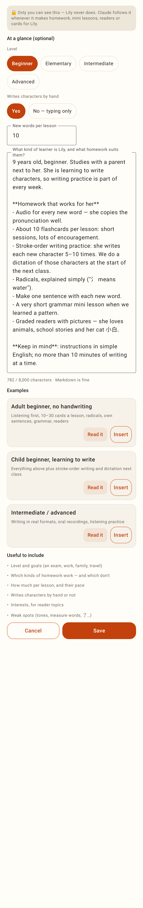
The editor started from "Child beginner, learning to write".

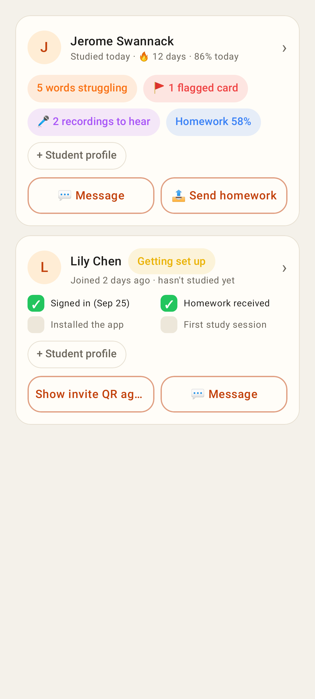
"+ Student profile" on the dashboard cards.
