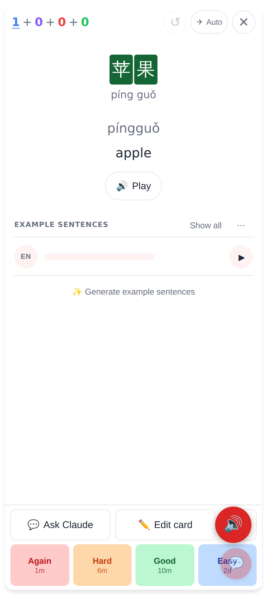
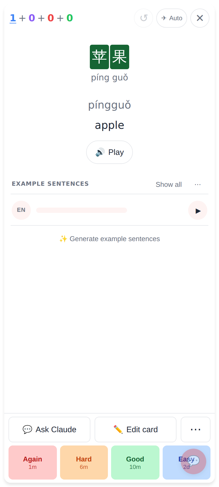
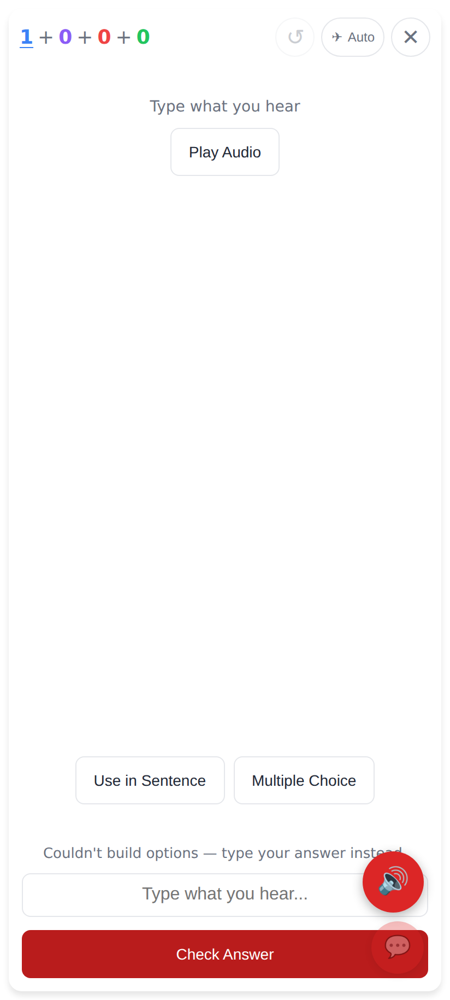

# Study: no floating replay button on the back of audio cards

Phone viewport (412×915, 2×), an audio → hanzi card.

Before — the floating replay button stayed up after the flip and covered ⋯ and part of Easy.

After — no floating button on the back; the Play button in the reveal area is the one to use. (The small circle on Easy is the draggable feedback button, unchanged.)

Front — unchanged: the floating button stays on the front, where it gives thumb reach to the prompt audio.
