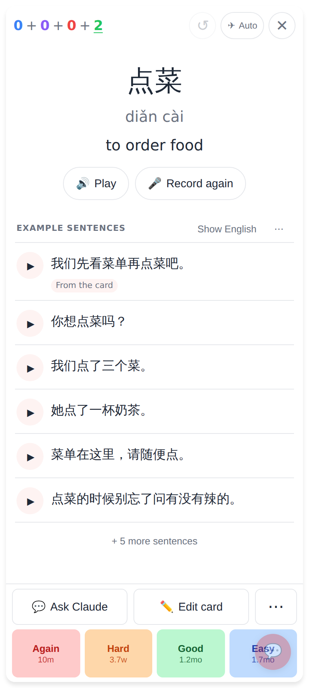
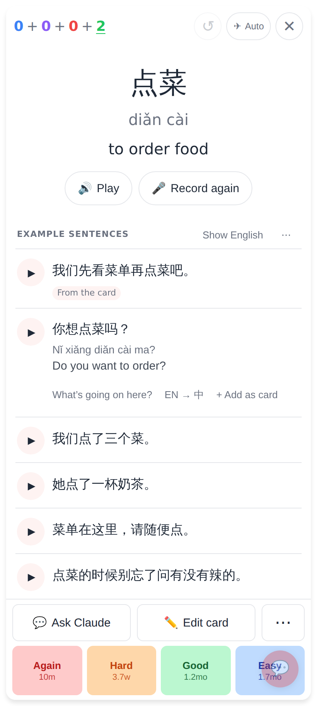
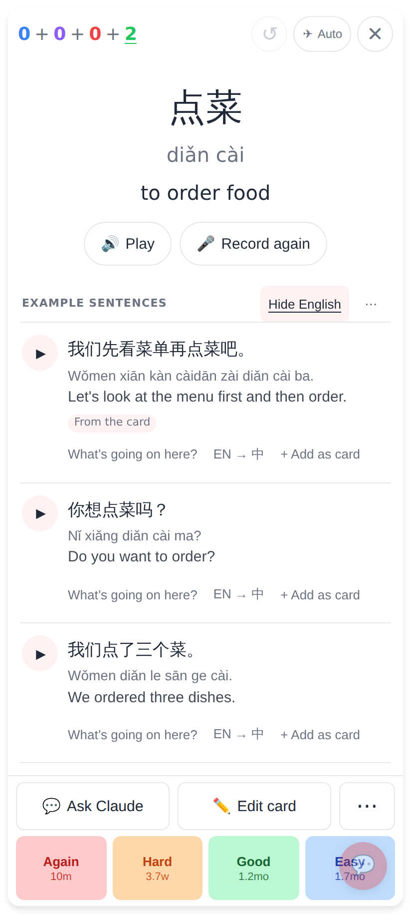
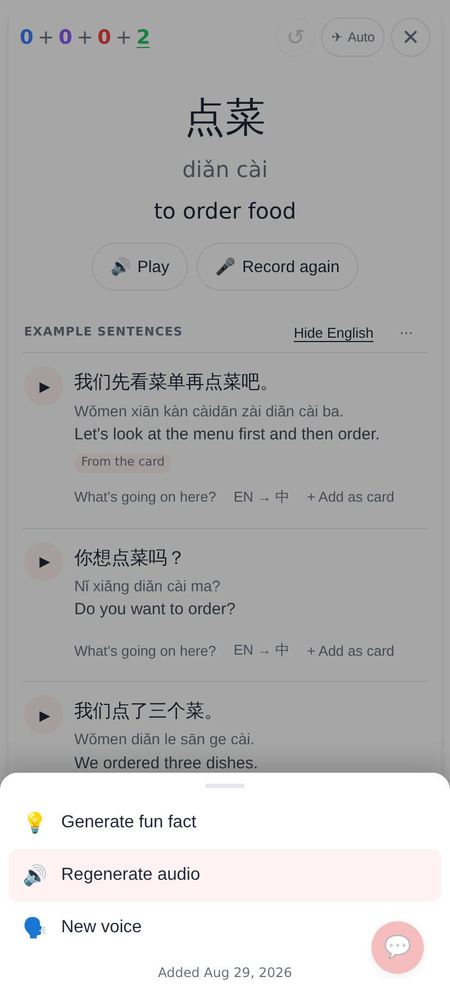

# Study card: example sentences always visible — screenshots

Phone viewport 412×915 @2×, seeded 餐厅 deck (点菜 / 买单) with a card sentence and a
generated set of five. No AI keys in the container, so audio is device TTS.

## Before

The card back on main: the note's sentence as two quiet lines, Ask Claude · **Sentences** · ⋯.

Tapping *Sentences*: numbered, boxed rows, an EN button column, every row hidden behind "Tap to reveal".

Three taps later: hanzi, pinyin, translation, a badge and a boxed "What's going on here?" button.

## After

The list is always there under the meaning: play button + Chinese on every row, *From the card* on the note's own sentence, a quiet "+ 5 more sentences". Footer: Ask Claude · **Edit card** · ⋯ above the ratings.

The sentences scroll underneath the footer; the buttons never move.

One tap on a sentence: pinyin + English, then the tools line — *What's going on here?* · **EN → 中** (reverse practice) · *+ Add as card*.

*Show English* opens every row at once (remembered between cards).

The ⋯ sheet without Edit card, which now lives on the row.
