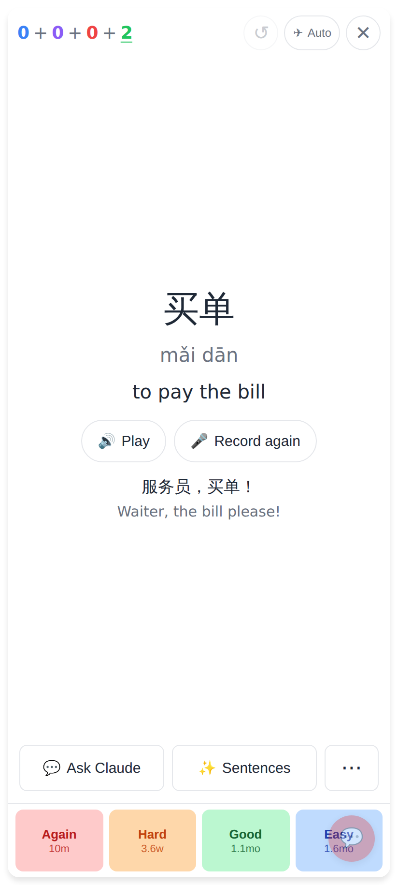
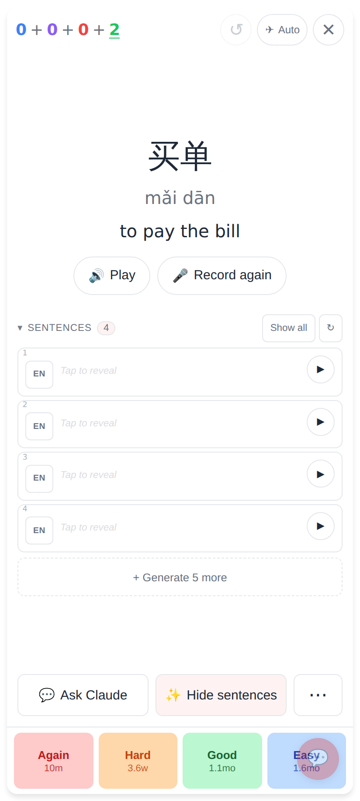
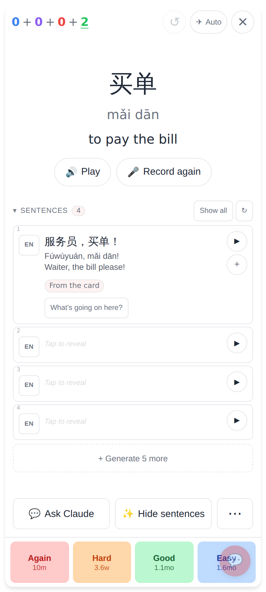
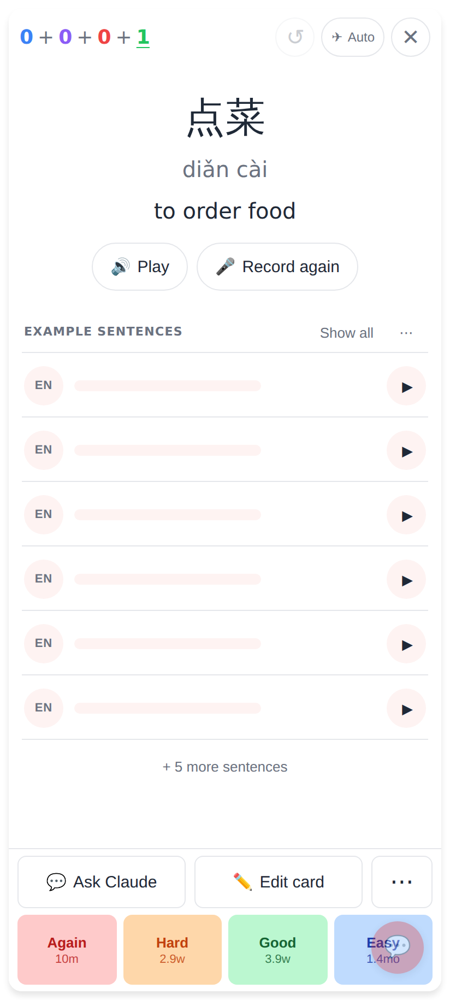
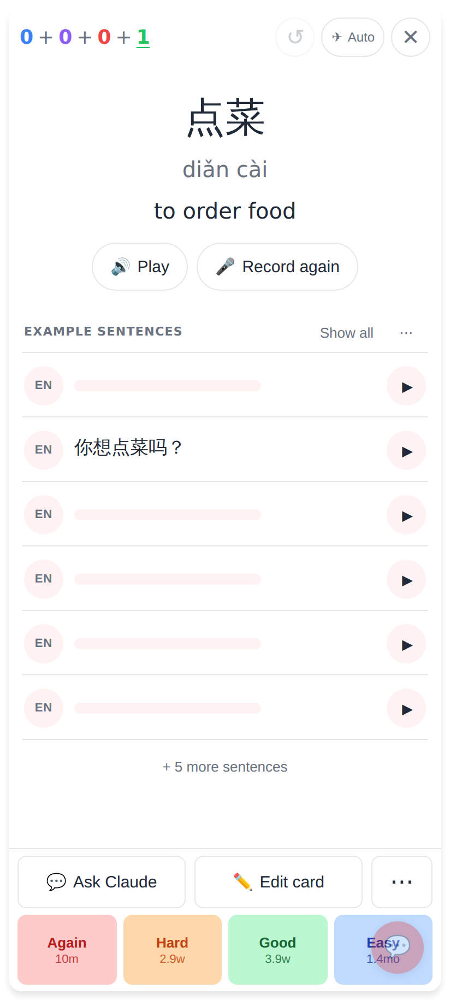
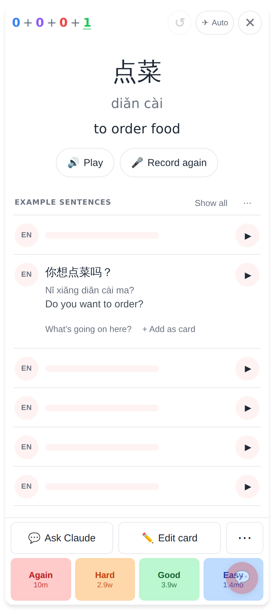
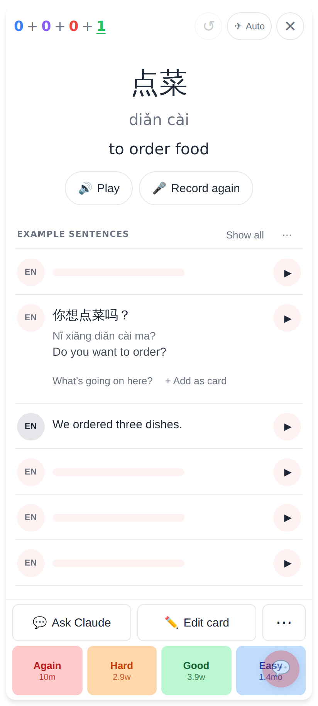
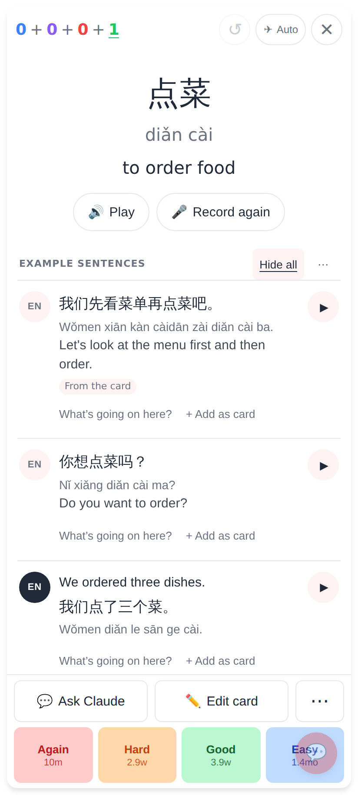
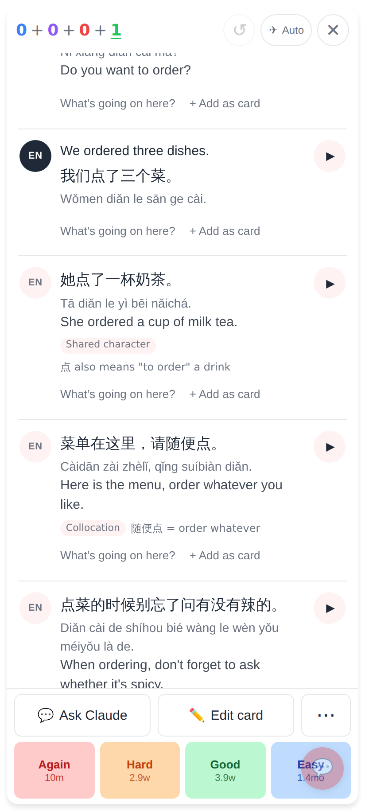

# Study card: example sentences always visible — screenshots

Phone viewport 412×915 @2×, seeded 餐厅 deck (点菜 / 买单) with a card sentence and a
generated set of five. No AI keys in the container, so audio is device TTS.

## Before

The card back on main: the note's sentence as two quiet lines, Ask Claude · **Sentences** · ⋯.

Tapping *Sentences*: numbered, boxed rows, an EN button column, every row hidden behind "Tap to reveal".

Three taps later: hanzi, pinyin, translation, a badge and a boxed "What's going on here?" button.

## After

The list under the meaning, every row blank: **EN** on the left, a faint bar where the sentence will appear, **▶** on the right. Listen first. Footer: Ask Claude · **Edit card** · ⋯ above the ratings.

One tap on a row uncovers the Chinese.

Two more taps: pinyin, then English, then the tools line — *What's going on here?* · *+ Add as card*. A tap on a fully open row hides it again.

**EN** flips a row to the reverse exercise: the English goes up alone; the taps then check the Chinese and pinyin.

*Show all* opens every sentence for this card (the next card starts blank again).

The sentences scroll underneath the footer; the buttons never move.
