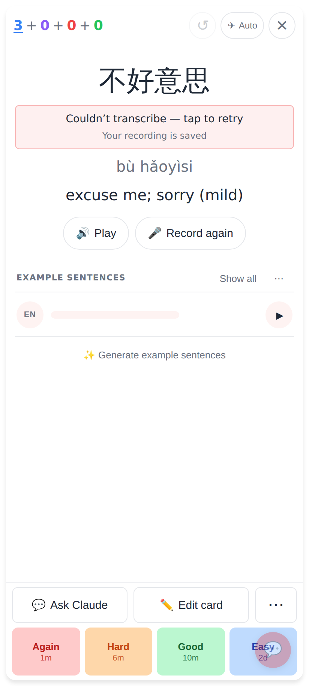
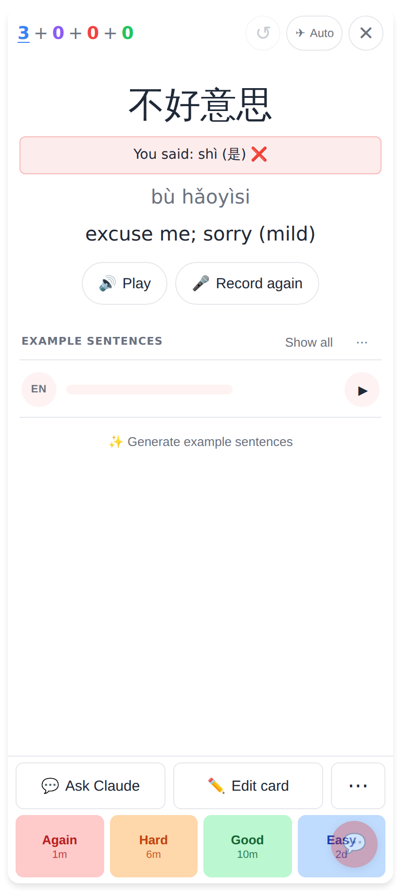
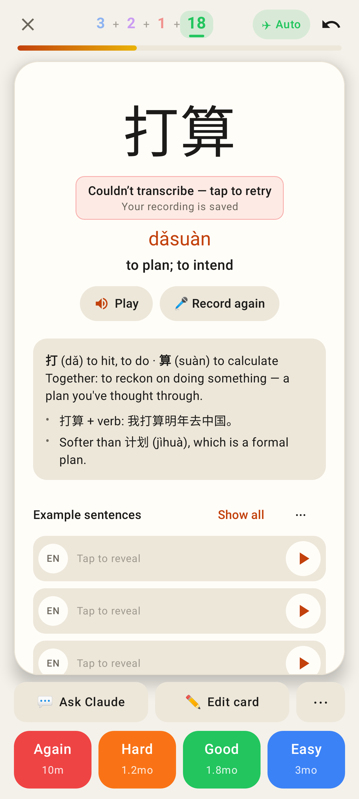

# Pronunciation: never silent when transcription fails

Web, read card after Stop: the live Soniox stream was refused and the upload got a 502 — "Couldn't transcribe — tap to retry" (it used to show nothing).

Web: the tap re-sent the same saved take; "You said: …" appears.

Lab app, same state (Roborazzi `study-b10b-read-back-transcribe-failed`).
