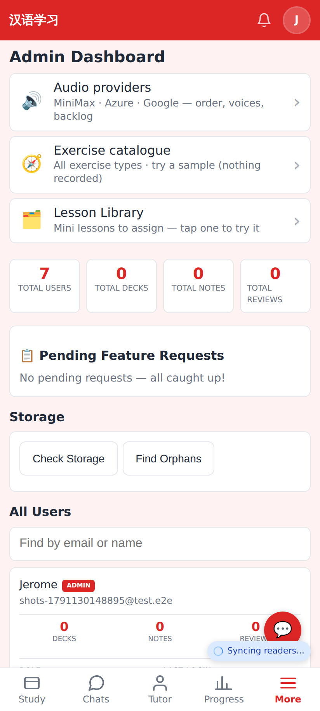
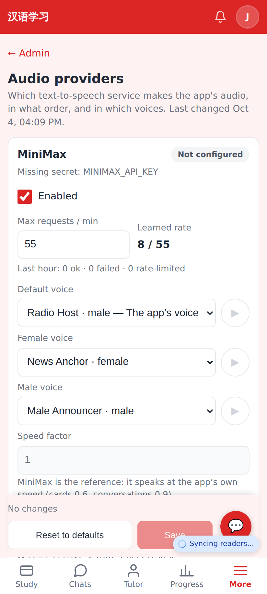
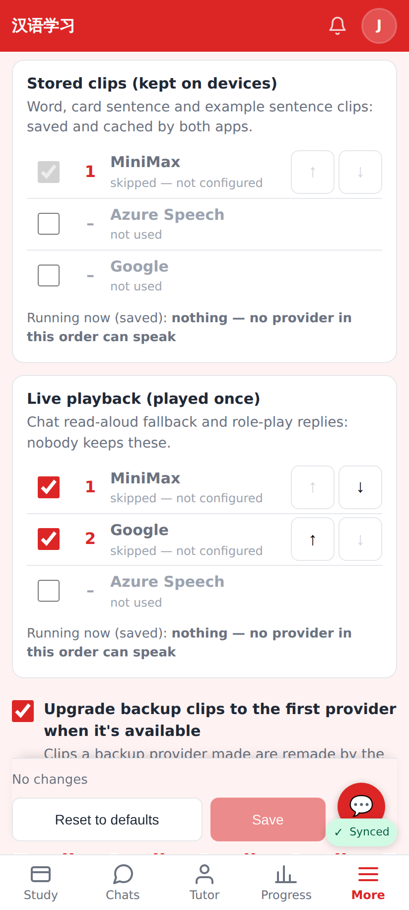
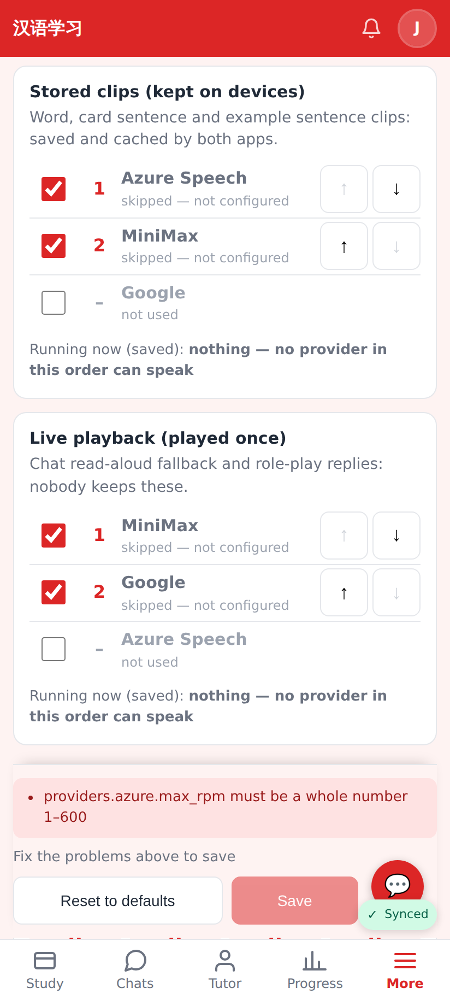
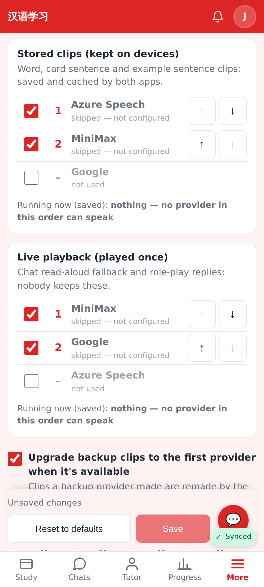
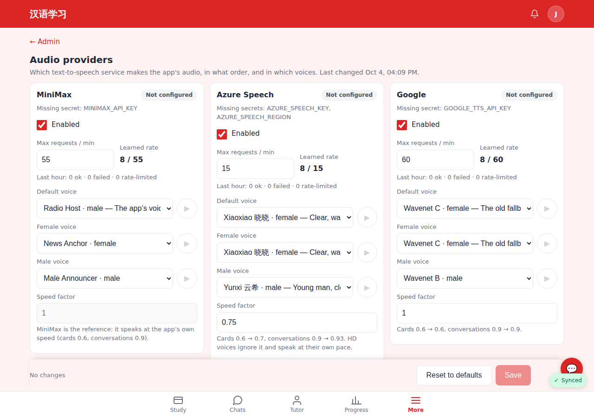

# /admin/audio — TTS providers

Phone shots at 412×915 (2×), local dev with no provider keys set (so every card says "Not configured").

The Admin page's new "🔊 Audio providers" row, first in the shortcuts.

Top of /admin/audio: a card per provider — status pill with the missing secret, Enabled, max RPM vs learned rate, last hour, voices per role with ▶ samples, speed factor (fixed at 1 for MiniMax). The Save bar is pinned above the tab bar.

Stored clips and Live playback orders: include checkbox, position, ↑ ↓ (44px), "skipped — not configured" notes and what is running now.

Azure added and moved to first, plus an invalid max RPM (0): the problem from `mergeTtsConfig` shows in the sticky bar and Save stays disabled.

The same edit with a valid value: "Unsaved changes", Save enabled.

At 1280×900 the three provider cards sit side by side.
