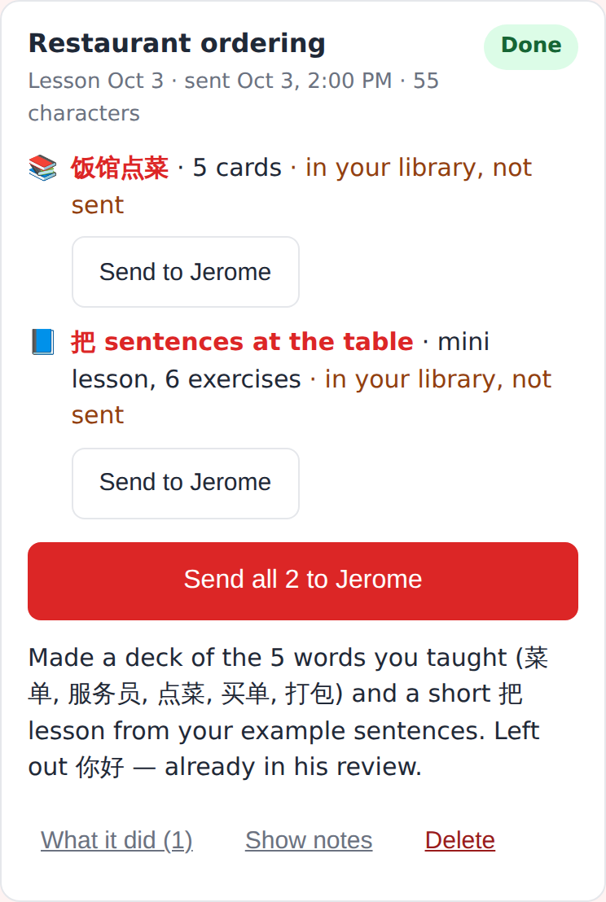
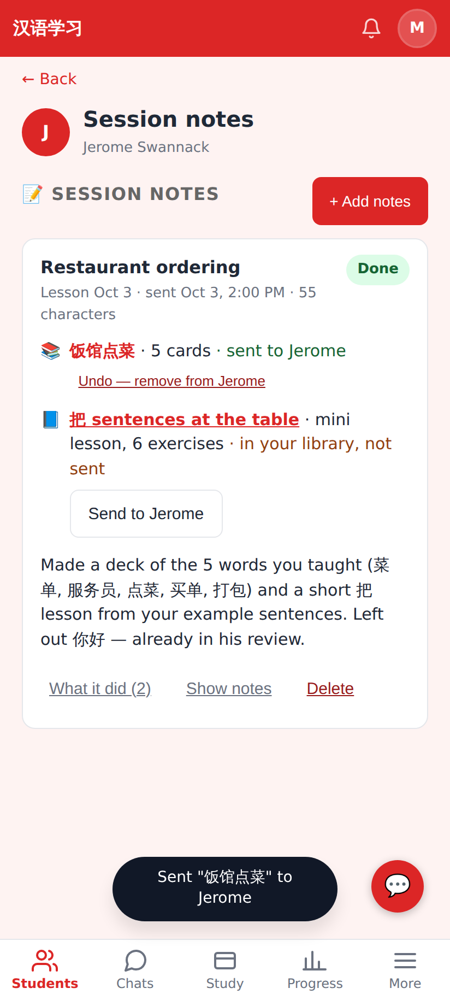
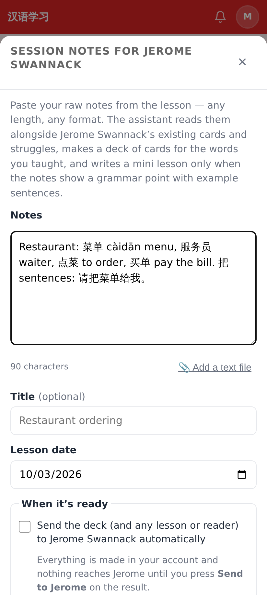

# Create, then send — screenshots (412×915 @2×)

A finished session-notes job: the deck and the mini lesson are in the tutor's account, each with **Send to Jerome**, plus **Send all 2 to Jerome**.

After pressing Send (and confirming): the deck reads "sent to Jerome" with Undo; the lesson still waits.

The session-notes sheet: "Send … automatically" is now OFF by default, with the hint that nothing reaches the student until Send.
