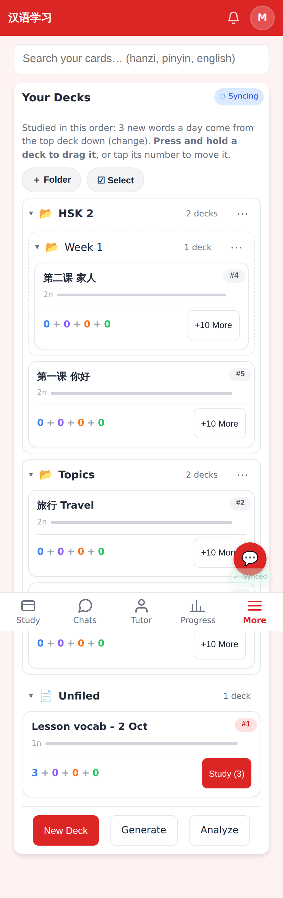
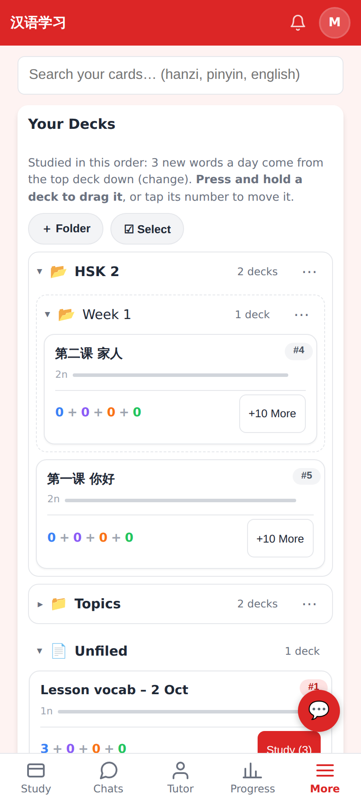
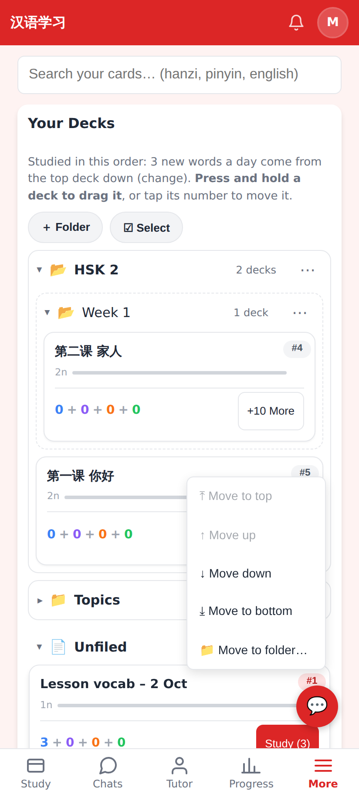
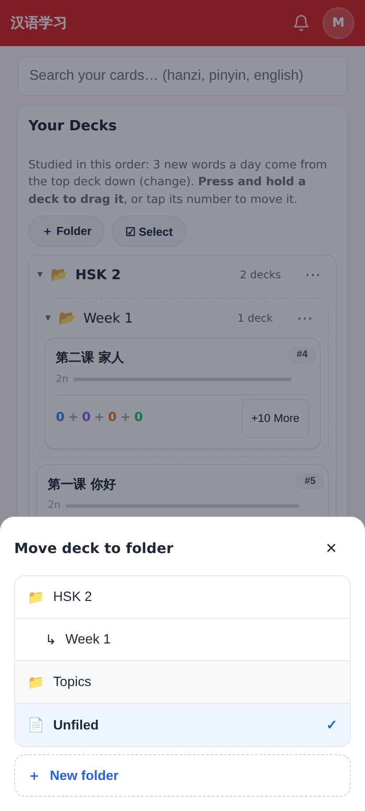
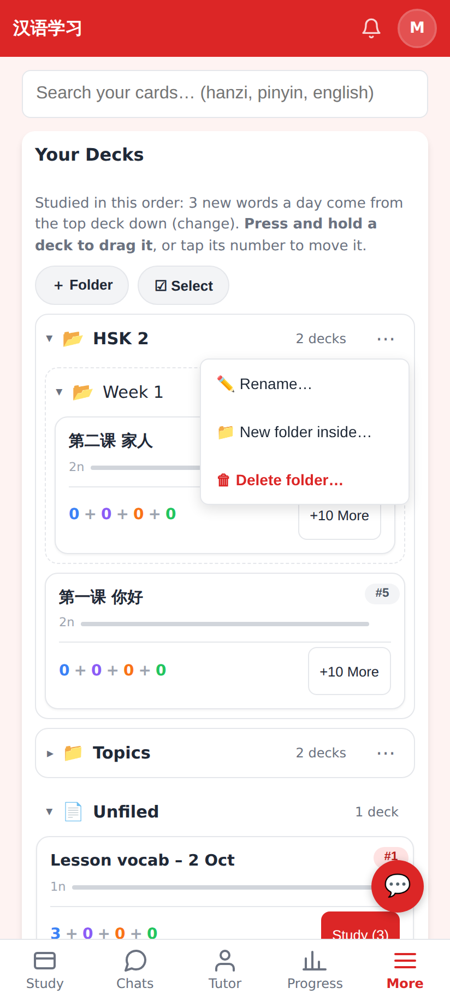
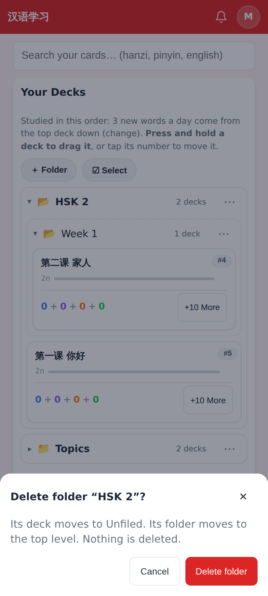
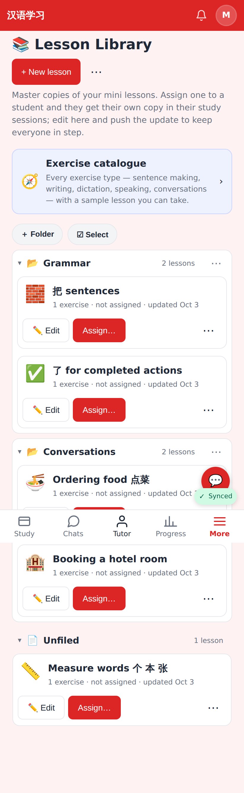
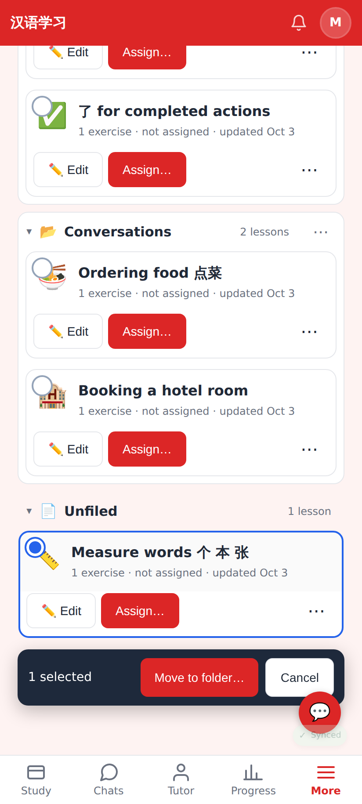
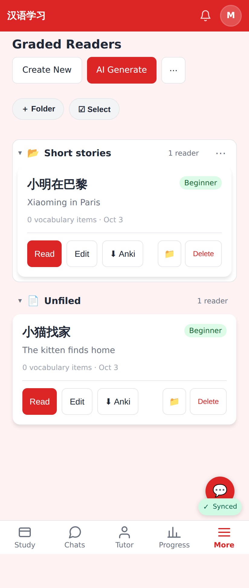

# Folders for decks, lessons and readers

Web (412×915, 2×):

More → Decks: HSK 2 (with a Week 1 subfolder), Topics, then Unfiled. #N badges stay the global study queue.

Topics collapsed — remembered on this device.

The deck's #N menu gains 📁 Move to folder… (opens upward near the bottom of the screen).

Move to folder: folders with subfolders indented, Unfiled ticked as the current place, ＋ New folder.

A folder's ⋯: Rename, New folder inside, Delete.

Delete confirm: the folder's own decks go to Unfiled, its subfolder to the top level, nothing is deleted.

Lesson Library grouped into Grammar / Conversations / Unfiled.

☑ Select → tap lessons → Move to folder….

Graded readers: 📁 button per story.
