# Compact Home + Notes from your tutor

Web shots at 412×915 (2×, folded Pixel Fold) unless noted; Lab shots are Roborazzi renders (412dp).

## Web

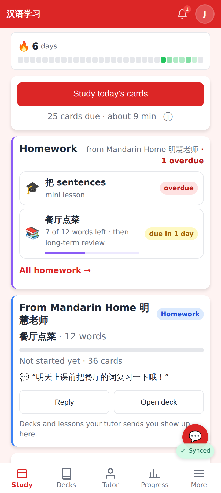
Before: two homework cards (the one-off list and the big "From <tutor>" card with Reply / Open deck buttons).

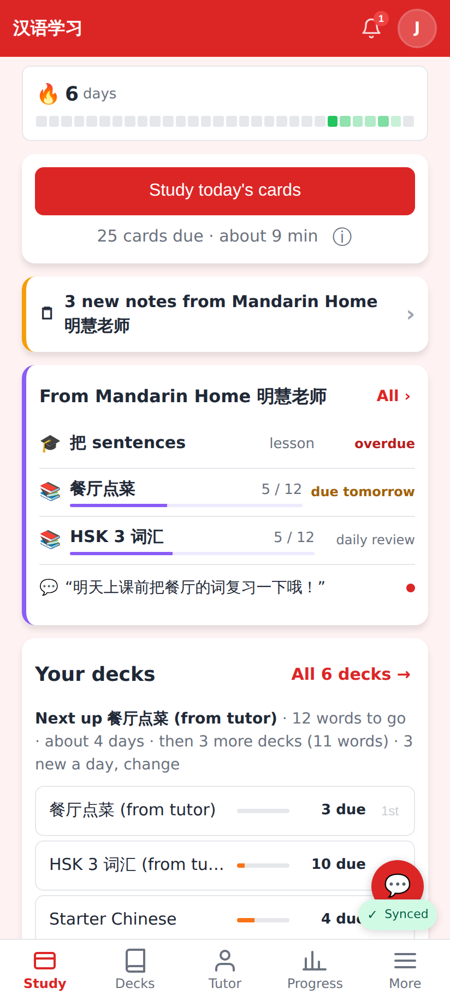
After: "🗒 3 new notes from …" row, then ONE compact card — a slim row per item with "5 / 12", a thin bar and the due label ("overdue", "due tomorrow", "daily review"); the unread message is one line. Deck rows are one line each.

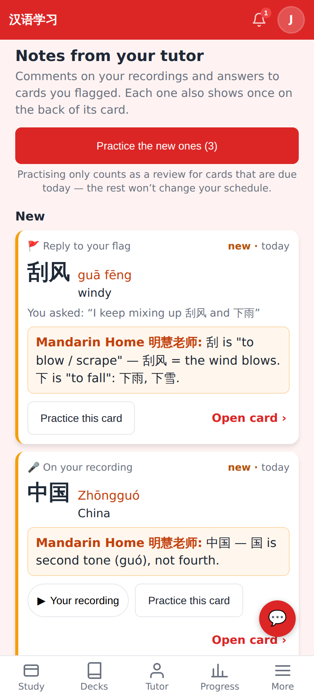
`/tutor-notes`: new notes first (then "Earlier"), each with the card, the tutor's comment, "You asked" for a flag, ▶ your recording, Practice this card, Open card.

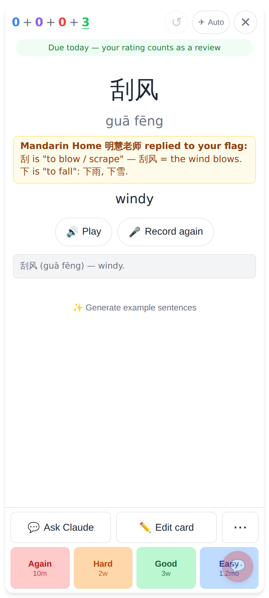
Practice, a card due today: the green line says the rating counts as a review; the tutor's note stays on the back.

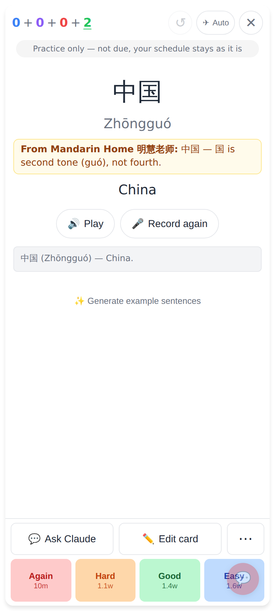
Practice, a card not due: "Practice only — not due, your schedule stays as it is"; nothing is written.

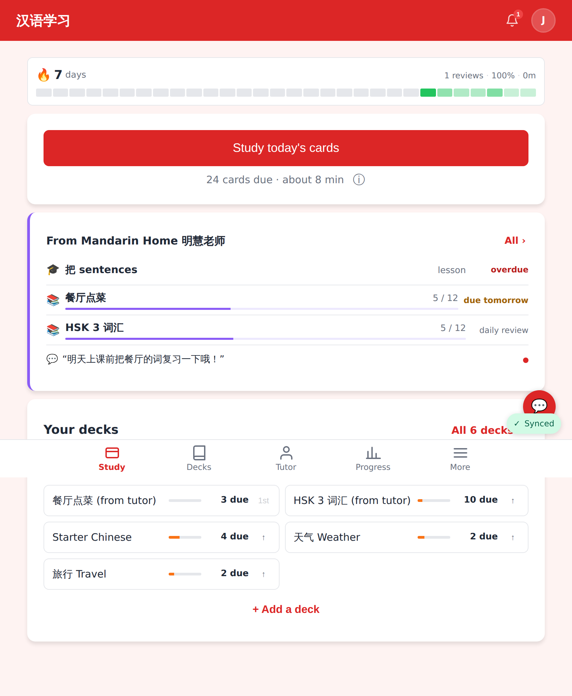
Home unfolded (841px): same compact card.

## Lab app

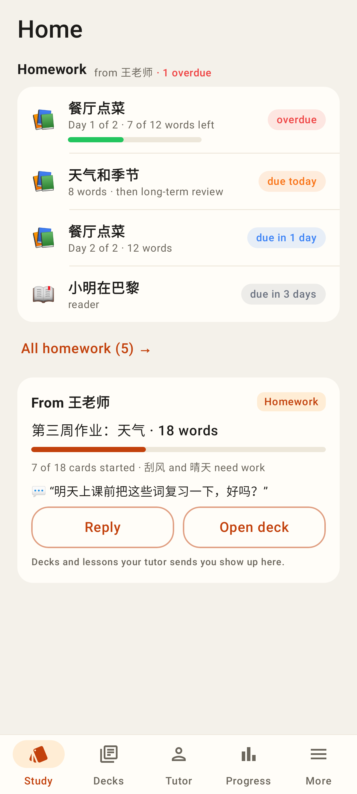
Before: the one-off list + the big "From <tutor>" card.

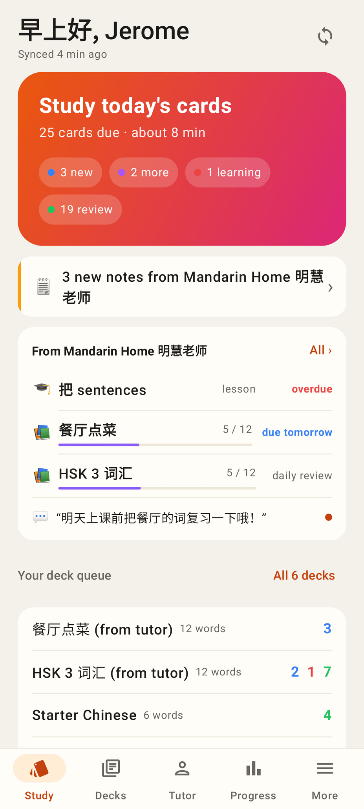
After: notes row, one compact homework card, five slim deck rows.

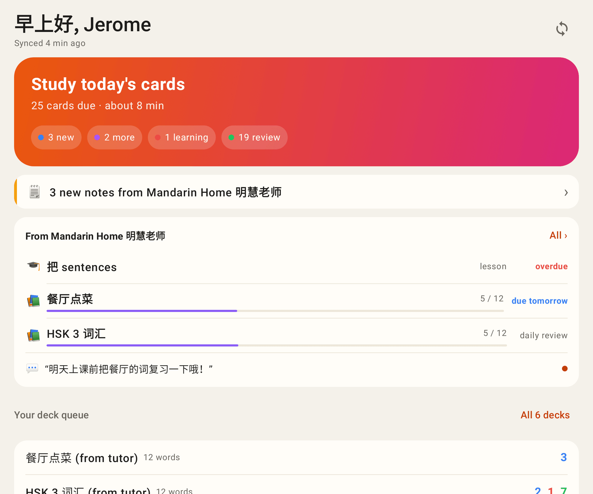
Unfolded.

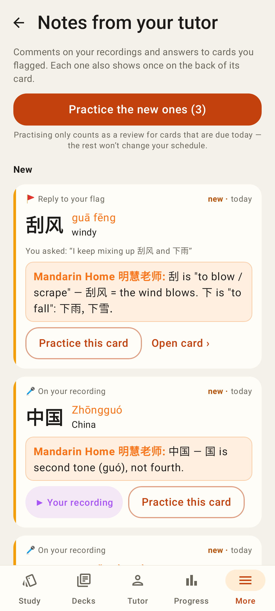
`/tutor-notes` in the Lab app.

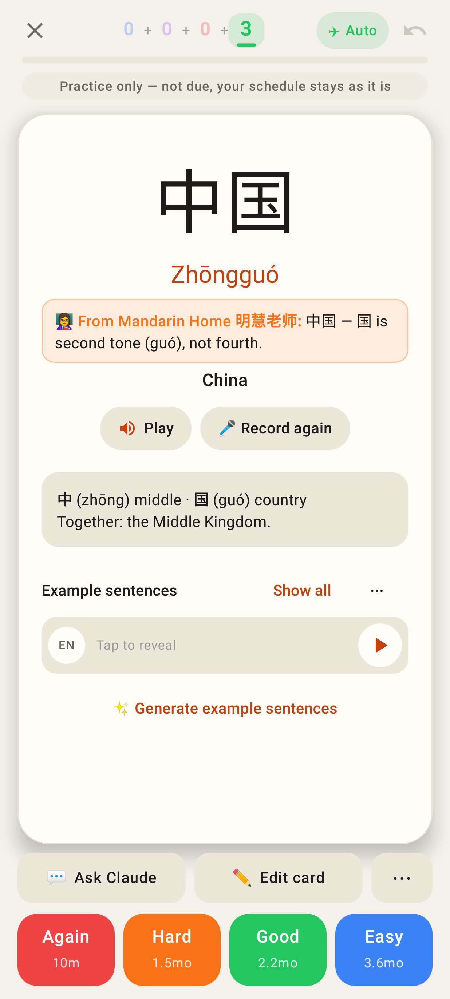
Practice, not due: practice only, note pinned on the back.

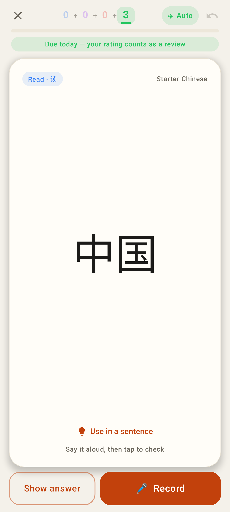
Practice, due today: the rating counts.

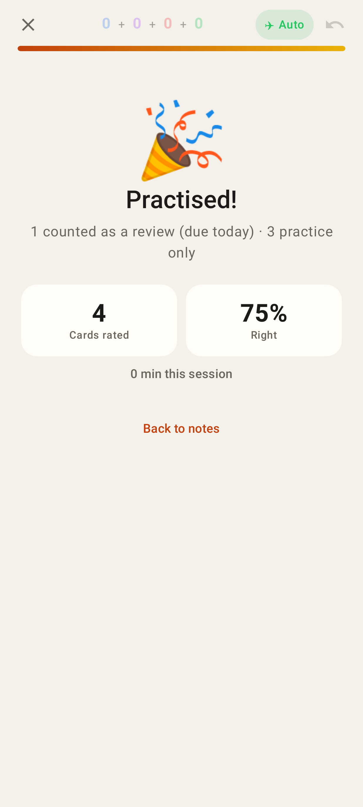
The end: "1 counted as a review (due today) · 3 practice only".
