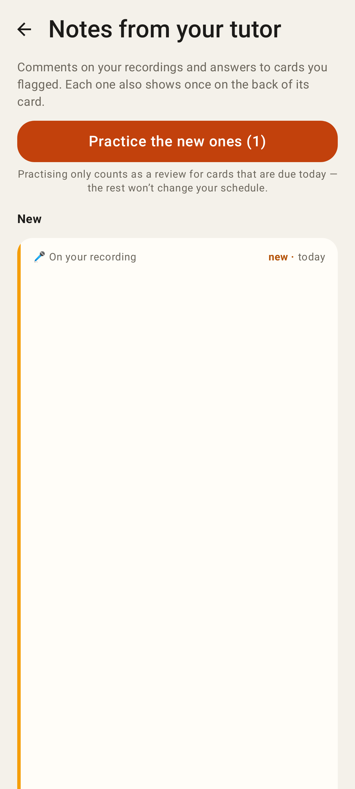
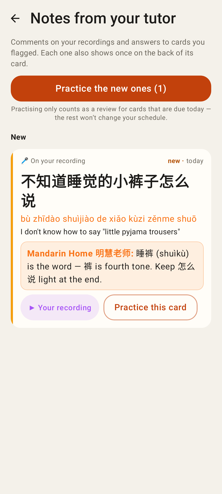
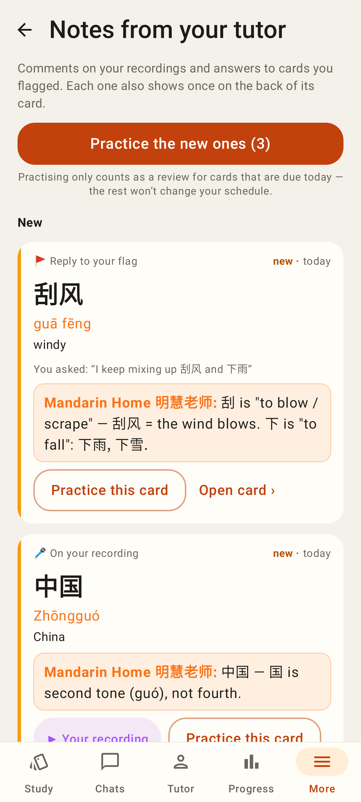
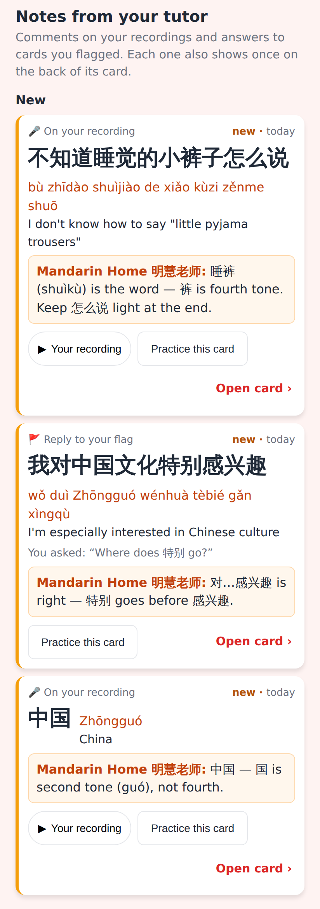
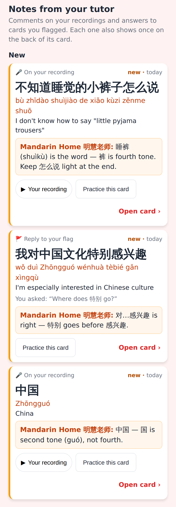

# Notes from your tutor — long-sentence note layout

Phone viewport, 412×915 dp at 2× / xxhdpi (Pixel Fold, folded).

## Lab app (Roborazzi, `TutorNotesLayoutTest` / `TutorNotesScreenshots`)

Before: the 28sp hanzi sat in a Row beside the pinyin / English column. The pinyin was measured 0 px wide and the card grew thousands of px tall. In Robolectric even the hanzi is squeezed out.

After: header, then the hanzi (wrapping), the pinyin, the English, the tutor's comment and the actions, stacked.

After: short words (刮风, 中国) on the regular page use the same stacked layout.

## Web (`TutorNotesPage.css`; the page's markup rendered with the app's CSS in Playwright)

Before: `flex-wrap` already moved long sentences onto separate lines, but short words still put the pinyin beside the hanzi.

After: always stacked, matching the Lab app. Long hanzi and pinyin may break anywhere.
