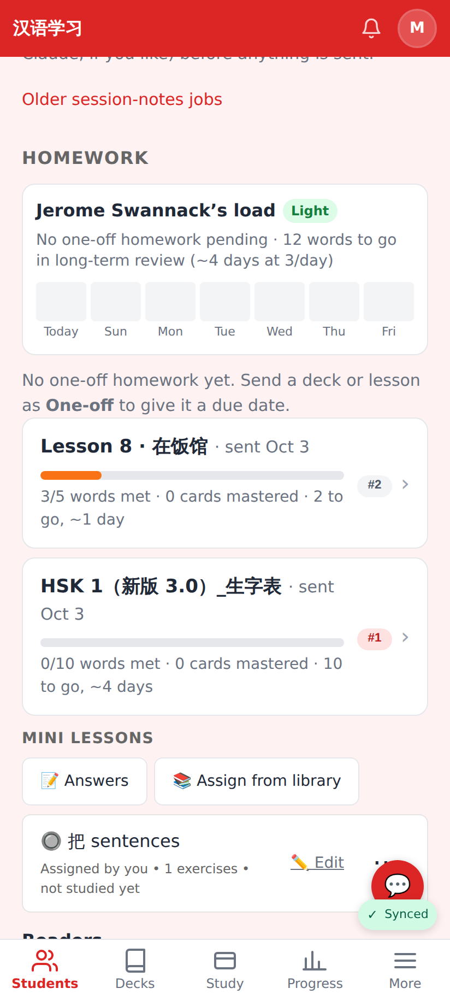
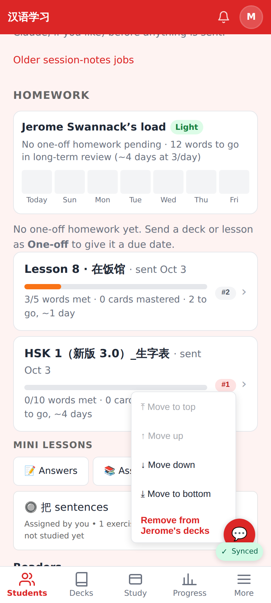
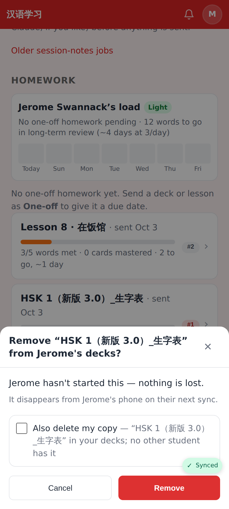
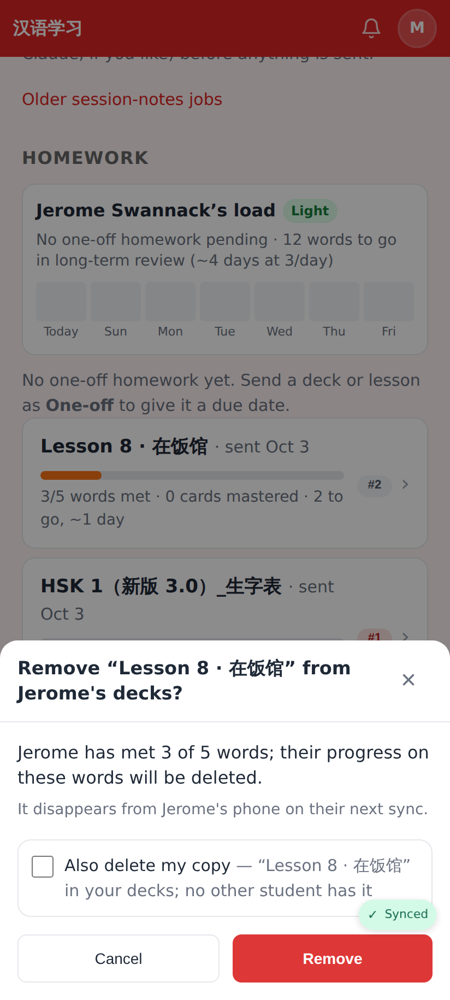
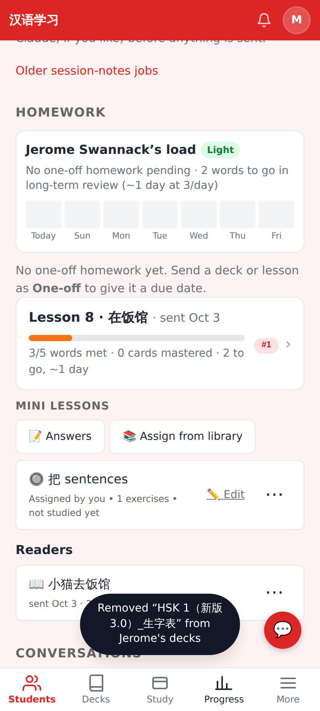
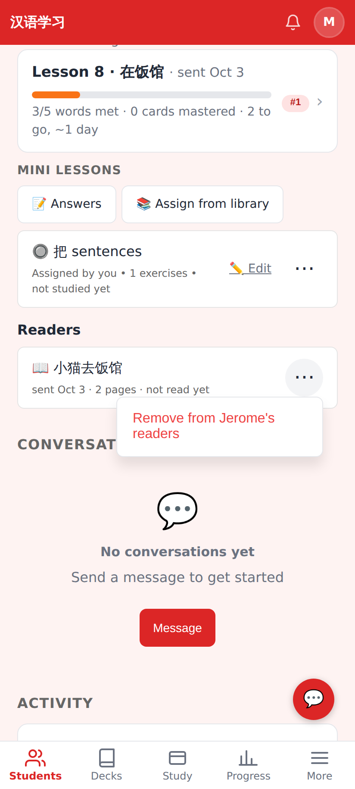
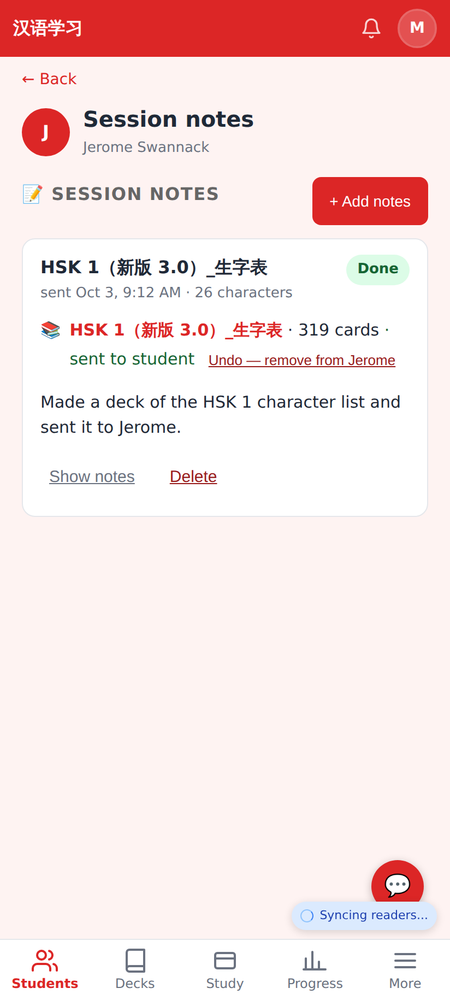
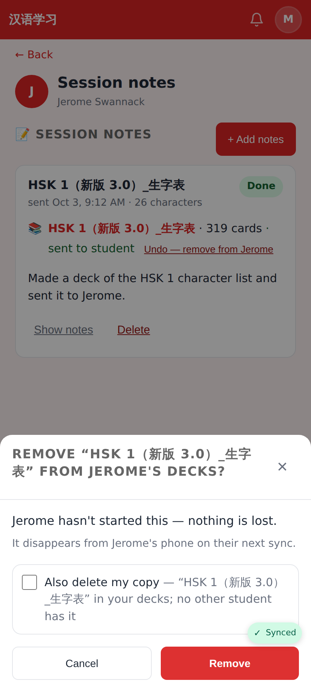
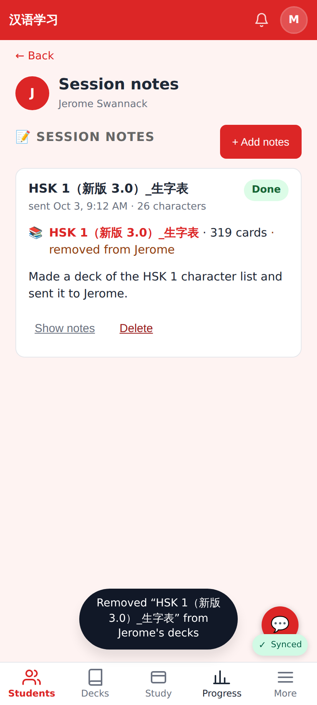

# Take homework back — screenshots (412×915 @2x)

## Web — tutor's student page

Homework list: an HSK deck sent by mistake (not started) and Lesson 8 (3 of 5 words met).

The #N queue menu on a homework deck now ends with **Remove from Jerome's decks**.

Confirm sheet when the student hasn't started: nothing is lost; "Also delete my copy" (no other student has it).

Confirm sheet when the student has started: says how much progress goes.

After removal: toast, the row is gone (the load gauge updates too).

Assigned mini lessons and the new **Readers** list have a ⋯ with "Remove from Jerome's …".

## Web — session-notes job card

A job that sent a deck: **Undo — remove from Jerome**.

Same confirm sheet from the job card.

Afterwards the job card says "removed from Jerome".
