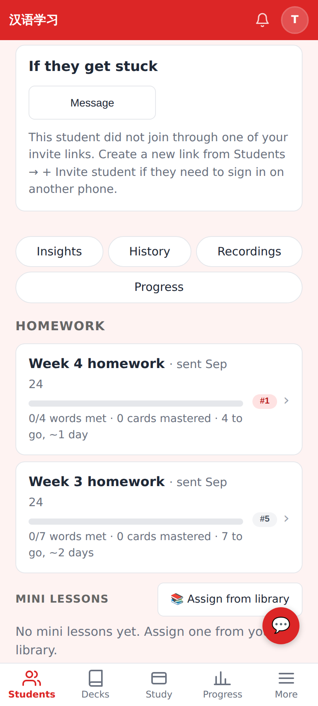
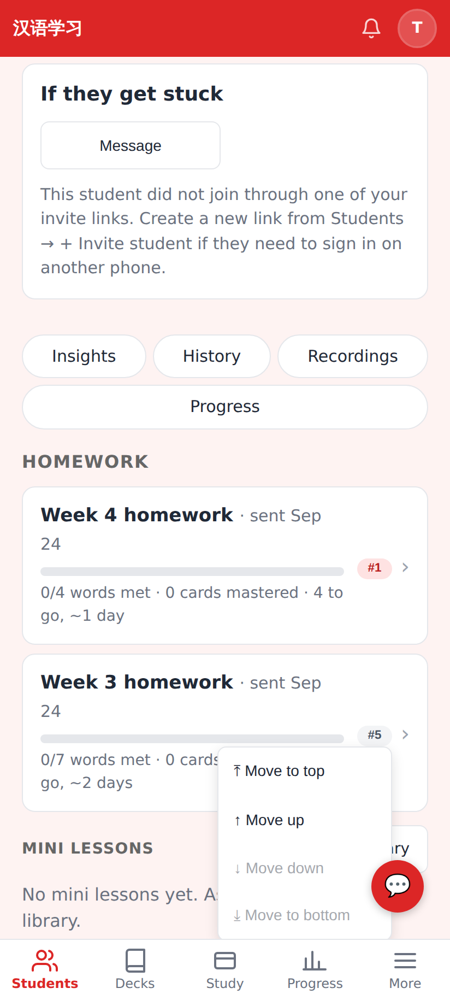
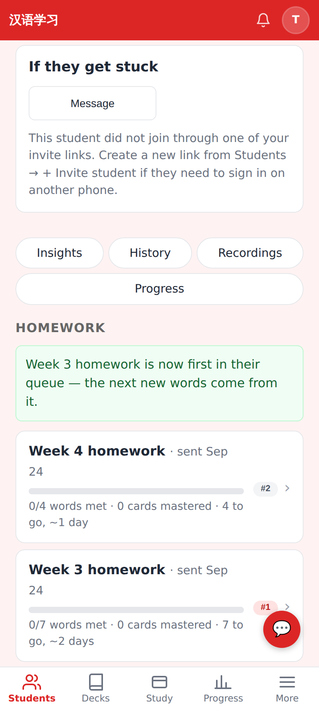
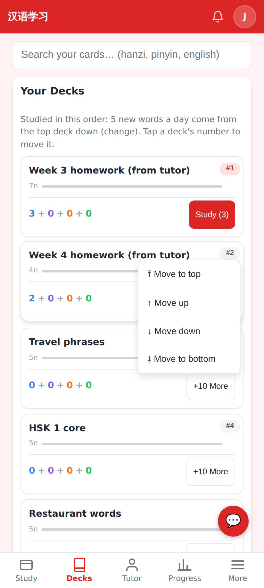

# Tutor reorders the student's queue — PR screenshots

Captured at 412×915 @2× from this branch running locally in E2E test mode. Tutor **Tutor Li** looking at student **Jerome**, who has three own decks and two homework packets.

**Homework rows with the queue badge.** Each packet now shows its place in the student's whole deck queue (#1 of 5 = the deck their next new words come from; #5 = last).

**Tap the badge → Move to top / up / down / bottom.** Moves that make no sense (down / bottom for the last deck) are greyed out.

**After "Move to top"**: the note says "Week 3 homework is now first in their queue — the next new words come from it", the badges swap, and the student's device picks the new order up on its next sync.

**Student's Decks tab, unchanged in behaviour** — it now uses the same `QueuePositionMenu` component as the tutor's page.

