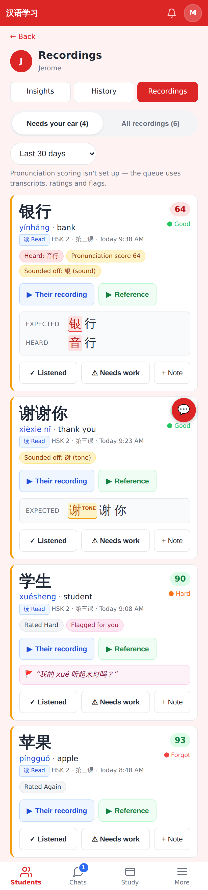
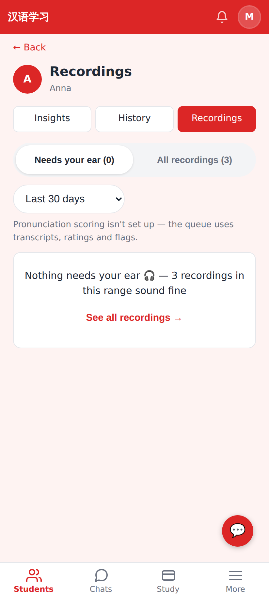
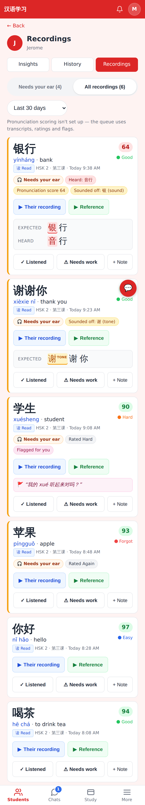
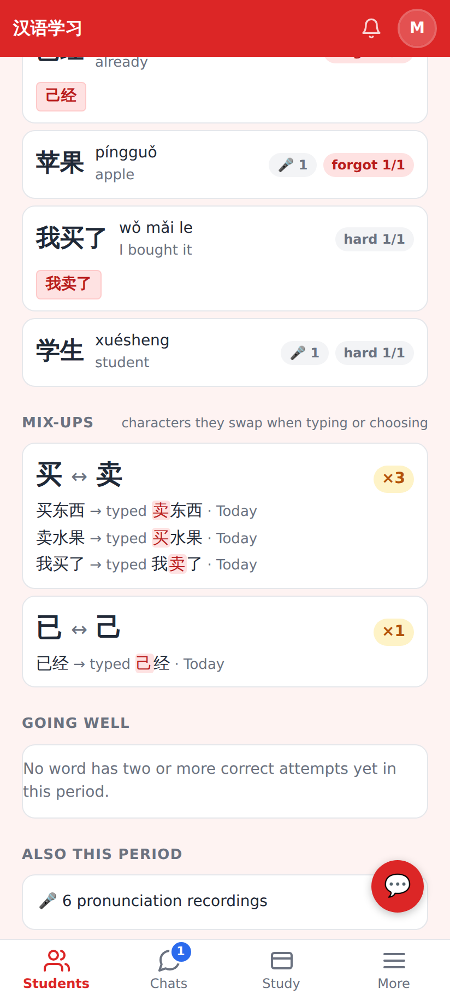
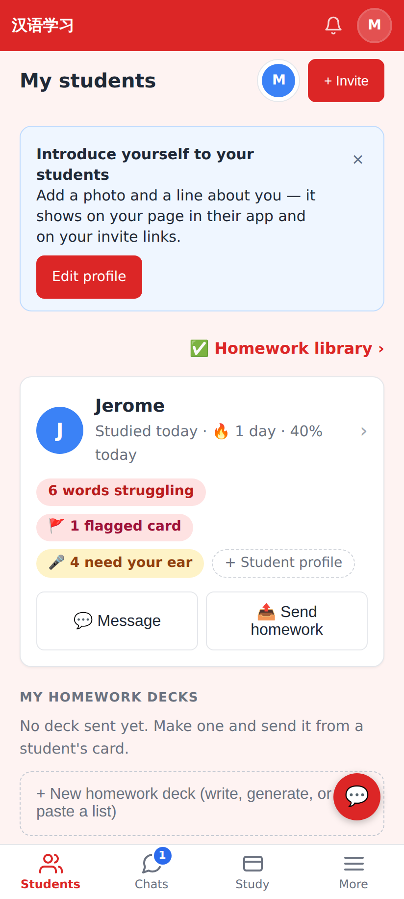
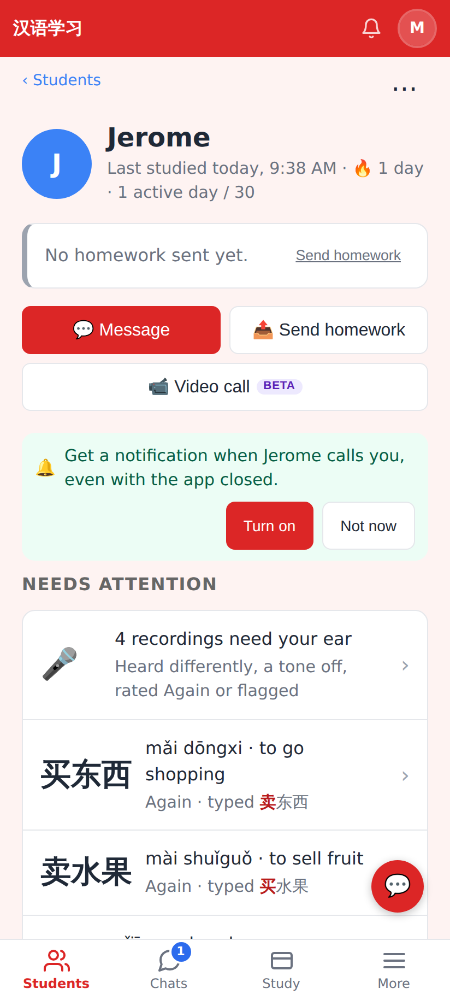
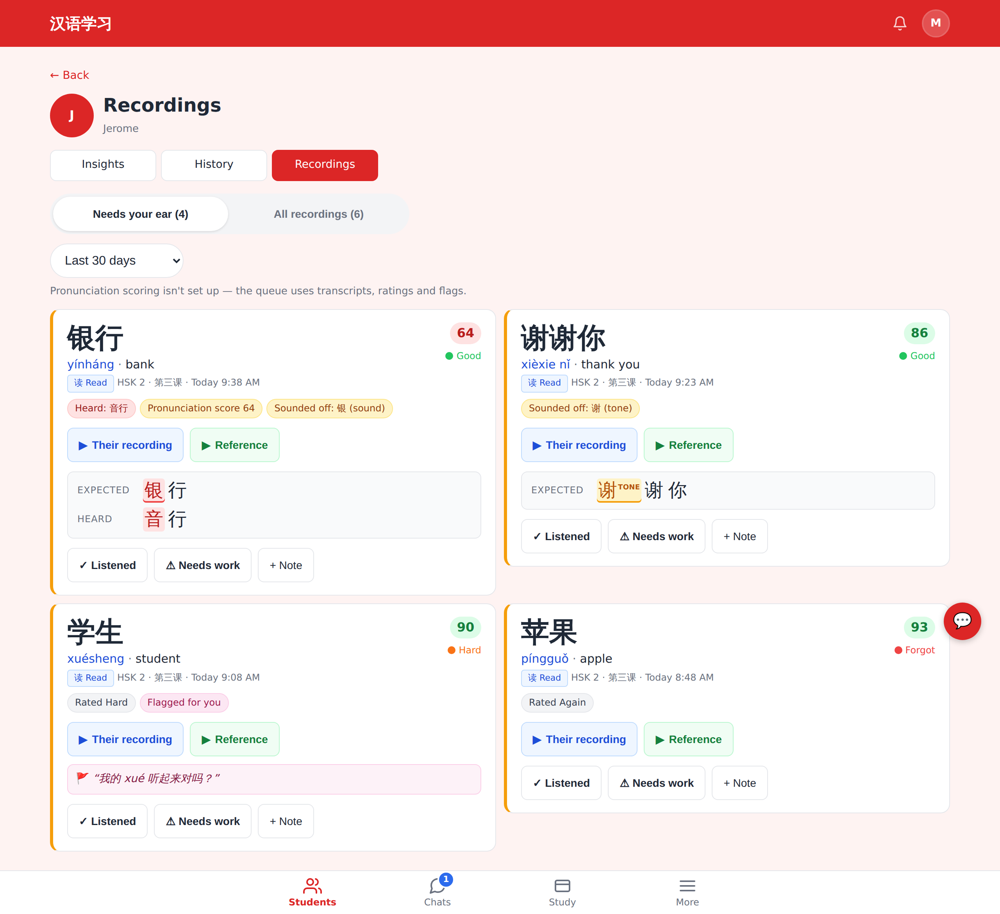

# Needs your ear — tutor recording review queue

Phone shots at 412×915 @2x; one desktop shot at 1280 px. Local dev has no Azure key, so the "scoring isn't set up" note shows; the scores and weak characters come from seeded checks.

The queue (default tab) shows heard-differently (音行 vs 银行, wrong char in red), a weak tone char (谢, amber "tone" tag), flagged + Rated Hard (with the student's flag message) and Rated Again.

An empty queue: "Nothing needs your ear 🎧 — 3 recordings in this range sound fine" with a link to All recordings.

All recordings: every take, unmarked first; queue items carry a "🎧 Needs your ear" badge.

The Insights Mix-ups section (买 ↔ 卖 ×3, 已 ↔ 己 ×1) with the words it happened in.

Students dashboard card: "🎤 4 need your ear".

The student page's Needs attention starts with "4 recordings need your ear".

The queue at ≥1024 px (two-column grid).
