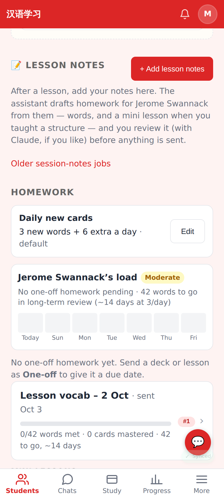
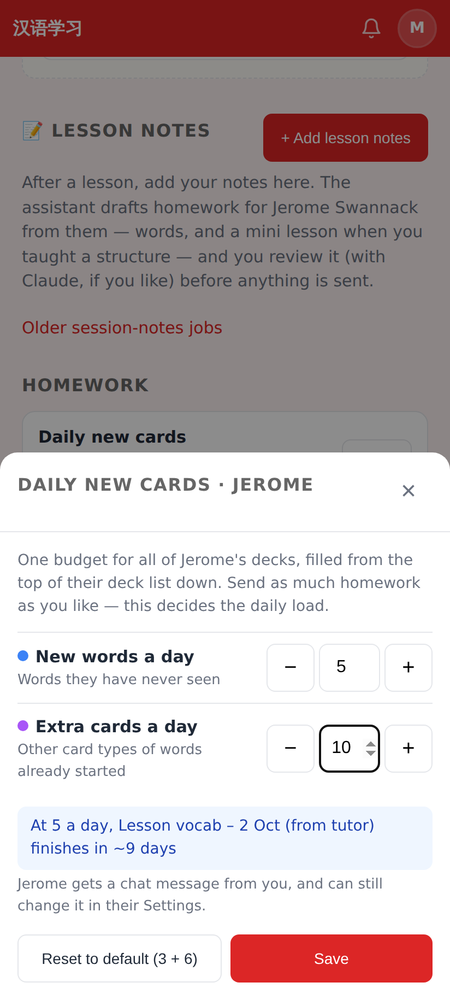
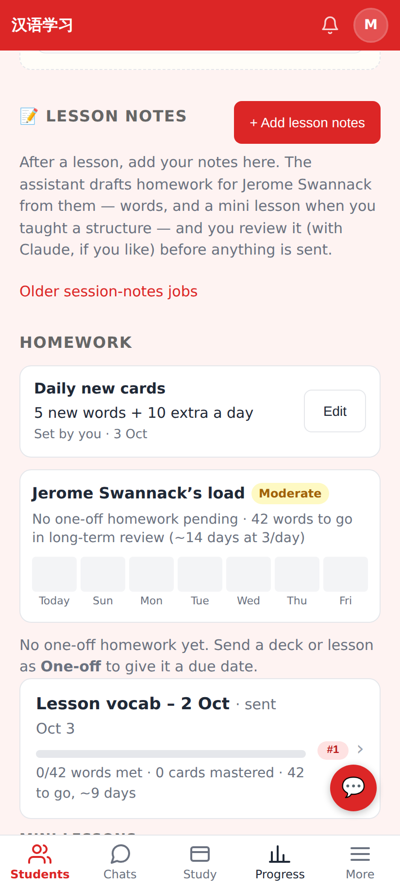
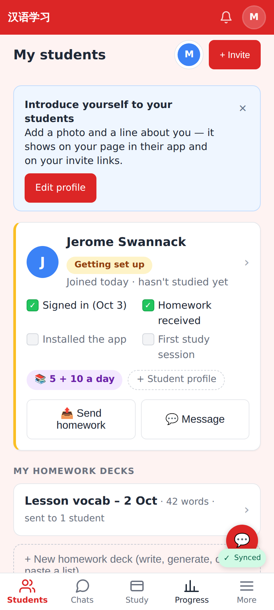
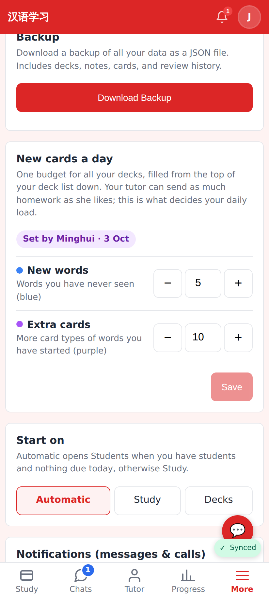
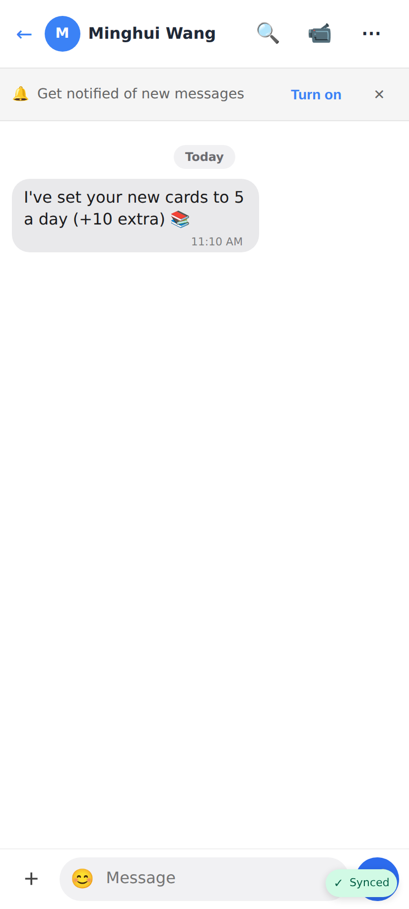
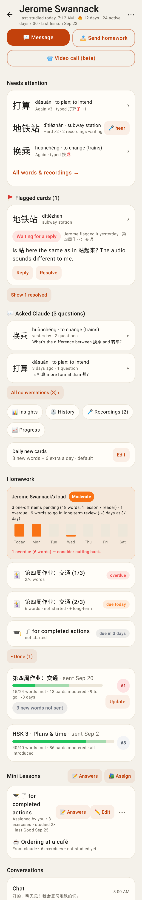
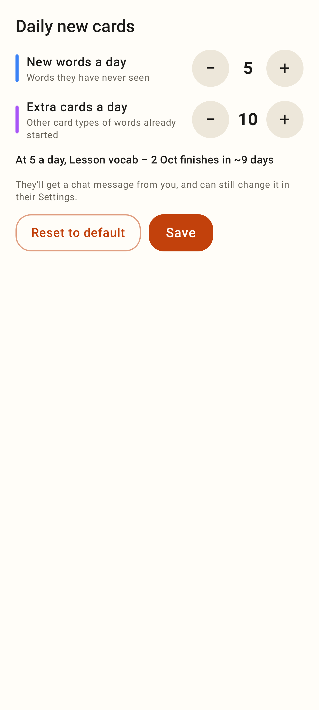
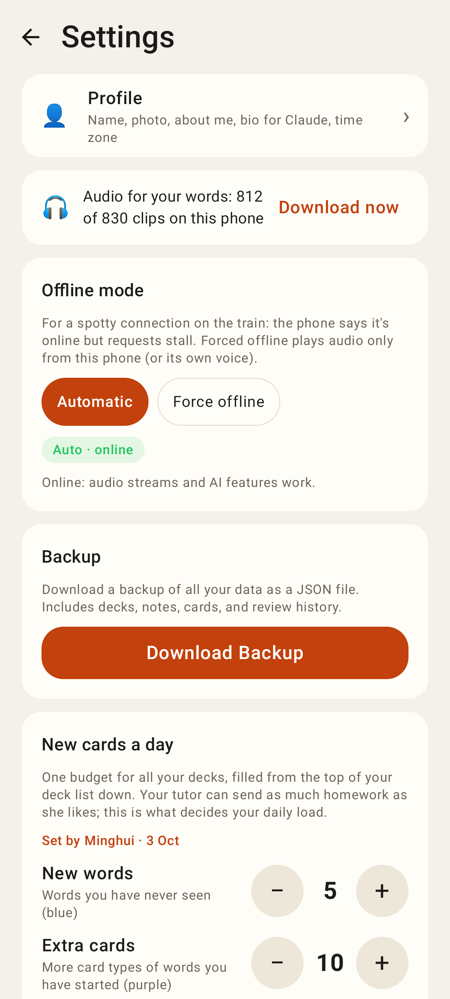
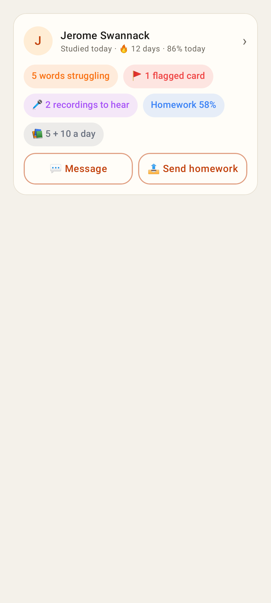

# Tutor sets a student's daily new cards

Phone viewport 412×915 @2×. Seeded: tutor Minghui Wang, student Jerome, a 42-word homework deck "Lesson vocab – 2 Oct".

## Web

Student page → Homework: the new **Daily new cards** row (default 3 + 6) with Edit.

Edit: "New words a day" (blue) and "Extra cards a day" (purple) steppers, the live hint from the student's queue, Reset to default, Save.

After saving 5 + 10: "Set by you · 3 Oct".

Students dashboard: a compact "📚 5 + 10 a day" chip when the budget isn't the default.

The student's Settings → New cards a day: the tutor's numbers with "Set by Minghui · 3 Oct". The student can still change them (last write wins).

The chat message the tutor's change posts (normal send path: unread badge, push).

## Lab app (Roborazzi)

Student page: "Daily new cards" row with Edit.

The sheet's content: blue / purple steppers, live hint, Reset to default, Save.

Student Settings: "Set by Minghui · 3 Oct".

Students dashboard chip "📚 5 + 10 a day".
