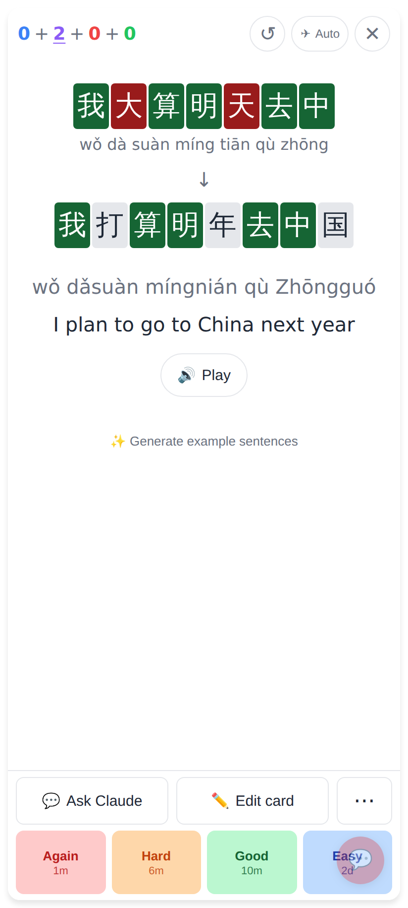
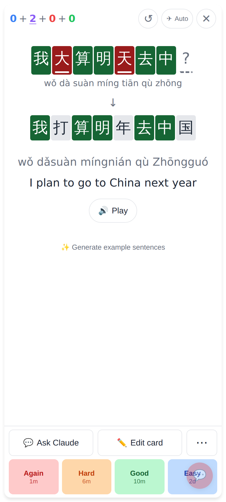
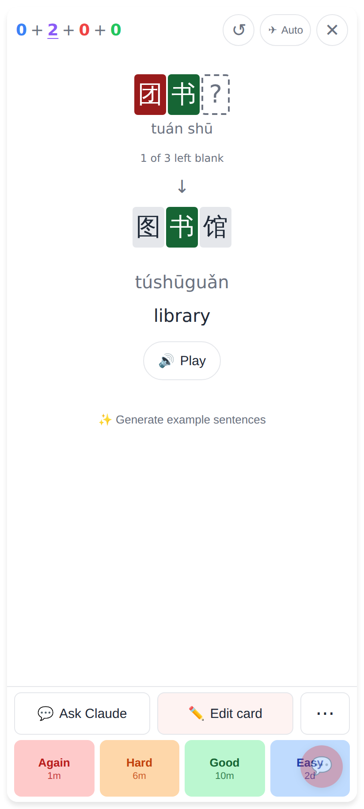
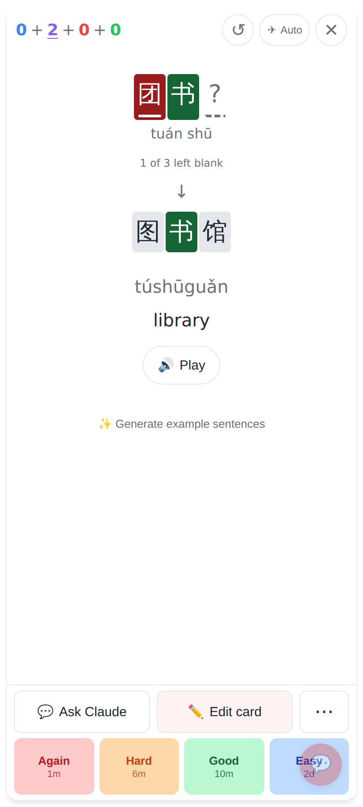
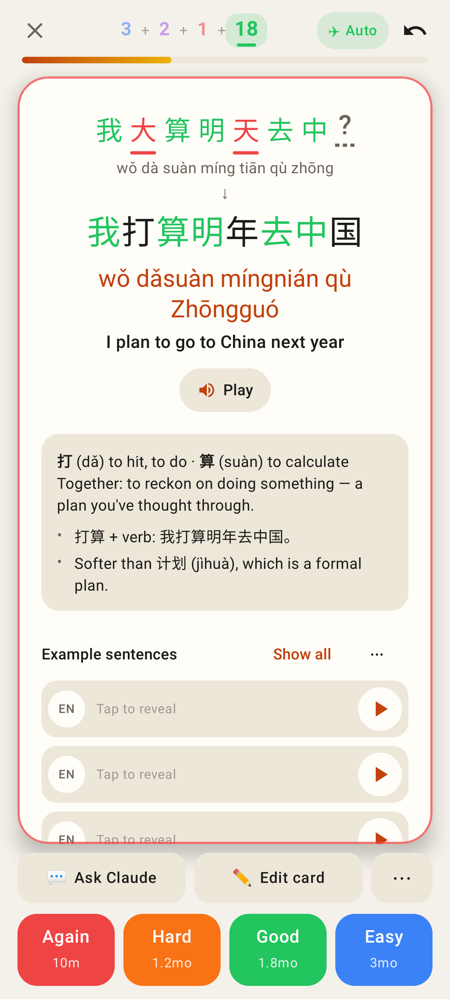
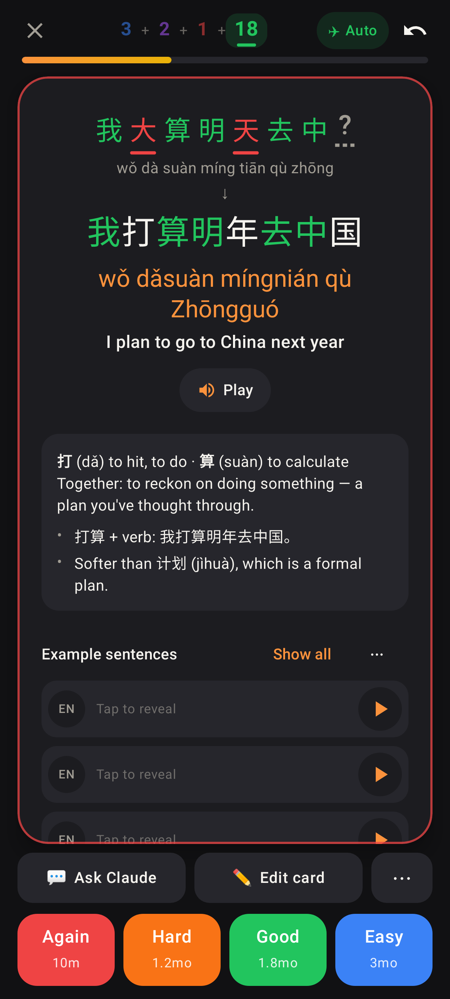
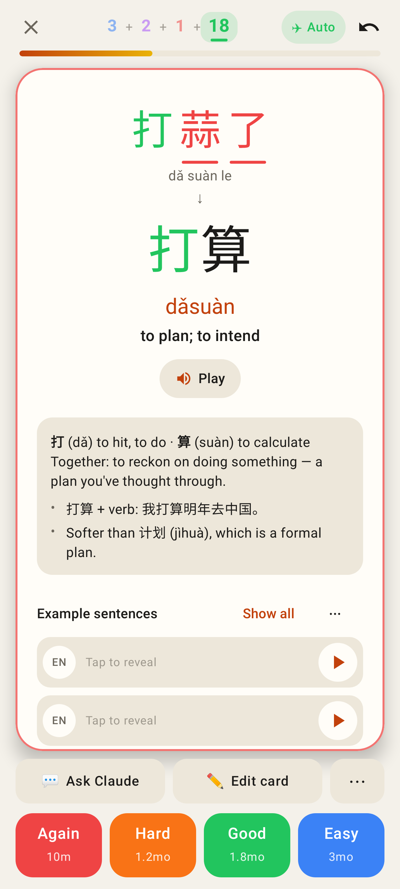
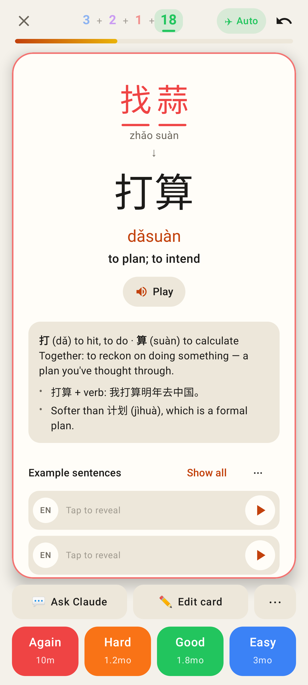
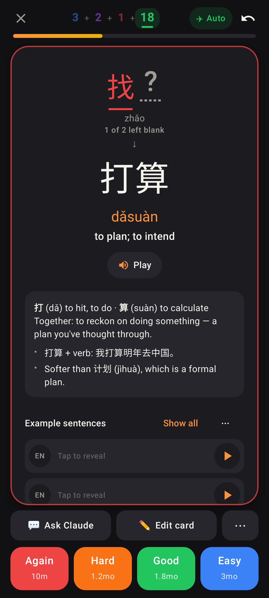

# Wrong characters: red AND underlined

Solid underline = wrong (or extra) character; dashed underline under a "?" = a character not typed / a
multiple-choice row left blank; correct characters stay green with no underline.

## Web app (412×915 @2×)

Before — a wrong typed answer: colour only; a missing character wasn't shown at all.

After — 大 and 天 underlined, the missing last character a "?" with a dashed underline.

Before — multiple choice: the blank row was a dashed box.

After — the wrong pick 团 underlined, the blank row a "?" with a dashed underline.

## Lab app (Roborazzi)

Typed sentence: two wrong characters underlined in red, one missing (dashed).

Same, dark mode.

One character too many: 蒜 and the extra 了 both red + underlined.

Multiple choice, both picks wrong.

Multiple choice, one wrong and one left blank, dark mode.
