# Unlockable mini lessons — podcast companions

Phone viewport (412×915). Web = the dev server with E2E_TEST_MODE (fake lesson writer + silent voices); Lab = Roborazzi.

## Lab app

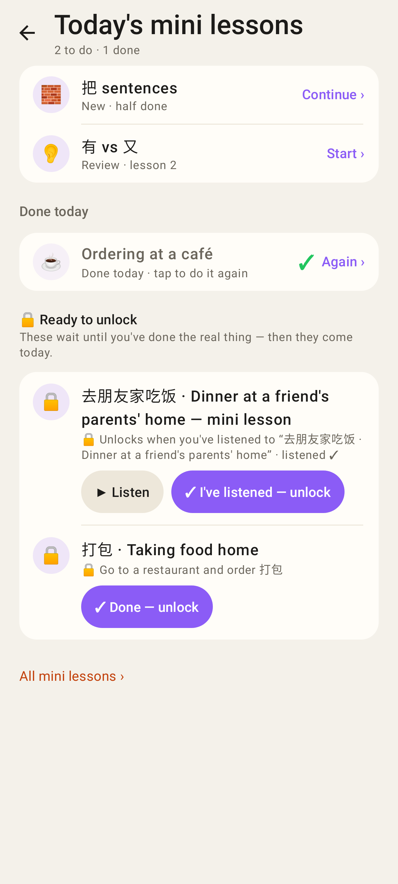
Home → Mini lessons → Today's mini lessons: "🔒 Ready to unlock" (podcast companion with ▶ Listen + "✓ I've listened — unlock", a manual task with "✓ Done — unlock"); "All mini lessons ›" stays as a smaller link below.

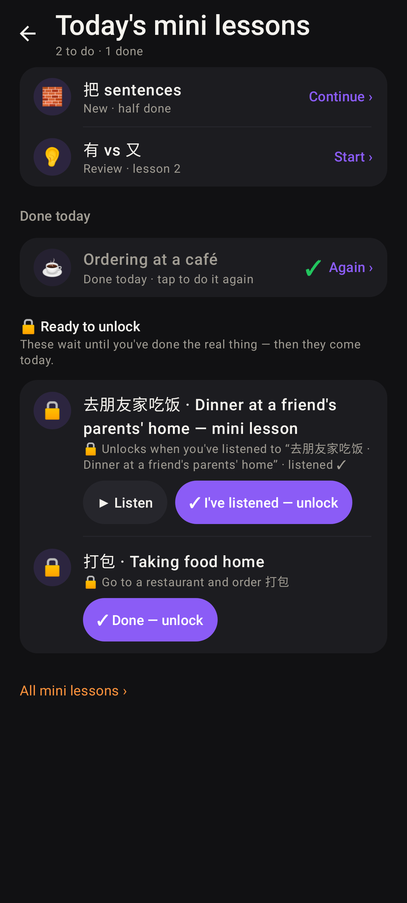
Same, dark.

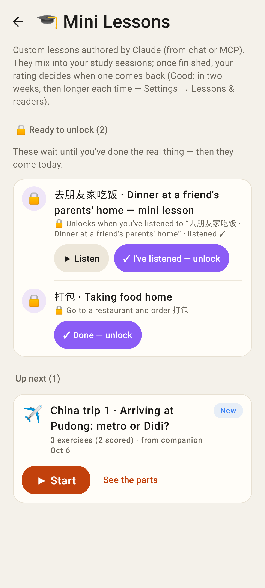
`/lessons`: the 🔒 group on top; locked lessons are not in Up next.

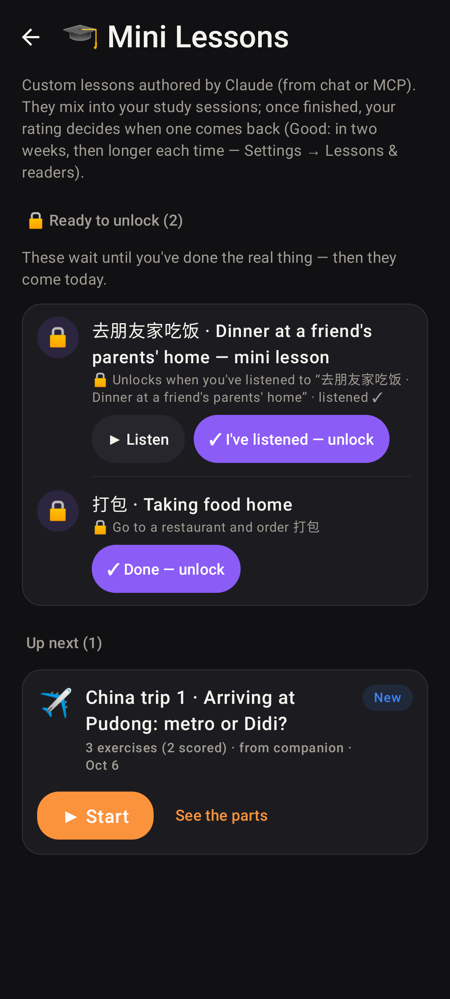
Same, dark.

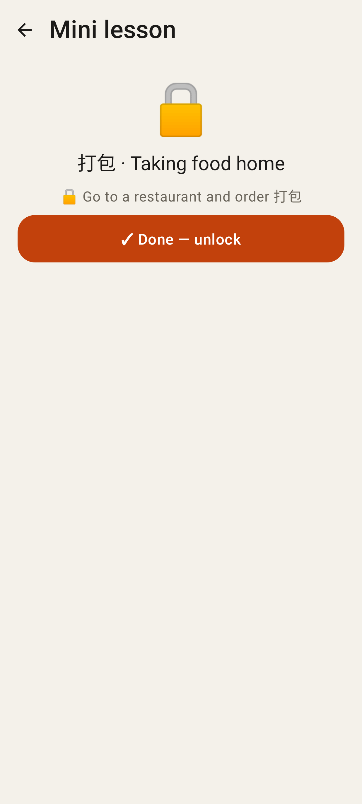
A locked lesson opened directly: what unlocks it + the button.

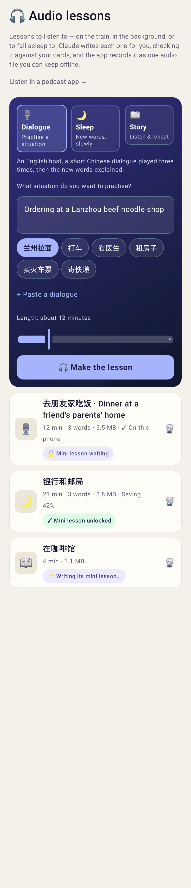
Audio lessons list: "🔒 Mini lesson waiting" / "✓ Mini lesson unlocked" / "✨ Writing its mini lesson…".

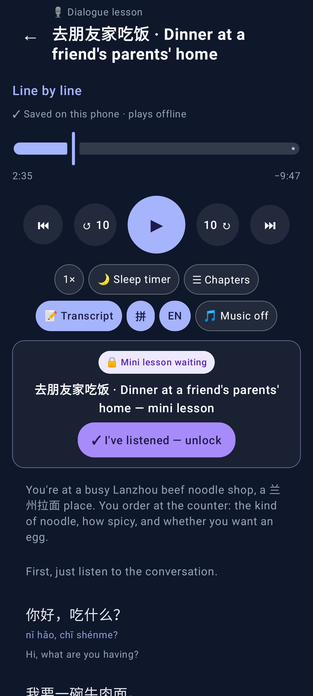
Player: the companion waits, with the unlock button.

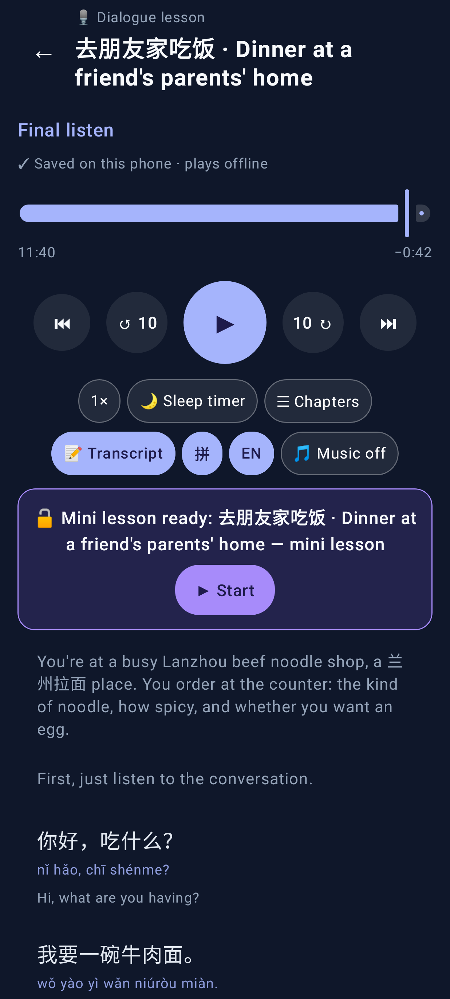
Player after the listen reached the Final listen: "🔓 Mini lesson ready: … → ▶ Start".

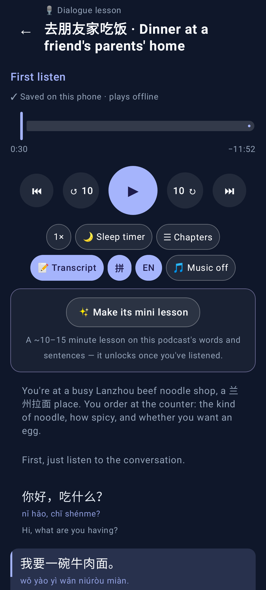
Player of a podcast without one: "✨ Make its mini lesson".

## Web

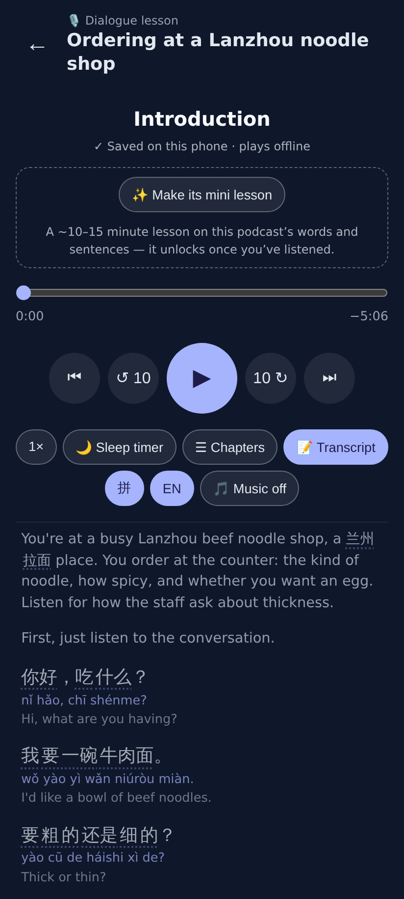
Player: "✨ Make its mini lesson".

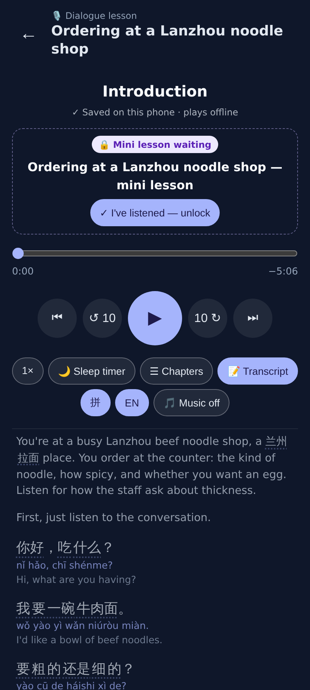
Made (locked to this podcast): "🔒 Mini lesson waiting".

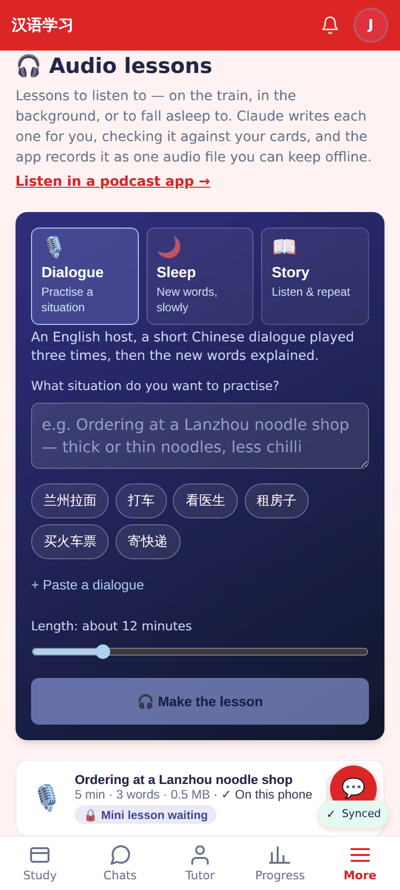
Audio lessons list with the companion badge.

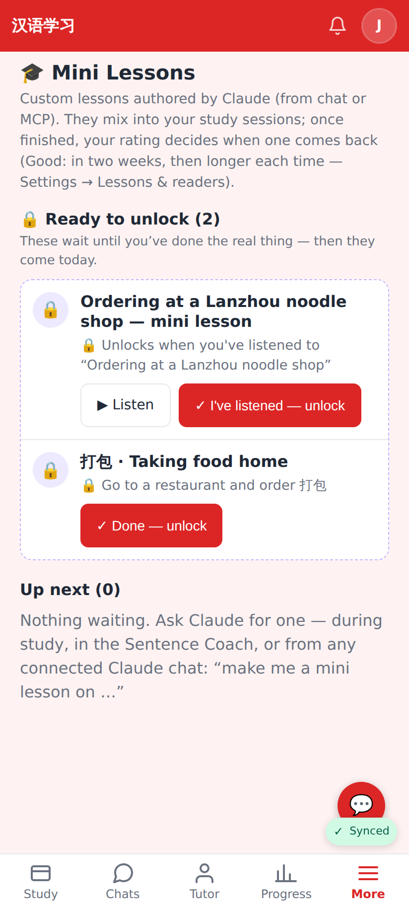
`/lessons`: "🔒 Ready to unlock" with ▶ Listen and the unlock buttons; Up next is empty (locked lessons never take the daily place).

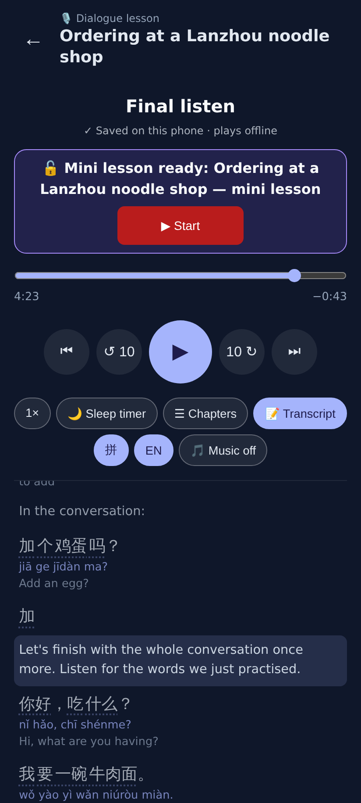
Listened into the Final listen → unlocked automatically → "Mini lesson ready → ▶ Start".

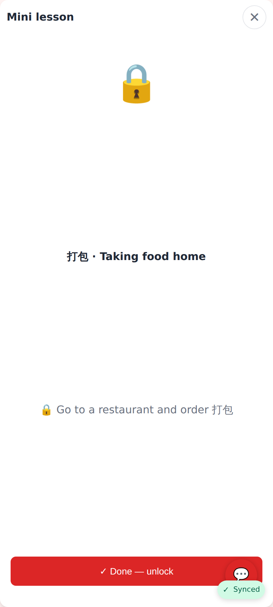
A locked lesson opened by link.

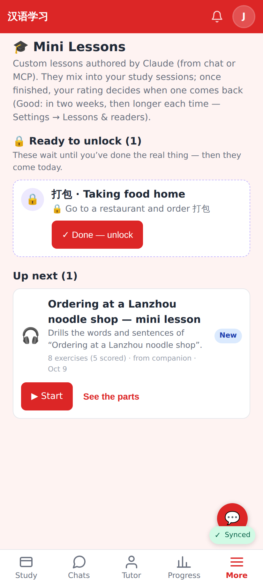
After the listen: the companion moved to Up next; the manual one still waits.
