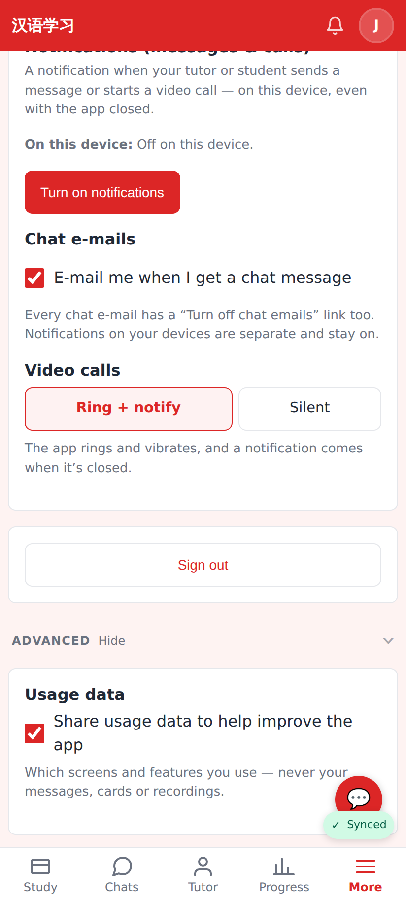
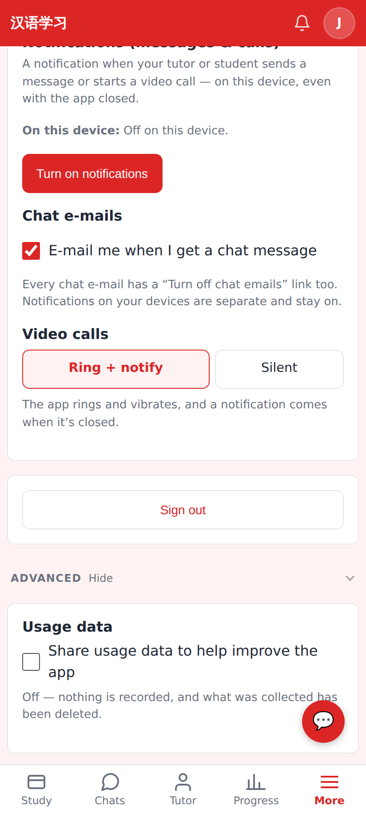

# Usage analytics — screenshots

Settings → Advanced, phone viewport (412×915 @2×).

*Settings → Advanced → Usage data, on by default.*

*Turned off: nothing is recorded and the server deleted what it had (`share_usage: false` on /api/auth/me).*
