# Chat page clean-up — PR screenshots

Captured on the dev server with Playwright at the phone viewport (412×915, 2×) with a seeded
tutor (王老师) ↔ student (Xiao Ming) conversation and the student's Claude practice chat. The
container has no AI/TTS keys, so every AI tool fails — which is exactly what the inline error
states show. The red bubble at the bottom-right is the shared feedback FAB (unchanged).

## Before

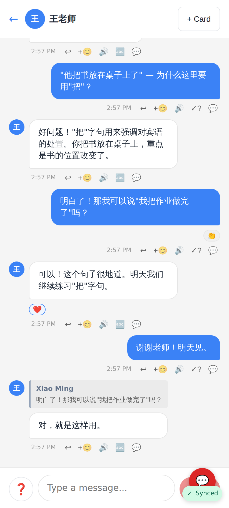

Student view before: five 20–34px tool icons under every message.

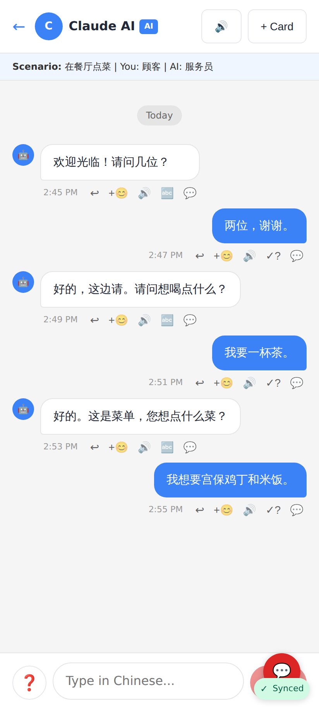

Claude practice chat before: same tool row, ❓ button by the composer.

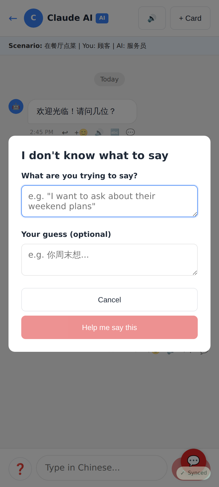

The ❓ dialog before, titled "I don't know what to say".

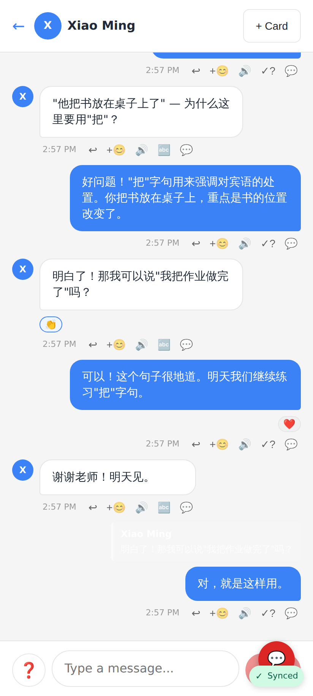

Tutor view before: the tutor's own messages get "Check my Chinese" (✓?), the student's get Translate.

## After — student view of the tutor chat

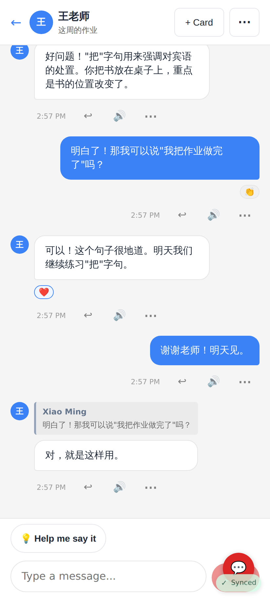

Inline per message: Reply, Play and ⋯ at 44px. Header: + Card, ⋯ (conversation menu); the conversation title sits under the tutor's name. "Help me say it" above the composer.

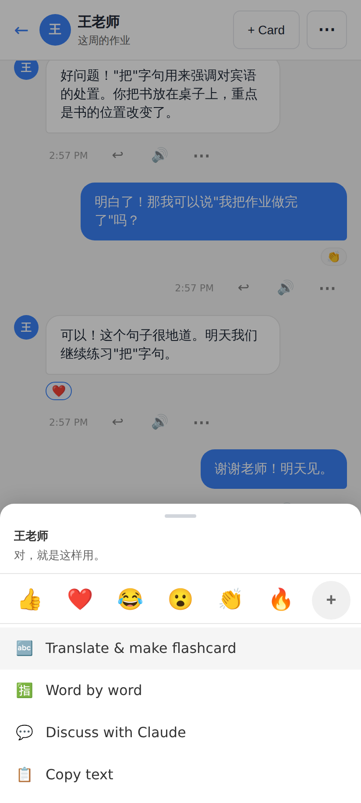

⋯ / long-press on the tutor's message: reactions row, Translate & make flashcard, Word by word, Discuss with Claude, Copy text.

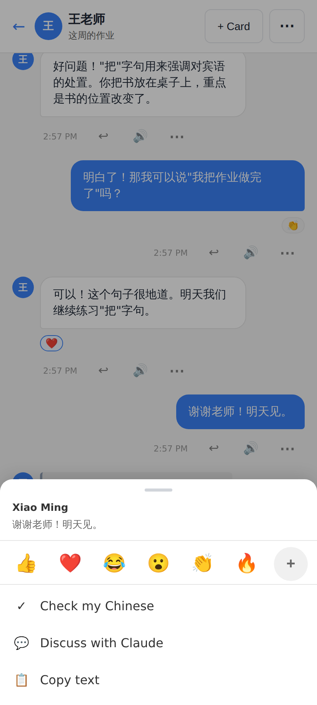

On the learner's own message: Check my Chinese instead of Translate.

"Checking…" spinner on the message while Check my Chinese runs.

Failed check: Coach-style inline error above the input row instead of an `alert()`.

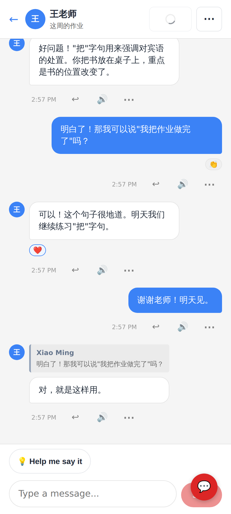

+ Card shows a spinner inside the button (label no longer turns into "…").

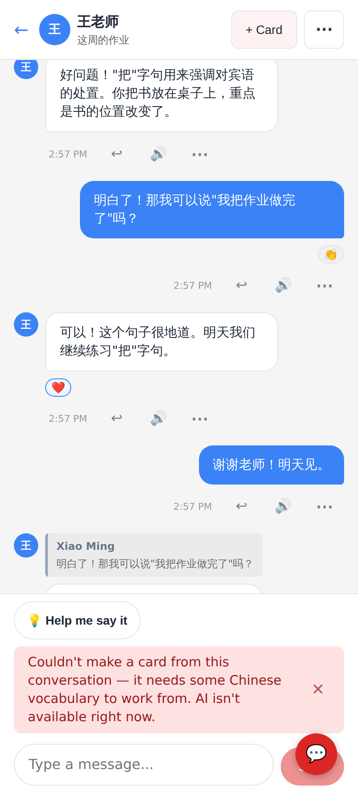

Failed card generation: inline error.

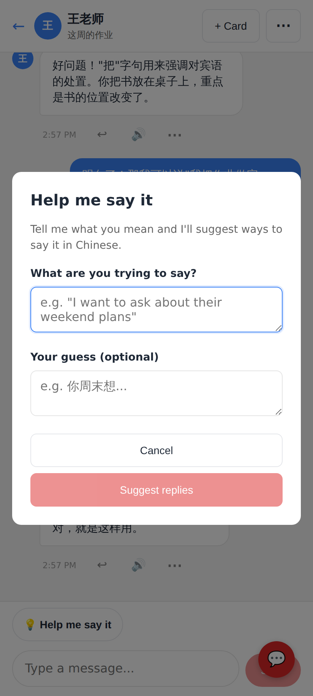

The dialog is now titled "Help me say it".

Failed suggestion call: inline error under the "Help me say it" button.

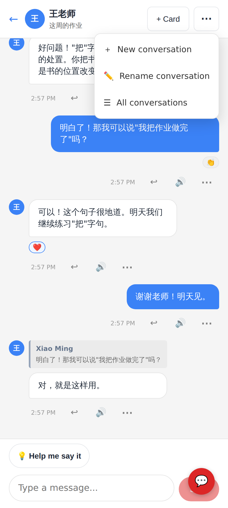

Header ⋯: New conversation, Add a title / Rename, Voice settings (AI chats), All conversations.

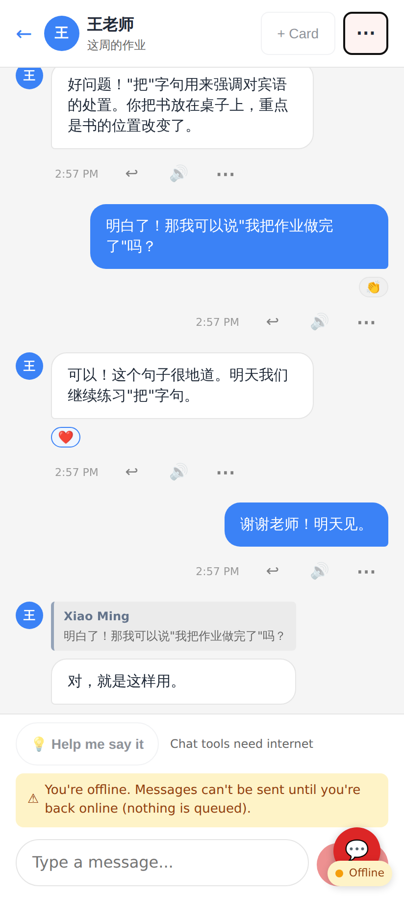

Offline: + Card, Play and Help me say it disabled with "needs internet" hints; sending blocked with an explicit message.

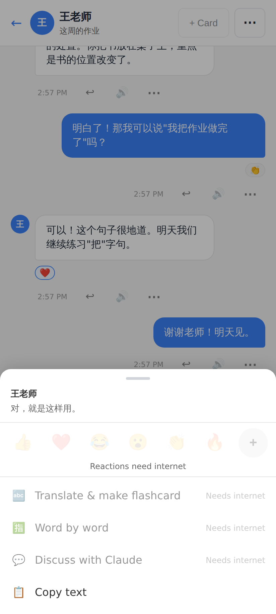

Offline action sheet: network tools disabled with a "Needs internet" hint; Copy and Reply still work.

## After — Claude practice chat

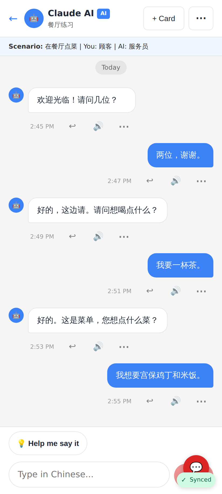

Claude practice chat with the lighter tool row.

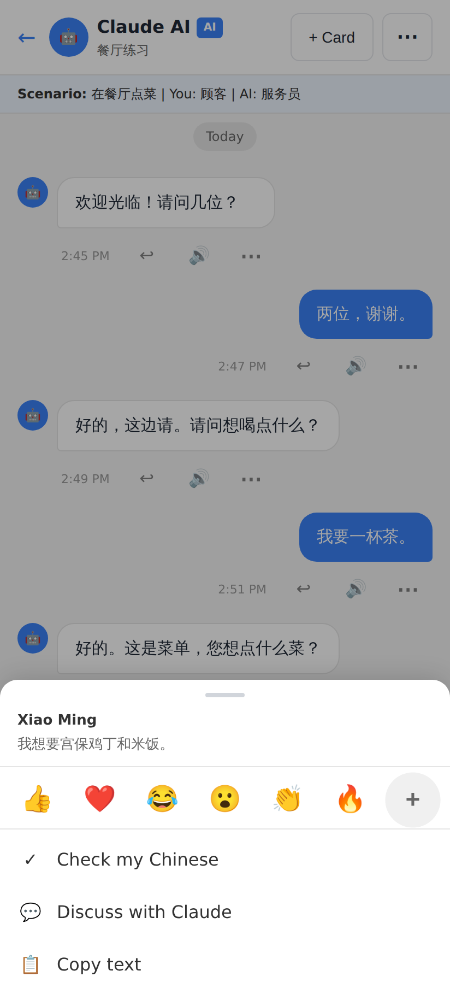

The learner's own message in the Claude chat keeps Check my Chinese.

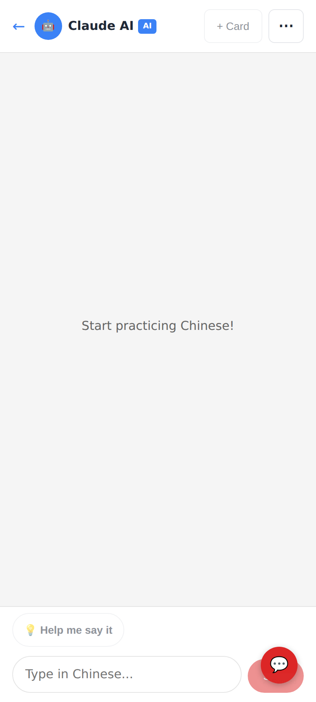

`?new=1` opened a fresh, untitled conversation directly (no title modal); a title can be added later from the header ⋯.

## After — tutor view

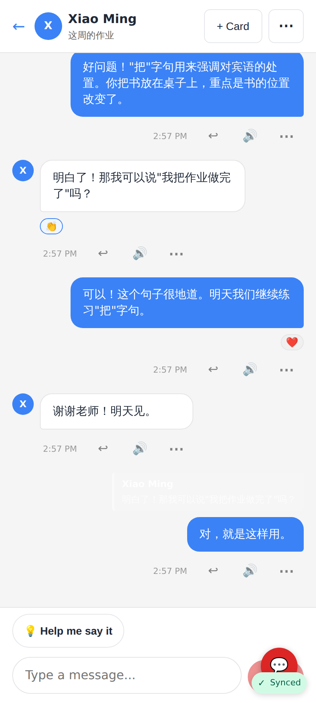

Tutor view after.

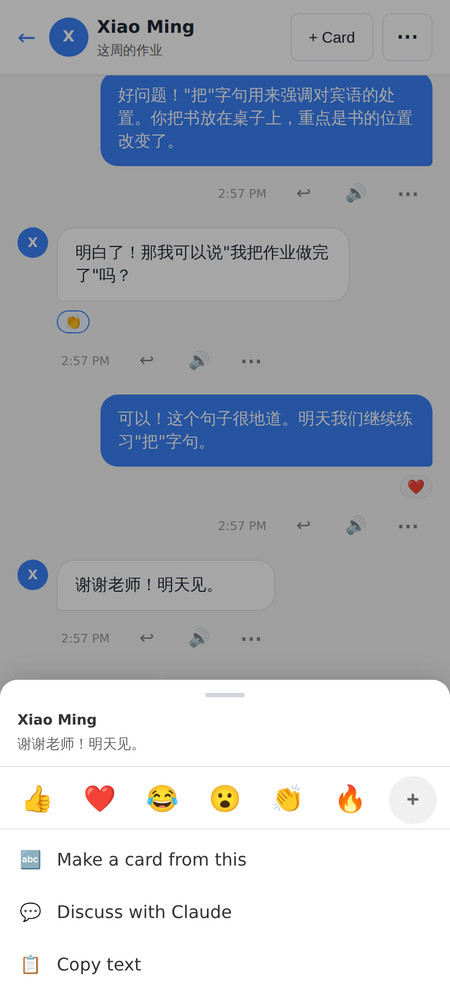

Tutor's sheet on the student's message: "Make a card from this" (no Translate wording, no word-by-word).

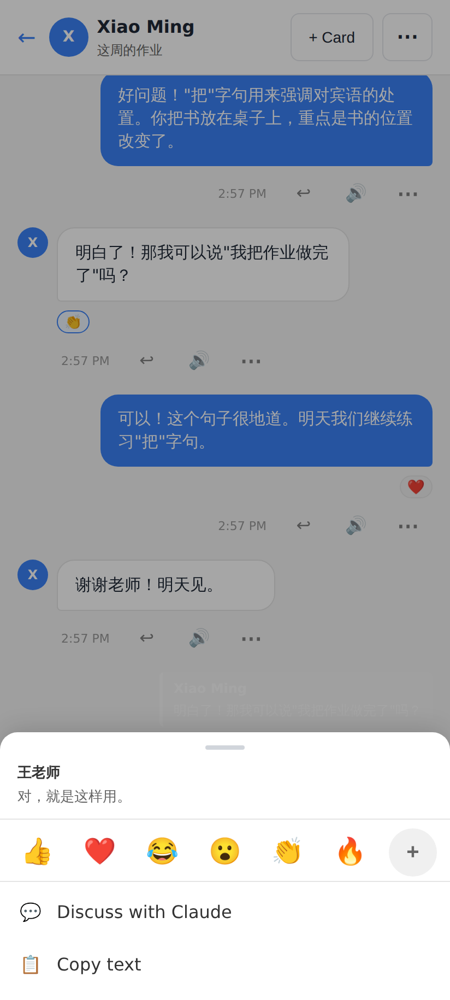

Tutor's sheet on their own message: React, Discuss, Copy — no Check my Chinese.

## Desktop (≥640px)

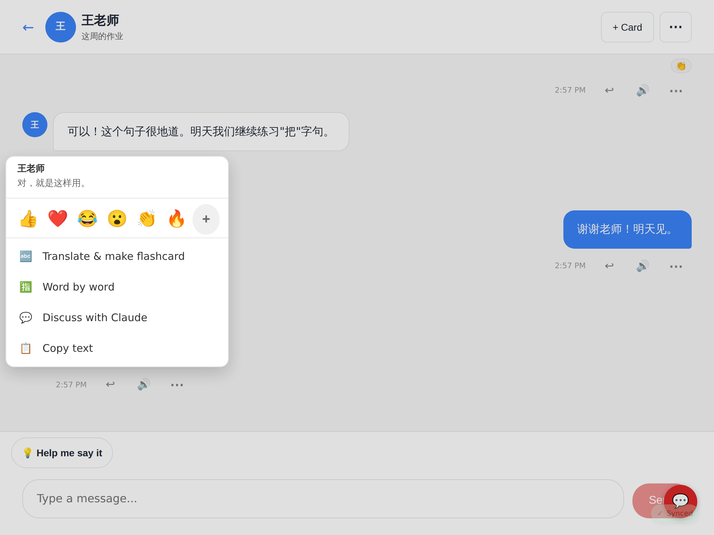

At 1024px the sheet becomes a popover anchored to the message's ⋯ button.
