# Student home & new-student onboarding — PR screenshots

Captured at 412×915 @2× (the dark /join and splash pages at 1× to stay under 500 KB) from this branch, running locally in E2E test mode with seeded data: tutor **Wang Laoshi**, existing student **Xiao Ming** (three own decks, a shared homework deck with review history, an assigned mini lesson and an unread tutor message) and brand-new invitee **Li Hua** (redeemed an invite that carried the 天气 deck and a welcome message).

**Home — before** (Study All + four-colour arithmetic, per-deck Study buttons, `12n`, New Deck · Generate · Analyze)

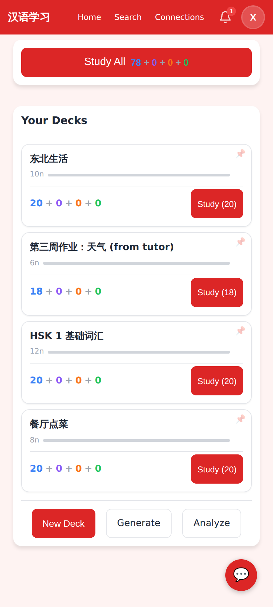

**Home — after**: one *Study today's cards* button with "81 cards due · about 27 min", the *From Wang Laoshi* homework card ("7 of 18 cards started · 刮风 and 晴天 need work", the unread message, Reply / Open deck, the caption), and the compact deck list ("n due", thin bar, "12 words", 44px pin, *All decks →*, *+ Add a deck*)

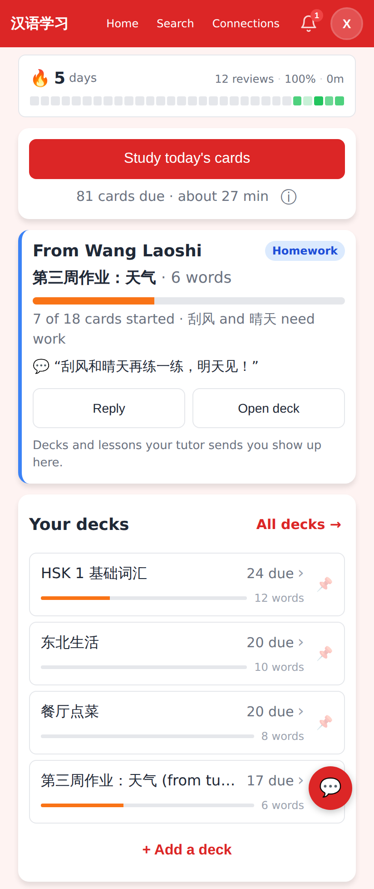

**ⓘ popover** — the four-colour breakdown in words

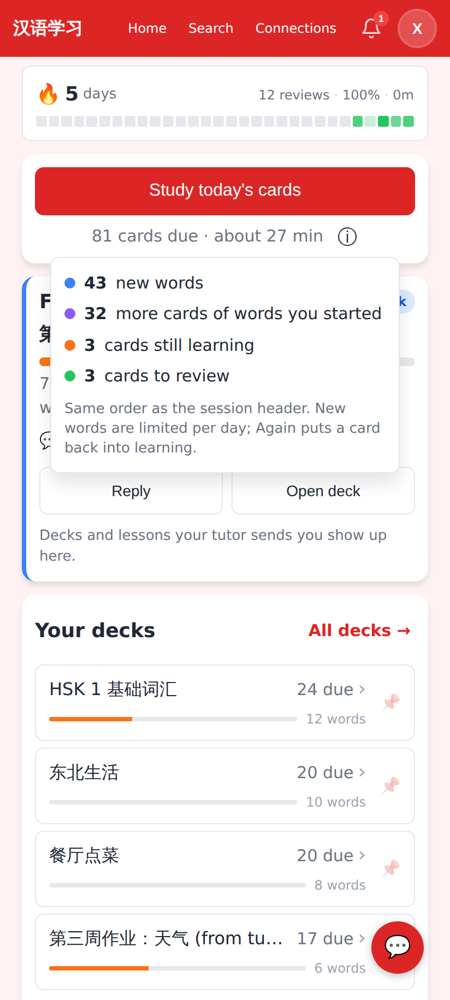

**Fresh device, sync not yet completed** — "Getting your words…" instead of "✓ Flashcards done"; the homework card falls back to the assigned lesson while the shared deck is still downloading

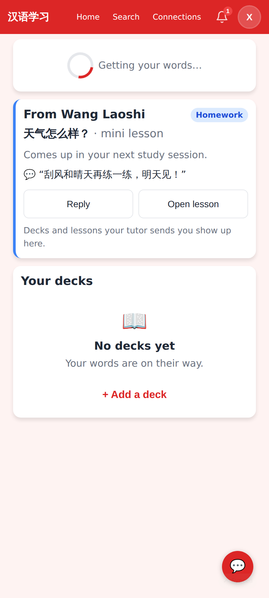

**+ Add a deck** — the existing create modal with *Generate with Claude* inside it

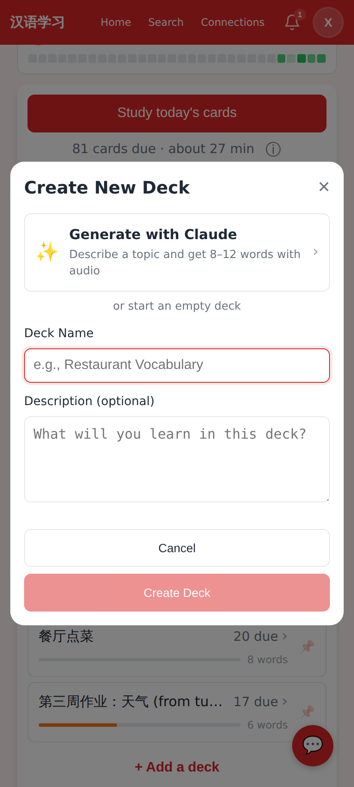

**First-open screen** for a brand-new invitee — greeting, tutor, first homework deck, *Start your first session*, the two-item checklist (audio: one quiet line), the tutor's welcome message with *Reply*

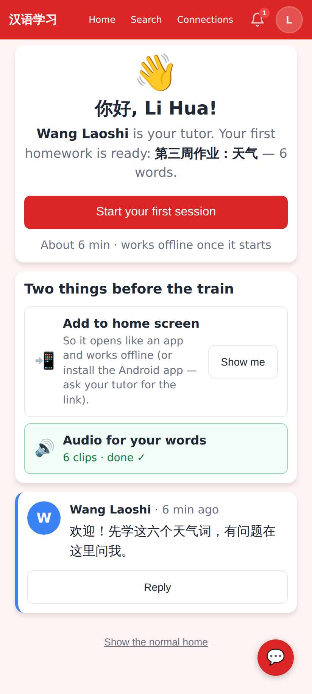

**Checklist states** — *Show me* expanded (Android hint; iOS gets the Share → Add to Home Screen version, Android Chrome gets a real install prompt), audio "6 clips · done ✓"

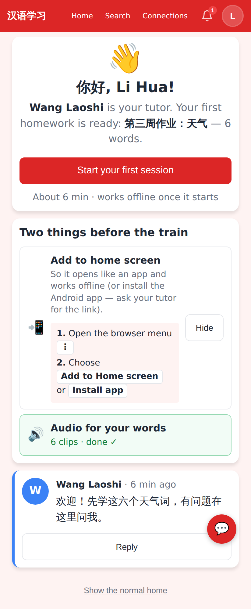

**First-card explainer** — one-time, three lines, mic note; shown over the very first card

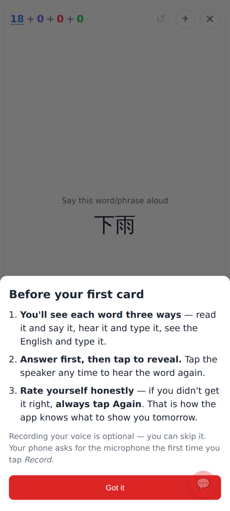

**Invite sheet** — *Starter Chinese* built-in deck preselected, deck required, welcome message; the role picker moved under Options

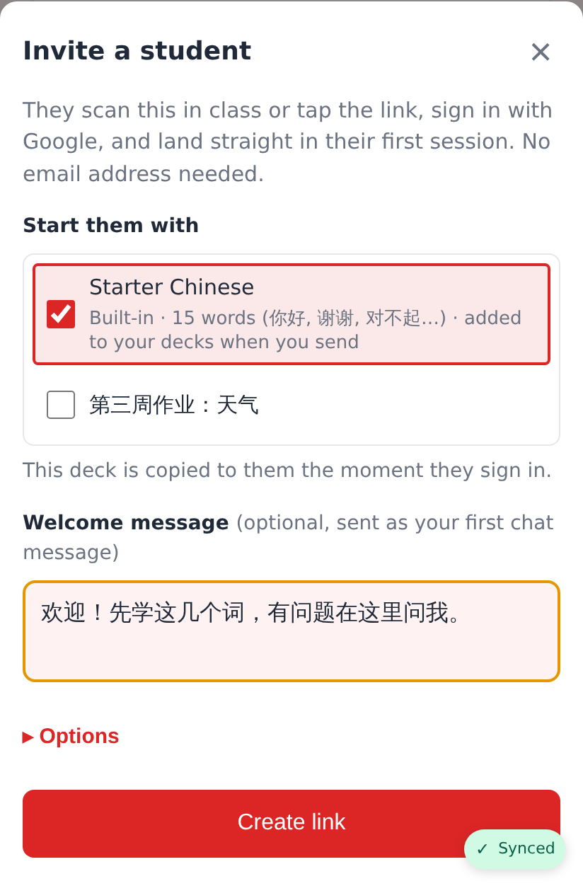

**Invite created** — summary mentions the deck and the waiting welcome message

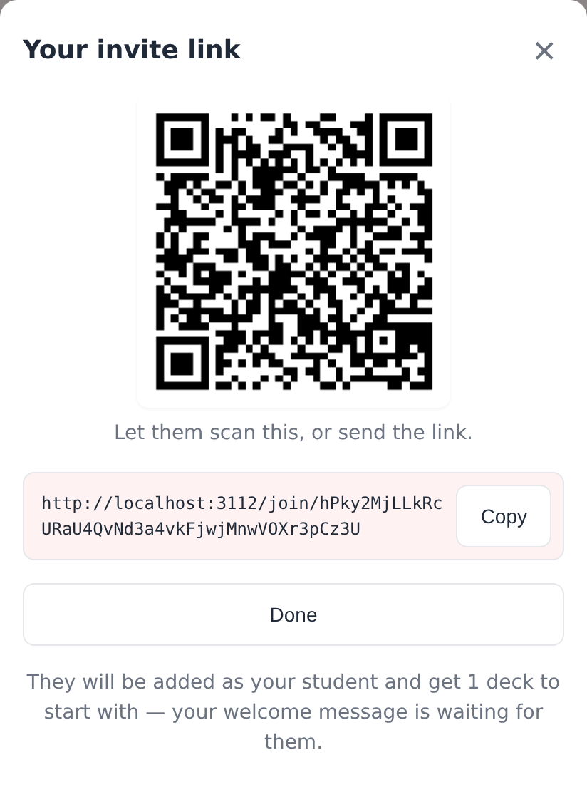

**Invite list** — "Link opened · not signed in yet" (`opened_at`) with the in-app-browser hint for the tutor

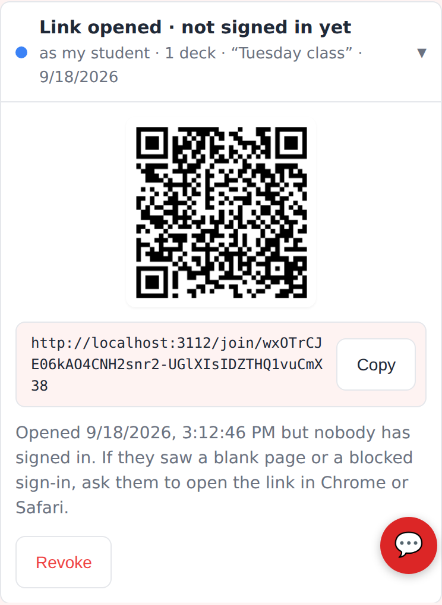

**/join in an in-app browser** (WeChat UA) — "Open this link in Chrome to sign in", Copy link, Try opening in Chrome

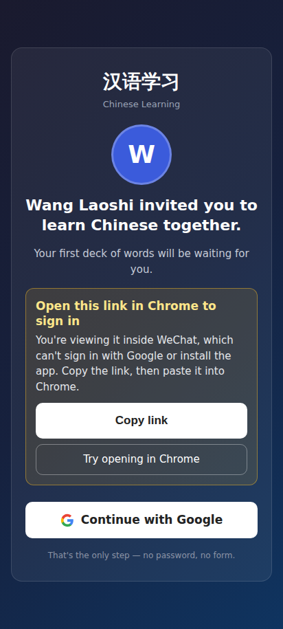

**/join in a normal browser** — unchanged happy path

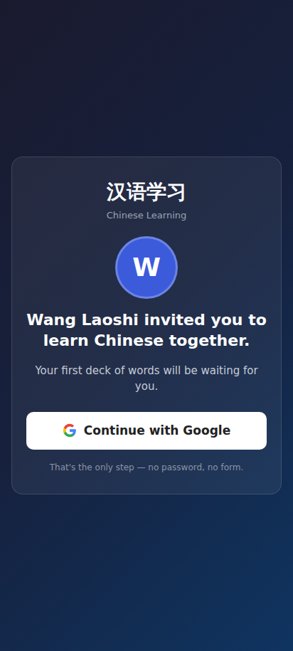

**Splash — uninvited sign-in** — "Ask your tutor for their invite link" with a one-line explanation

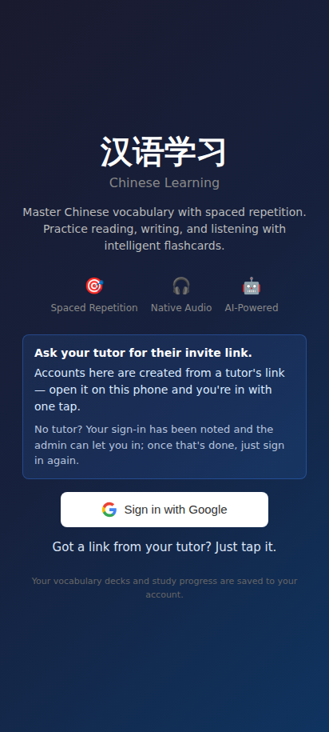

**Splash — default** — "Got a link from your tutor? Just tap it."

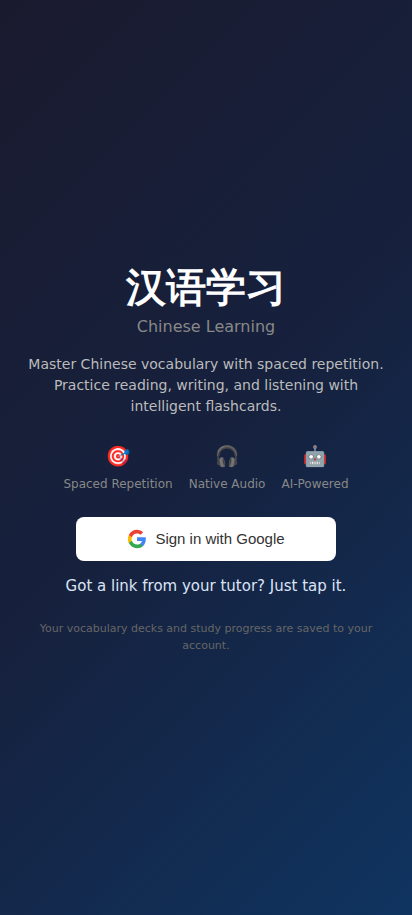
