# Navigation overhaul — screenshots

Captured with Playwright (Chromium, 2×) against a local worker with seeded
data. Phone shots are 412 px wide (Pixel Fold, folded).

## Tab bar

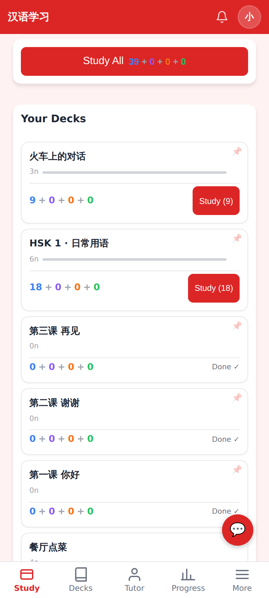
Home at 412×915 with the bottom tab bar: Study · Decks · Tutor · Progress · More. Study is active.

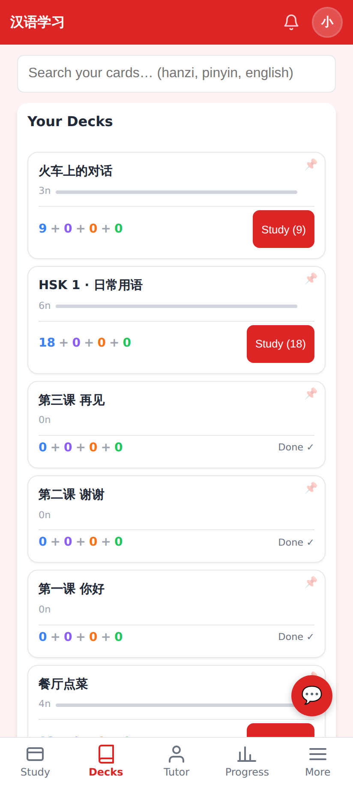
The new Decks tab: search field at the top, the deck list (pinned first) and New Deck / Generate / Analyze.

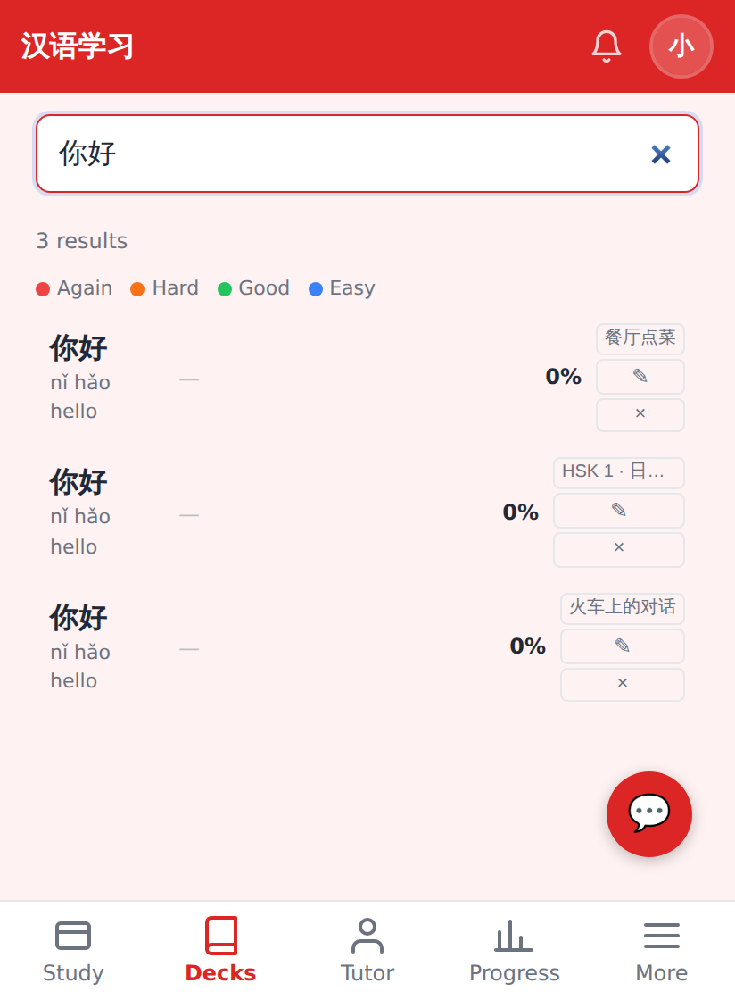
Searching "你好" with the viewport shrunk to 560 px (the on-screen keyboard, `interactive-widget=resizes-content`): the bar follows the resized viewport and the field and results stay above it.

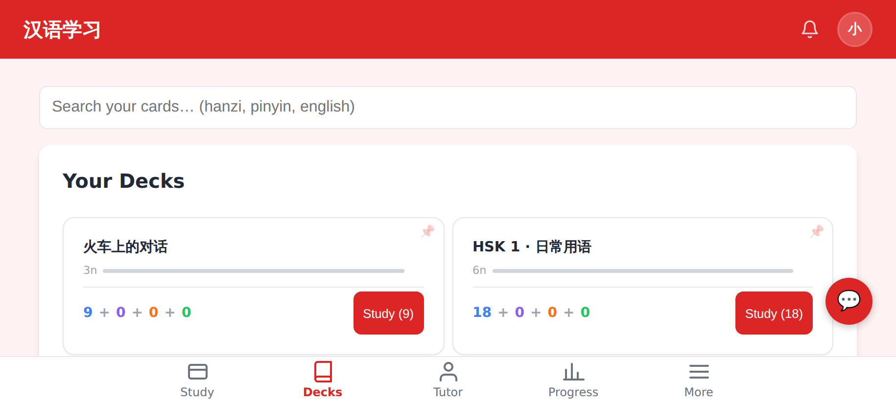
915×412 landscape: the bar drops to 48 px so the page keeps room.

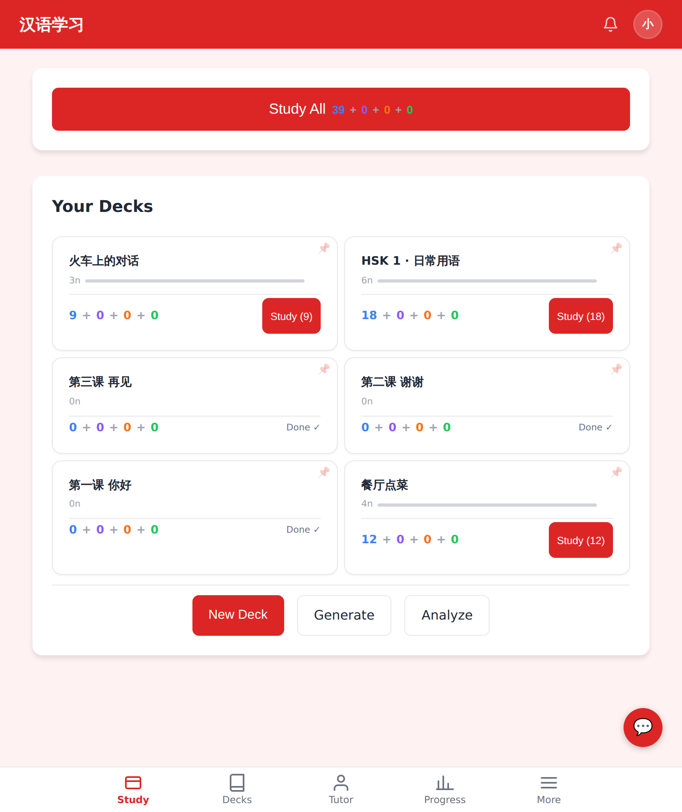
840×1000 (unfolded): the bar stays, its tabs centred at 640 px.

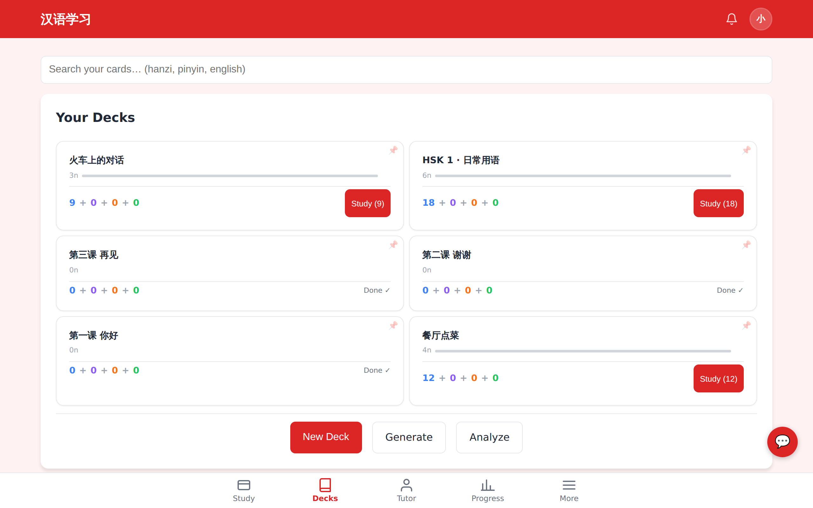
1280×800 desktop web app: same bar, same centred tabs.

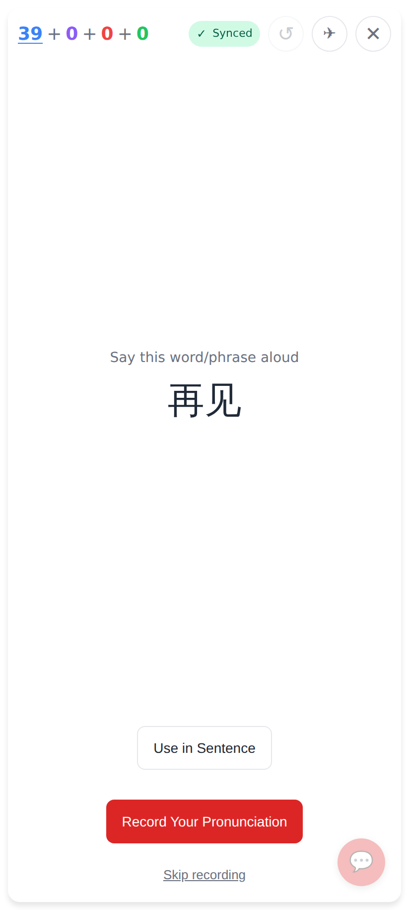
A running study session is immersive — no header, no bar, no bottom padding.

## More page (replaces the 15-item avatar dropdown)

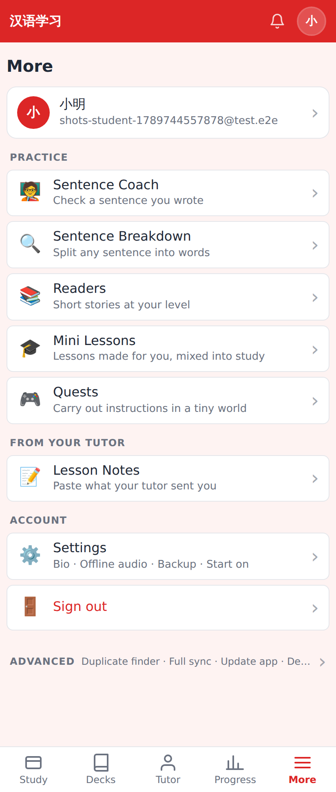
Grouped: Practice · From your tutor · Account, then Advanced collapsed. 56 px rows with an icon, label, one-line description and chevron. The avatar in the header opens this page.

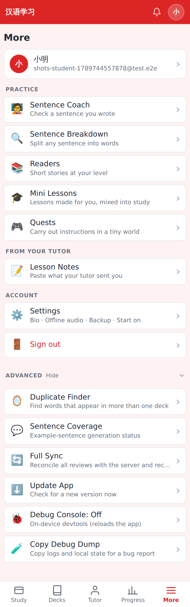
Advanced: Duplicate Finder, Sentence Coverage, Full Sync, Update App, Debug Console toggle, Copy Debug Dump (and Admin for admins).

## Settings

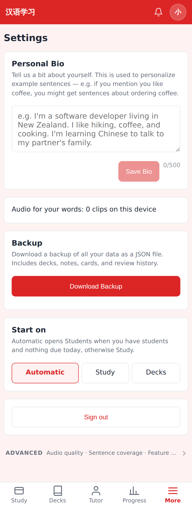
Personal Bio · Offline audio as one status line · Backup · Start on (Automatic / Study / Decks; Students appears for accounts with students) · Sign out · Advanced collapsed.

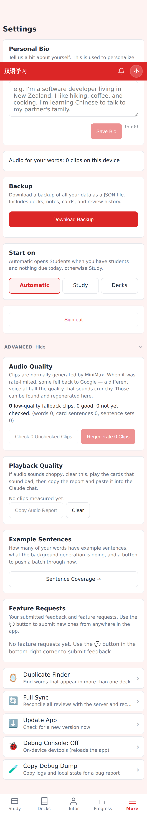
Advanced: Audio Quality, Playback Quality, Sentence Coverage, Feature Requests, Duplicate Finder, Full Sync, Update App, Debug Console, Copy Debug Dump.

## Tutor-only account

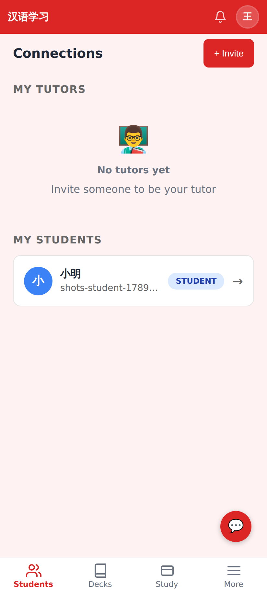
An account with a student, no decks and nothing due opens on the Students tab (`/connections`). Tabs: Students · Decks · Study · More.

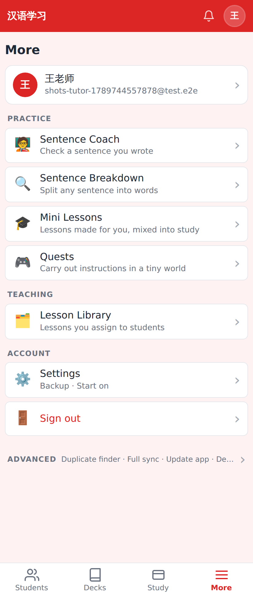
No Readers, no Lesson Notes; a Teaching section with the Lesson Library.

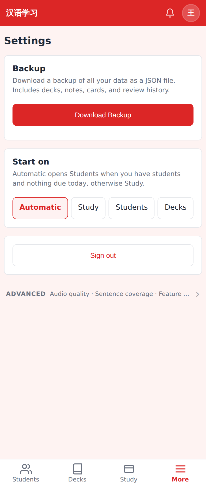
No Personal Bio, no Offline audio; Start on offers Students.
