# Deck page, failed AI work & polish backlog — PR screenshots

Captured on the dev server with Playwright at the phone viewport (412×915, 2×; the one full-page
"before" readers shot is 1.5× to stay under the size limit). Seeded as **Xiao Ming** with a 12-word
HSK 1 deck and a week of review history, a tutor (**Wang Laoshi**) who accepted the connection and
has the deck shared with them, 10 failed daily readers (raw API errors in `error_message`), two
ready readers and two failed quests. No AI keys in the container, so audio is missing for every
word — which is what makes *Generate missing audio (12)* appear in the menu.

## Deck page (I1–I3, I6)

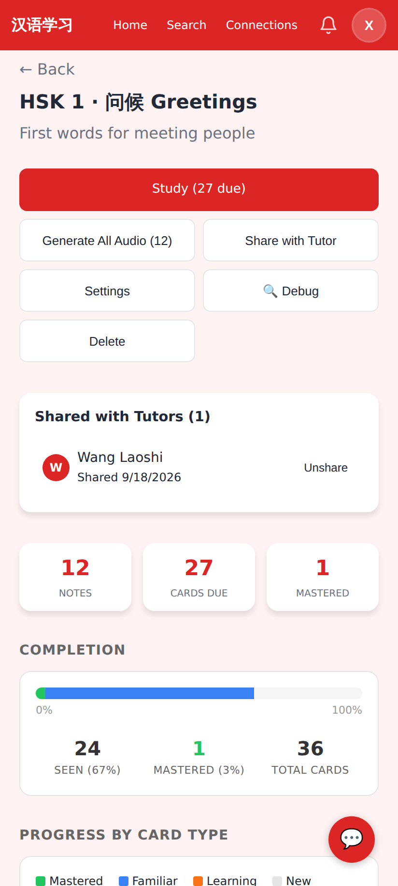

Before: six full-width buttons (Study, Generate All Audio, Share with Tutor, Settings, 🔍 Debug, Delete), then three stat tiles, a Completion block, Progress by card type and Recent Activity before the word list.

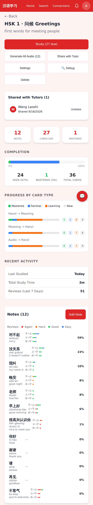

Before, full page: four ways of saying "1 mastered" before the first word.

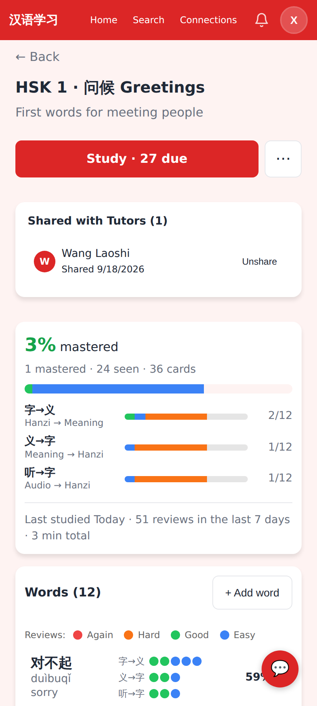

After: **Study · 27 due** + ⋯. One progress block. Debug is gone from the page (it is only in the menu while the Debug Console flag is on).

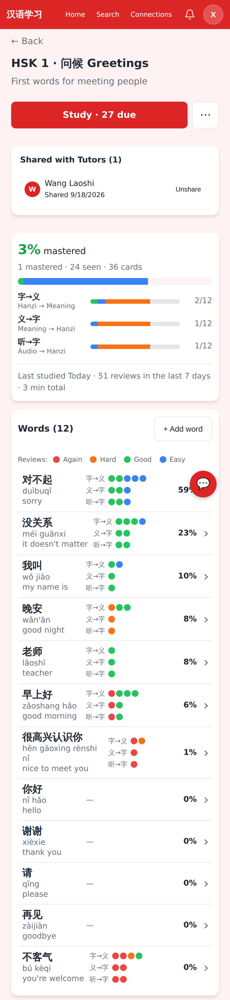

After, full page: the word list starts a screen earlier.

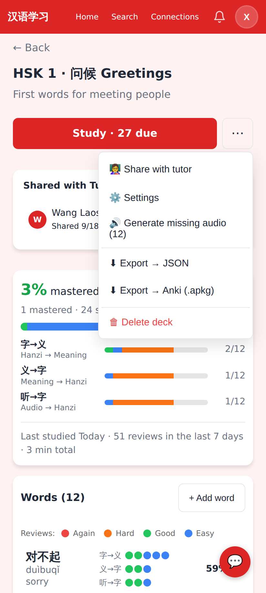

The ⋯ menu: Share with tutor (only shown when the account has a tutor), Settings, Generate missing audio (12), Export → JSON, Export → Anki (.apkg), Delete deck. *Regenerate audio…* appears once any word has audio.

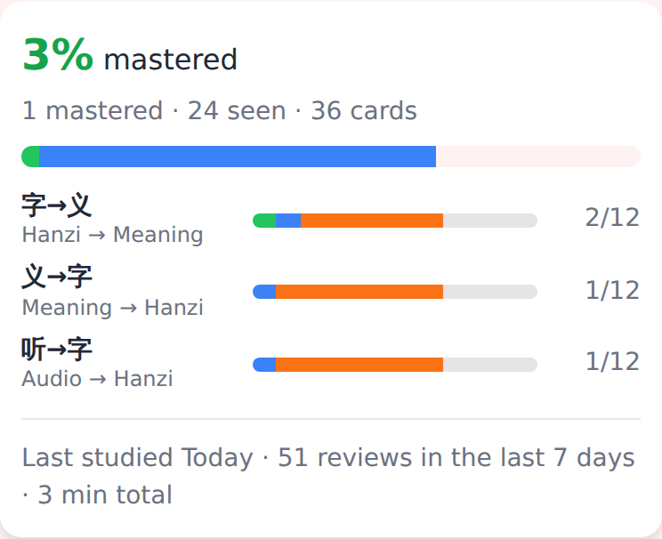

The single progress block: mastery bar, one row per card type (字→义 / 义→字 / 听→字 with a mini bar and mastered+familiar / total), and the "Last studied · reviews in the last 7 days · total time" line.

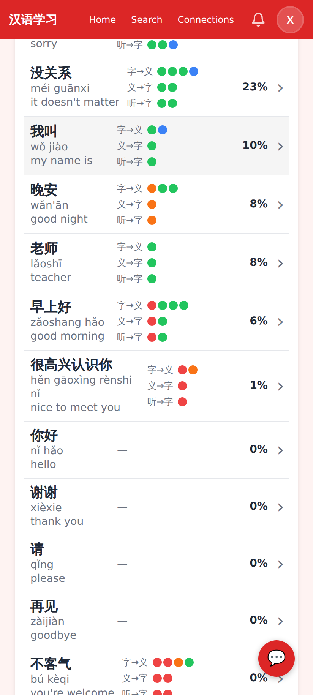

Word list: pinyin/meaning at 14px, 12px rating dots, 12px 字→义 labels, a chevron on every row, row separators and a 56px row height. Tapping a row opens the editor (it already did; now it looks like it).

## Deck settings (I4)

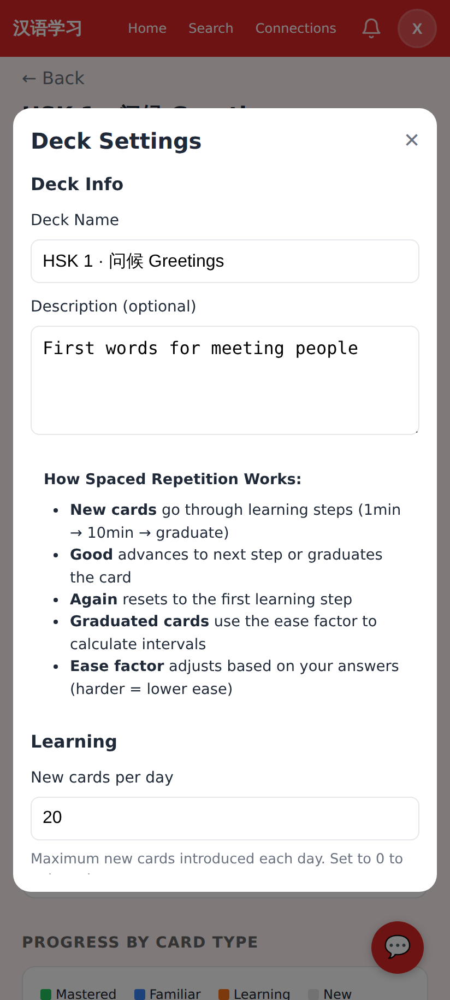

Before: "How Spaced Repetition Works" described SM-2 learning steps and the ease factor.

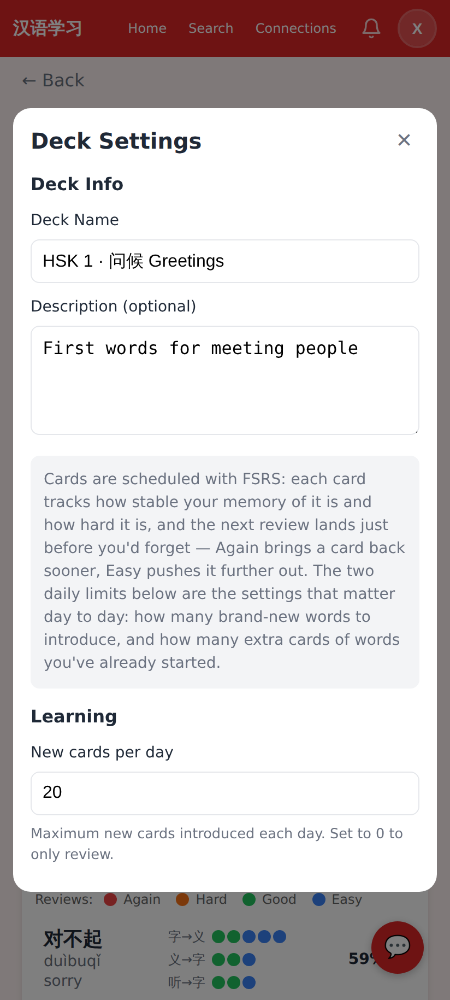

After: two FSRS sentences (stability/difficulty, Again sooner / Easy later, and which two daily limits actually matter). The SM-2 ease explainer and worked example under Advanced are replaced by a one-line "legacy, ignored by FSRS" note. Anki export moved from this modal into the deck ⋯ menu.

## Edit card modal (I5)

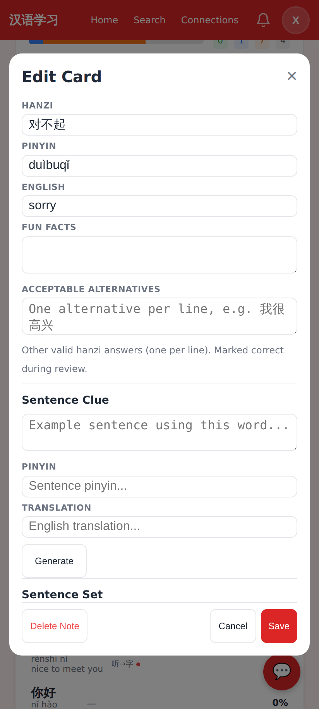

Before: 28px inputs; *Delete Note* sits in the Save footer.

After: 44px inputs at 16px (no iOS zoom), a ⋯ in the header, and a Cancel / Save footer.

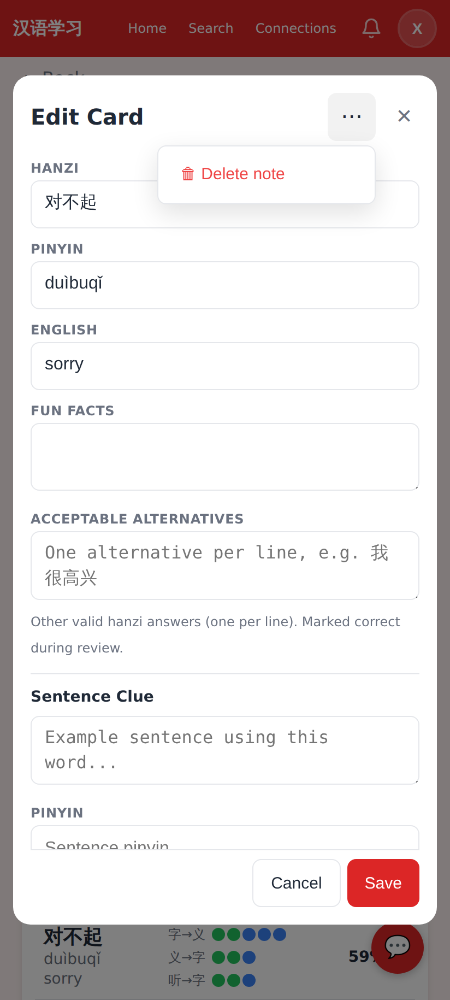

The modal's ⋯ holds *Delete note*.

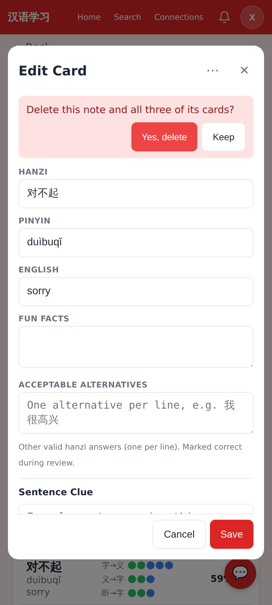

Choosing it shows an inline confirmation strip under the header (Yes, delete / Keep).

## Readers — failed generations (G1, G3, G5, K1)

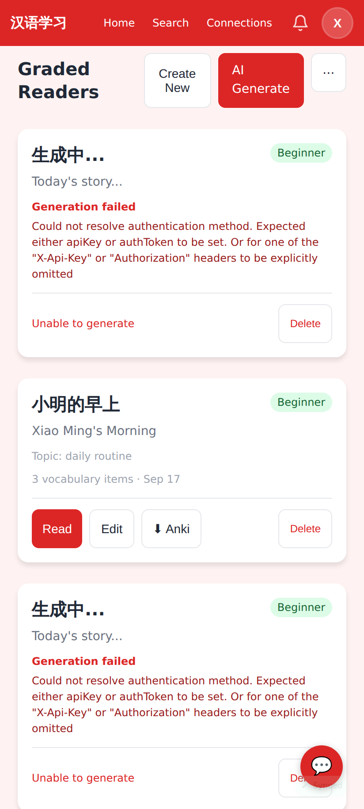

Before: every failed daily reader was a full card titled 生成中… with the raw API error and only a *Delete* button.

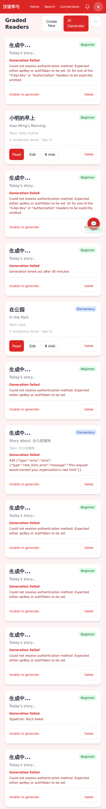

Before, full page: ten dead cards in a row; a real story is buried between them.

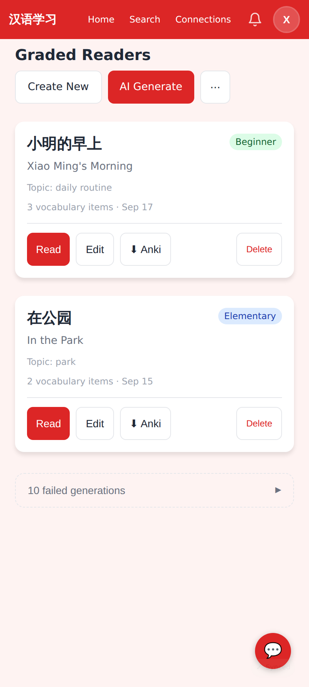

After: the real stories, then one muted **10 failed generations ▸** row at the bottom. *Create New* now opens the editor directly (`/readers/new/edit`) instead of a title modal.

After, full page: the whole list fits on one screen.

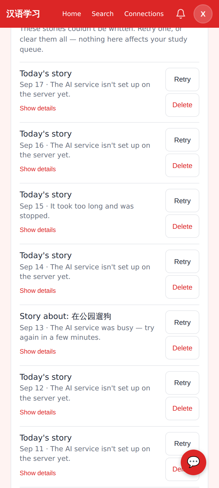

Expanded: one line per failure with the date and a friendly reason ("The AI service isn't set up on the server yet." / "It took too long and was stopped." / "The AI service was busy…"), *Retry* and *Delete* per row, and *Delete all failed (10)* at the bottom. Retry re-queues the same reader row in place (new `POST /api/readers/:id/retry`).

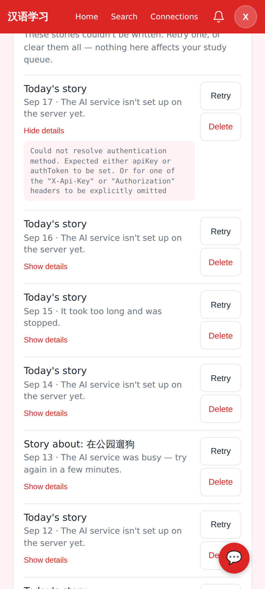

The raw error text is still there for debugging, behind *Show details*.

The import alerts on this page are now toasts (`components/Toast.tsx`).

## Reader generate (K2)

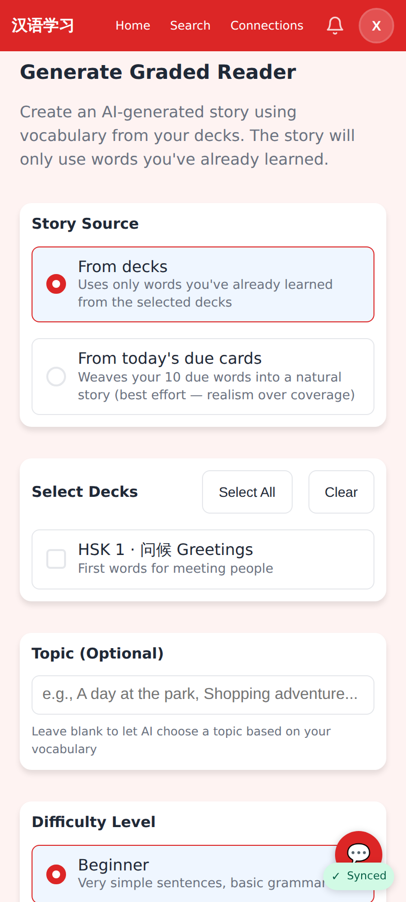

Story source, deck and difficulty options are 44px card-style options with a custom radio/checkbox mark; the native inputs stay in the tree for keyboard and screen readers. Errors use the Coach-style inline block.

## Quests (G5, K3)

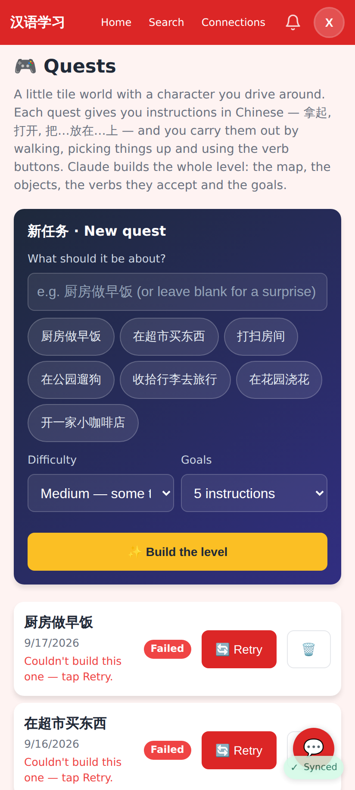

Topic chips are 44px tall. A failed quest says "Couldn't build this one — tap Retry." instead of the raw API error; the generate error is a friendly sentence too.

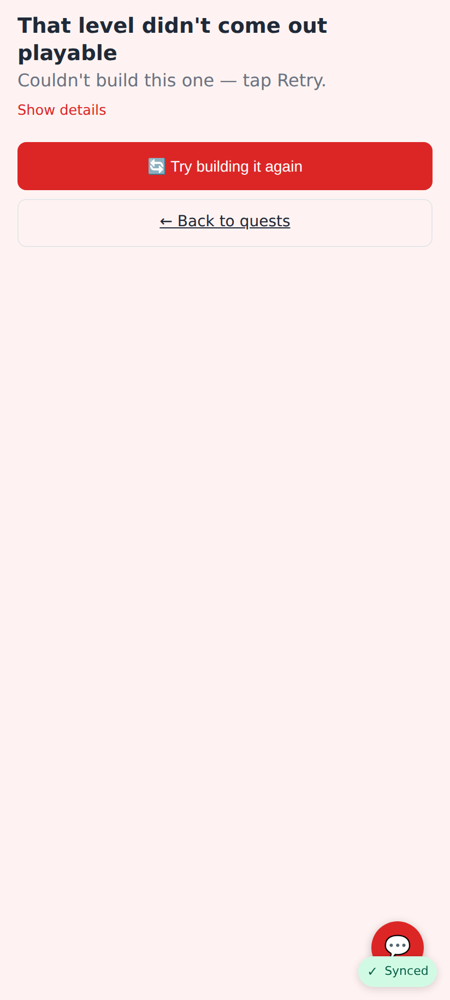

The quest page for a failed level: friendly sentence, *Try building it again*, raw error behind *Show details*.

## Modals (K8)

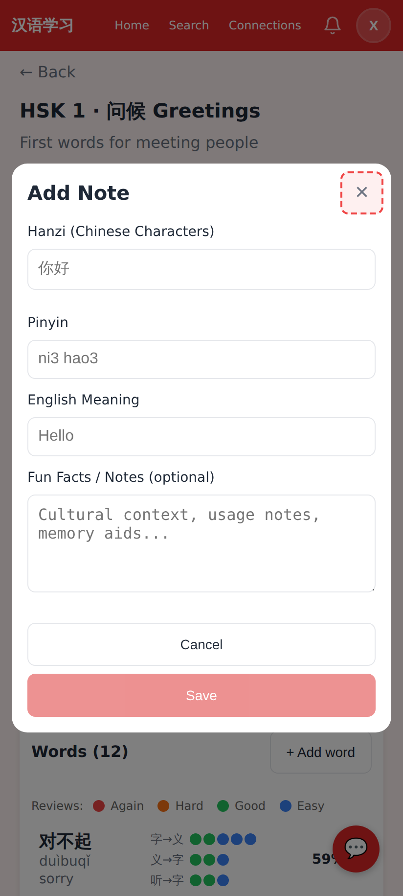

Every `.modal-close` × now has a 44×44 hit area (highlighted here with a dashed outline for the screenshot; it is invisible in the app) without changing the header's visual size.

## Progress tiles (K6)

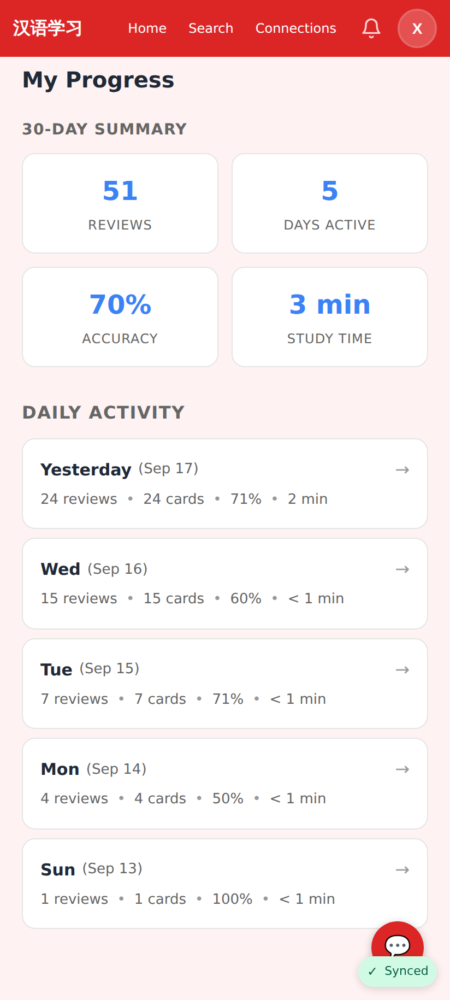

Study time shows "3 min" / "< 1 min" instead of "0m" (the same formatter is used on the tutor's Student Progress page and in the deck's activity line).

## Shared-deck progress (K4, tutor view)

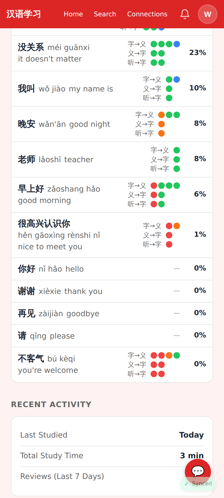

Wang Laoshi's view of the shared deck: 字→义 labels at 12px and 12px rating dots (was 8px / 5px), pinyin and meaning at 14px.

## Card review page (K5, tutor view)

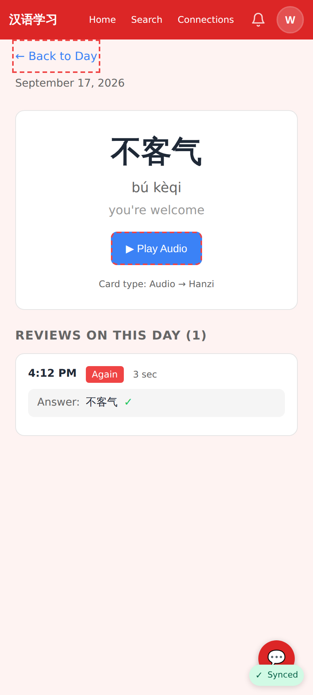

*Back to Day* is a 44px target and *Play Audio* / *Play Recording* are 44px (dashed outlines added for the screenshot only; no recording exists in the seed, so only the audio button is visible).
