# Study screen declutter — PR screenshots

Captured on the dev server with Playwright at the phone viewport (412×915, 2×) with seeded
data: a student (Xiao Ming) with a restaurant deck whose 点菜 card has a recording that the
tutor (Wang Laoshi) marked *needs work* with a note, plus a second deck with a typing card in
learning. No AI/TTS keys in the container, so AI calls fail the way they do offline on the train.

## Card back — before / after

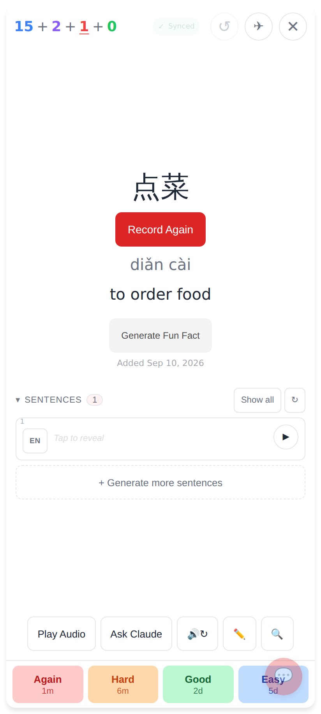

Before (main): Record Again, Generate Fun Fact, "Added …", the sentence panel with its own
toolbar, then Play Audio · Ask Claude · 🔊↻ · ✏️ · 🔍 above the ratings — 25 tappable controls
(22 if the queue counter is counted as the single button it is).

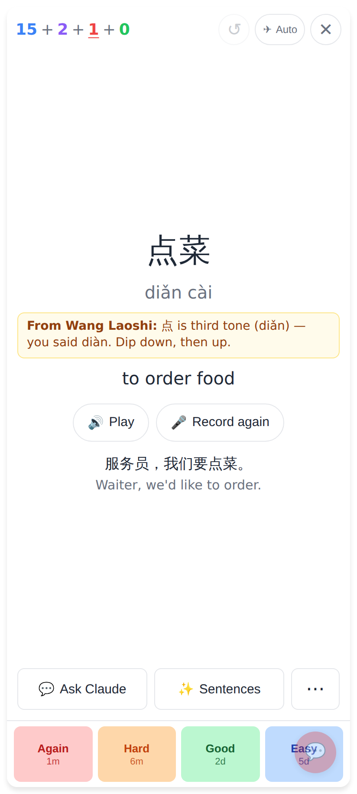

After: hanzi · pinyin · (tutor note) · meaning · **Play** · **Record again** · the card's own
sentence · one action row **Ask Claude · Sentences · ⋯** · ratings — 16 tappable controls
(13 counting the queue counter once). Ratings are 64px tall.

## Front

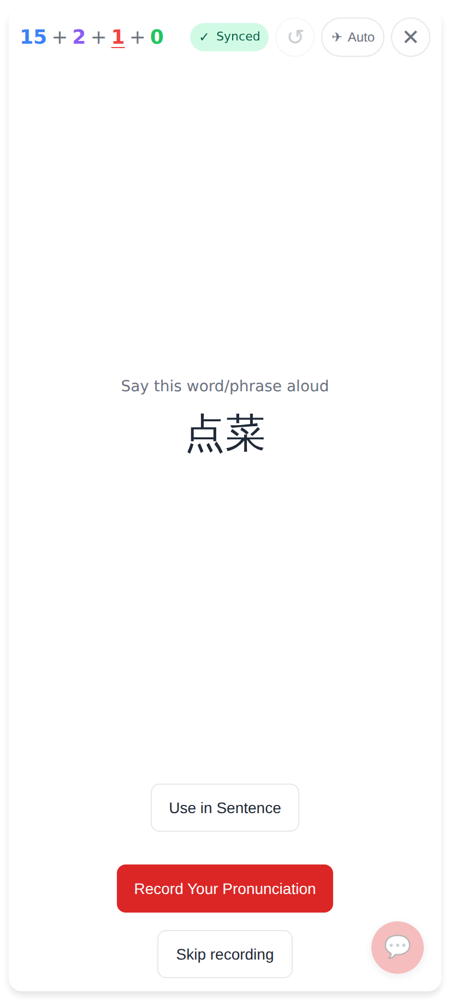

Front of a speaking card: *Skip recording* is a 44px secondary button, not an underlined link.

## ⋯ menu

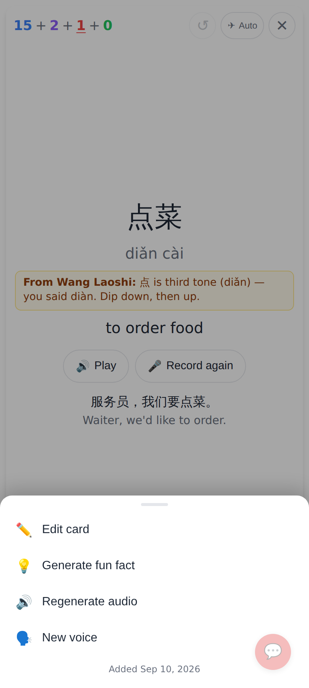

Everything that left the card back is under ⋯: Edit card, Generate fun fact, Regenerate audio,
New voice (was "+ New Voice" on the audio card front), Roleplay (when a Claude connection
exists), Play my recording (after recording), Debug info (only with the Debug Console flag on),
and "Added Sep 10, 2026" as the footer.

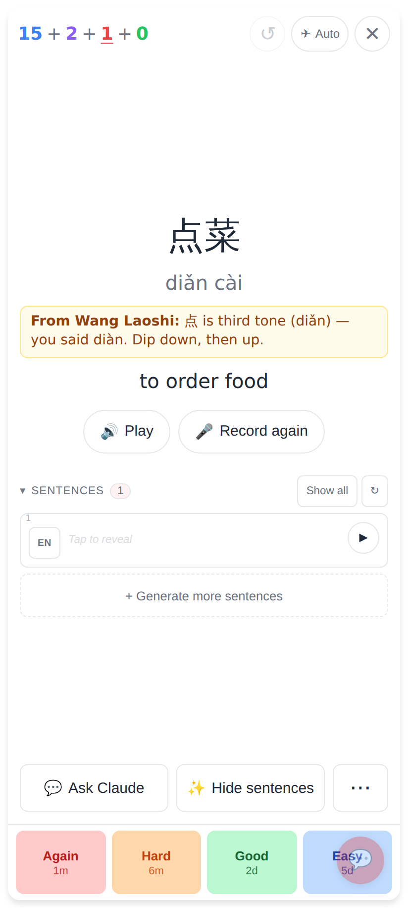

*Sentences* opens the full list (progressive reveal, audio, EN-first, generate more) in place of
the quiet two-line clue; *Hide sentences* closes it.

## Typing card and multiple choice

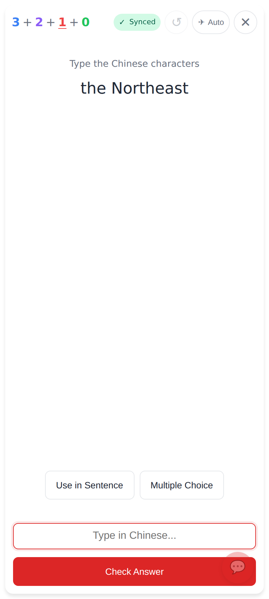

Typing card: no pre-loaded options, no grey "Loading…" button.

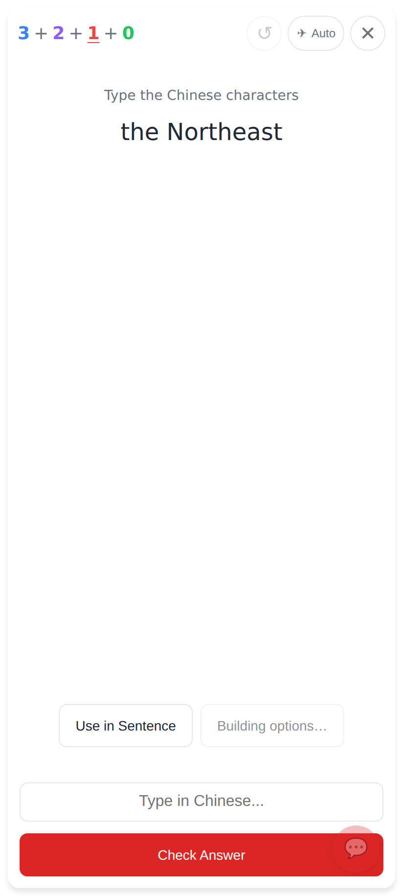

Tapping *Multiple Choice* shows "Building options…" for at most 8 seconds.

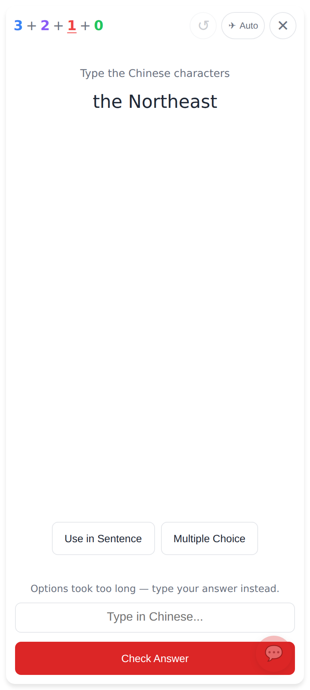

The request was slowed past 8s: the card falls back to typing with a one-line note. The mode is
per card and does not carry over.

## Tutor note

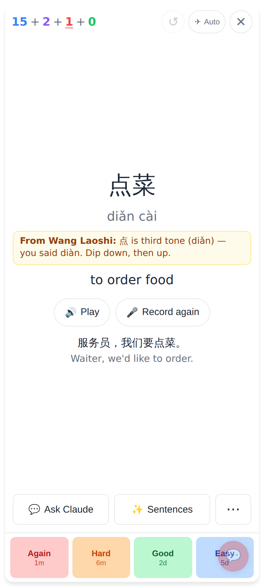

"From Wang Laoshi: …" — the tutor's needs-work comment on this card's recording, shown once
(marked seen when the card is rated; synced to IndexedDB so it shows offline).

## Exit

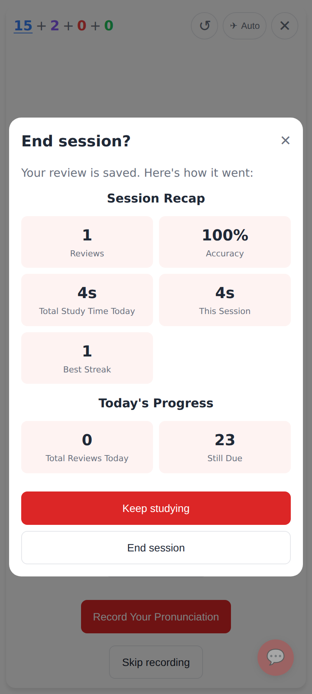

✕ after at least one review: the session recap and an explicit *Keep studying* / *End session*.
With zero reviews ✕ leaves immediately.

## Offline

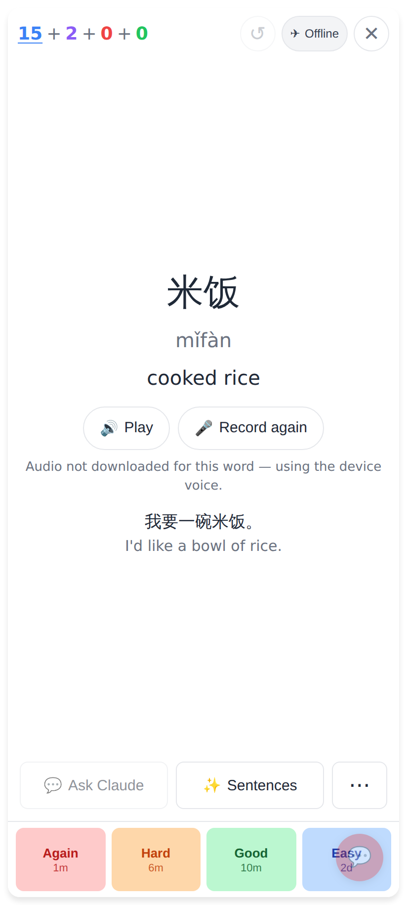

Connection dropped (automatic): the pill reads *Offline*, Ask Claude is disabled with a
"Needs internet" title, Sentences stays enabled because the card's sentence is cached, and the
audio line says the clip was never downloaded so the device voice is used.

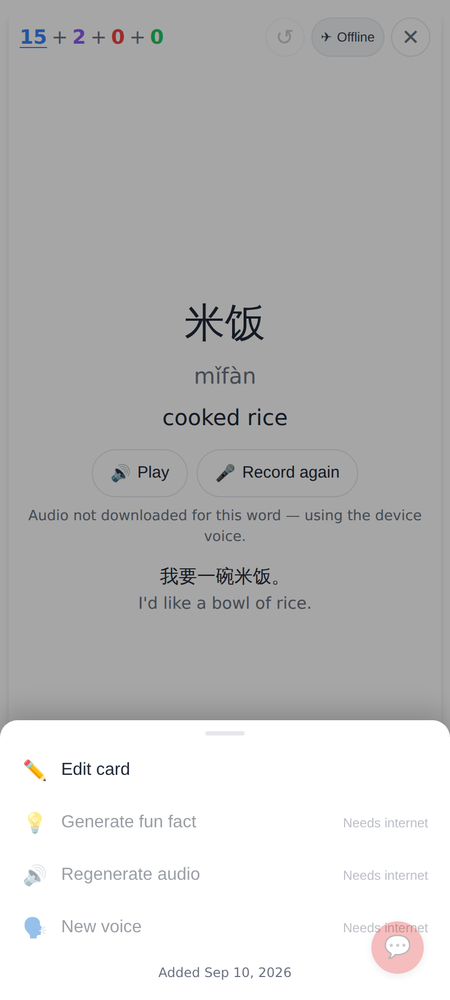

The ⋯ menu offline: every AI action disabled with "Needs internet"; Edit card still works.

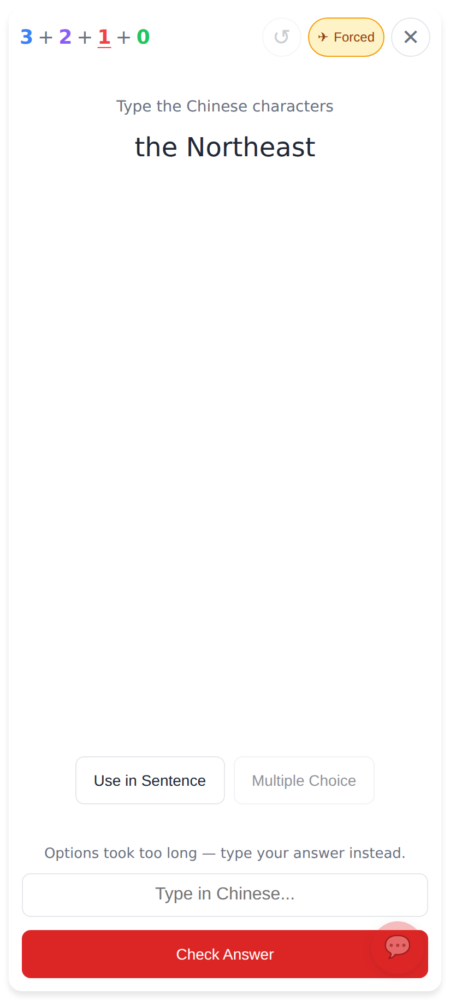

The manual override for the train: one tap on the pill → *Forced* (amber); another tap → back
to automatic. From 480px wide the pill reads "Auto · online" / "Auto · offline" / "Forced offline".

## Ask Claude

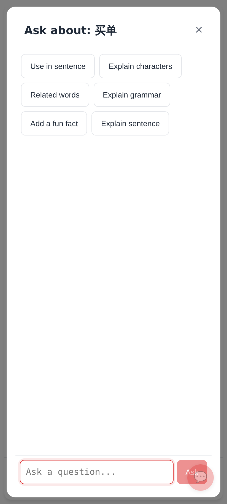

One *Check my answer* chip (it only appears on typing cards with an answer); the duplicate
*Verify my answer* is gone.

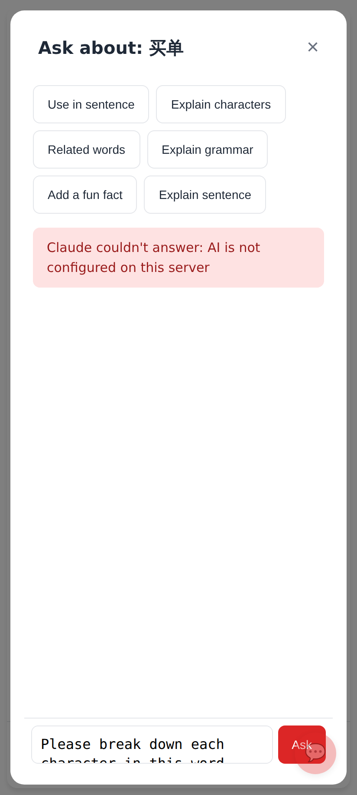

A failed question shows the Coach-style inline error instead of a silent console line.

## Unfolded Fold (840px)

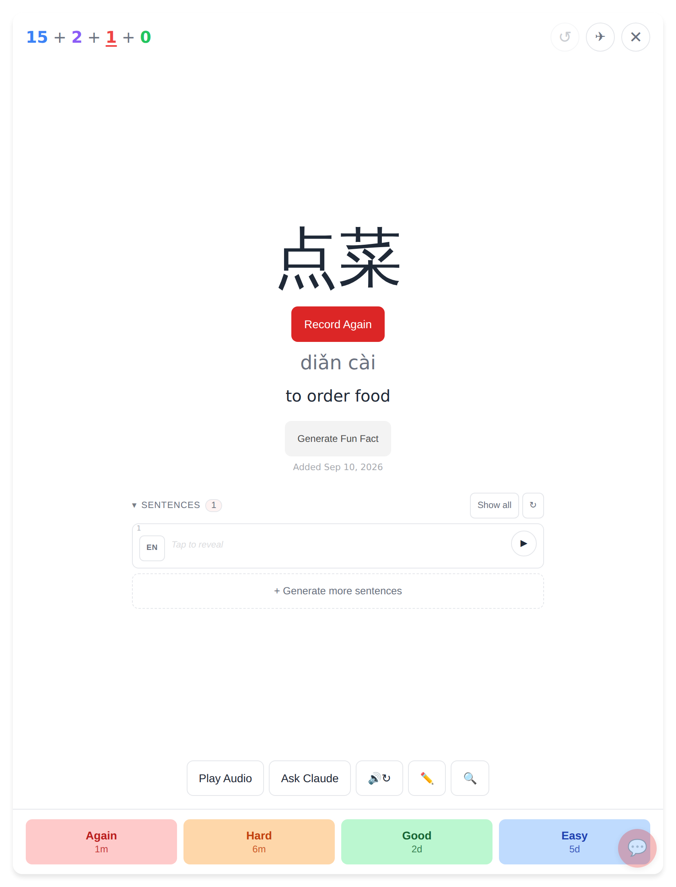

Before: the card and the four ratings stretch across the full 840px.

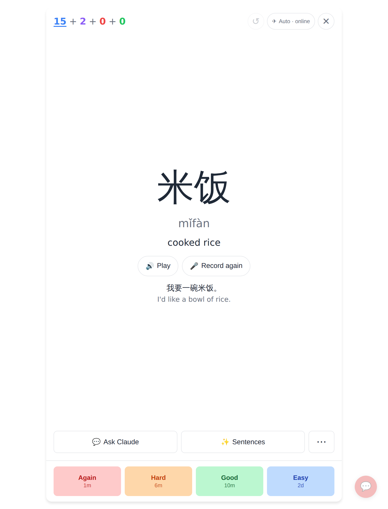

After: the card column is capped at 640px and centred, so the ratings are buttons, not strips.
