# Tutor dashboard, setup checklist, reorganised student page

Phone viewport 412×915 at 2×. Seeded: tutor Wang Laoshi with an active student (Xiao Ming — wrong typed answers, two unheard recordings, a lesson assigned, a conversation), a brand-new student (Li Hua — signed in via the invite link, deck copied, nothing studied), one pending invite link, and two homework decks.

## Before

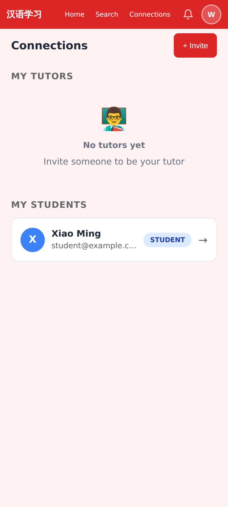
Connections page before — a tutor with no tutor still sees "My Tutors" first; the student row carries no information.

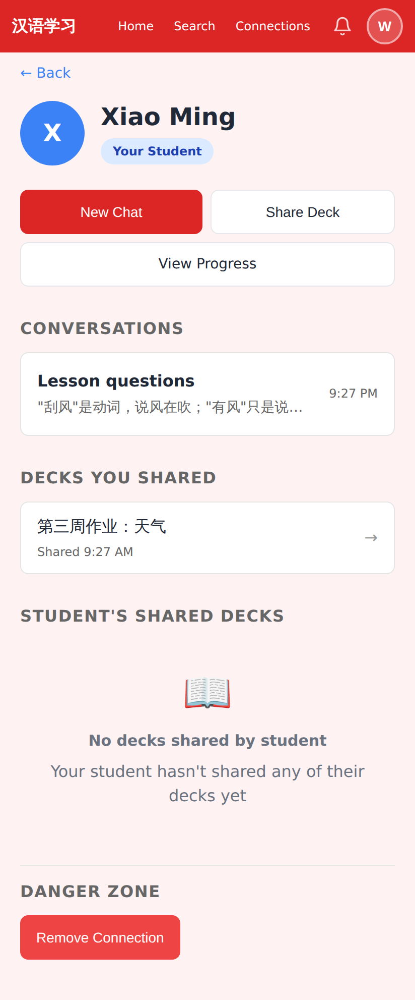
Student page before — New Chat / Share Deck / View Progress, then Conversations, Decks You Shared, Student's Shared Decks, Danger Zone.

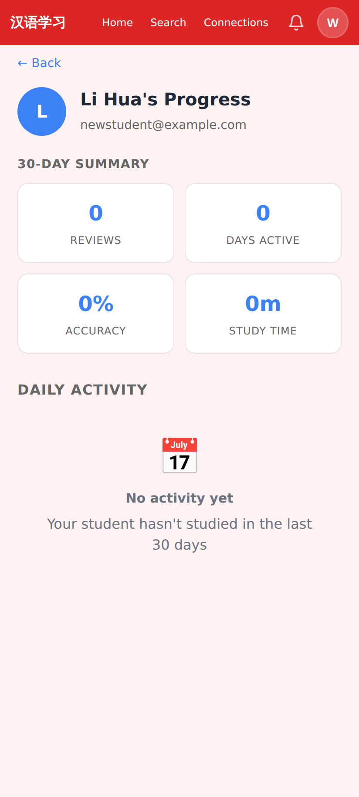
A brand-new student before — the empty progress page could not tell "never opened the link" from "opened, gave up".

## After

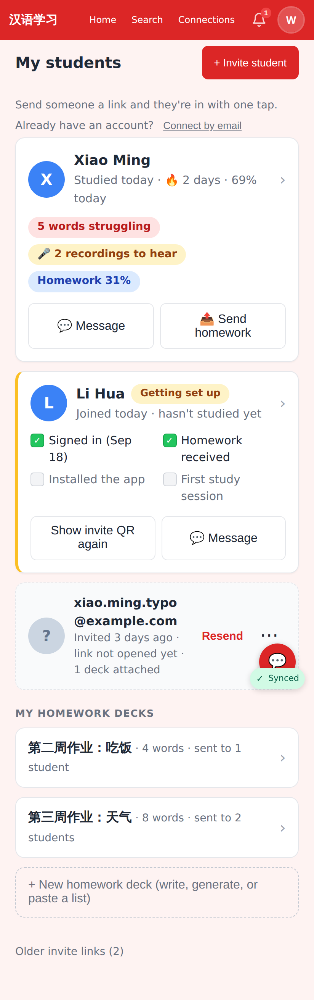
`/connections` for a tutor with students: one card per student (status line, three pills, Message / Send homework), the "Getting set up" card for Li Hua, the pending invite as a muted row with Resend and ⋯, then My homework decks and + New homework deck.

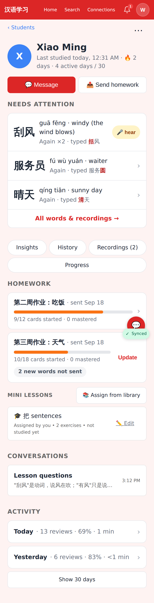
Xiao Ming's page: status line under the name, Message / Send homework, Needs attention (wrong characters in red, 🎤 hear on an unheard recording), the compact Insights · History · Recordings · Progress row, Homework with progress bars (+ Update when the tutor's deck has newer words), Mini Lessons folded in, Conversations, Activity (last two days, Show 30 days).

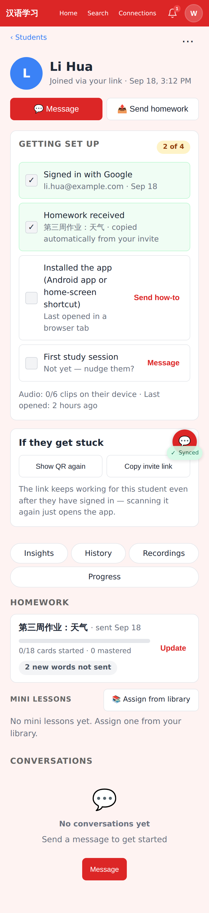
Li Hua's page: the four-step "Getting set up" card replaces the empty progress page — Signed in, Homework received, Installed the app (Android app or home-screen shortcut, with Send how-to), First study session — plus audio-on-device and last-opened, and "If they get stuck" with Show QR again / Copy invite link.

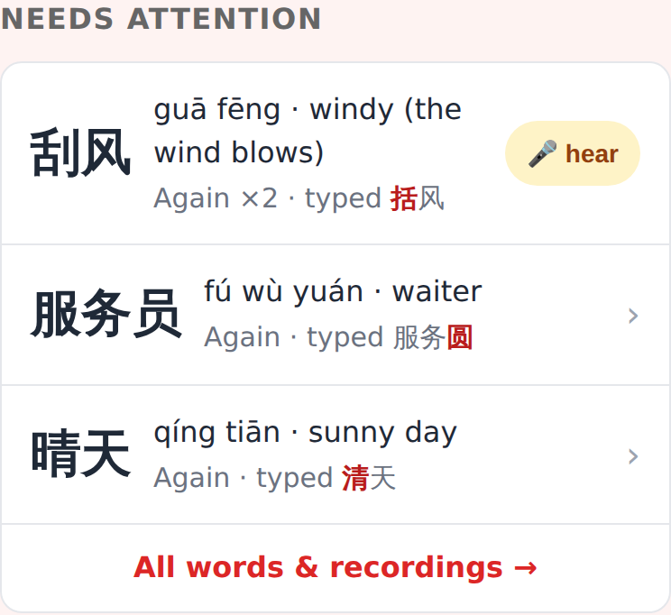
Needs attention up close: top 3 struggling words from the last 7 days with the characters they typed wrong.

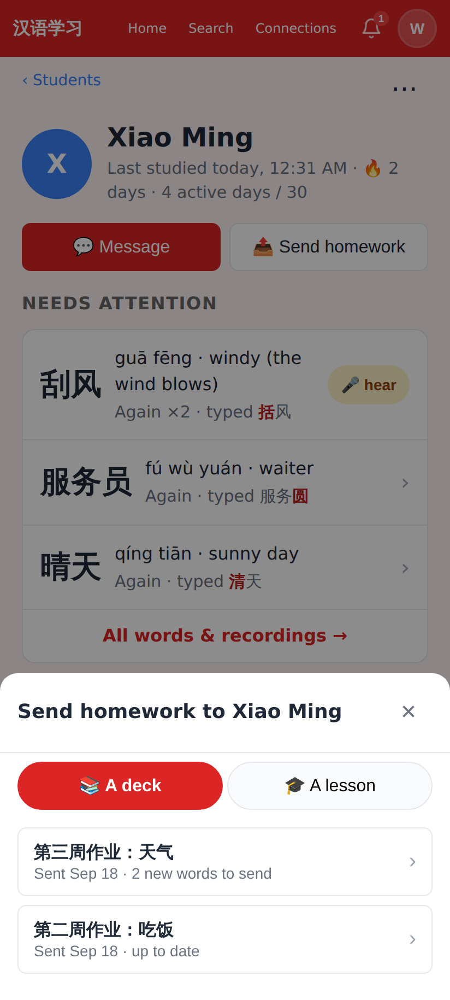
Send homework sheet, deck tab: decks already sent show when, and how many newer words are waiting.

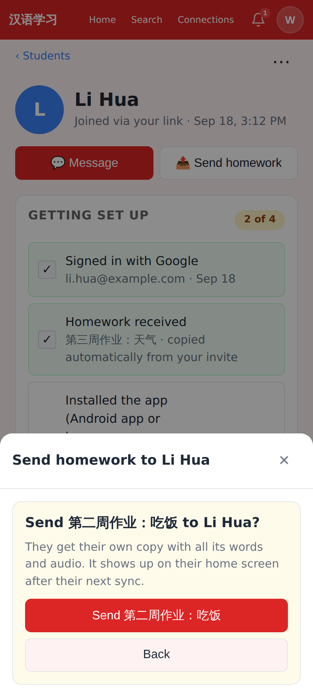
Sharing a deck for the first time asks for confirmation instead of sharing on the row tap.

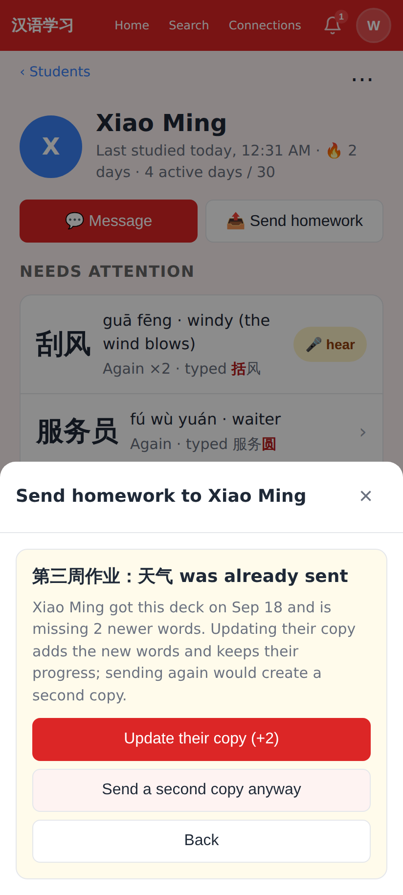
A deck that was already shared offers "Update their copy (+2)" — adds the new words, keeps the student's progress — instead of silently creating a duplicate.

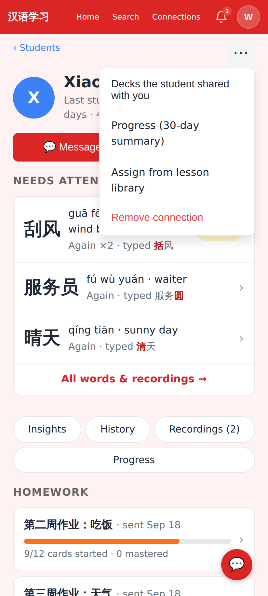
The ⋯ menu on the student page: decks the student shared with you, the 30-day progress summary, assign from library, Remove connection.

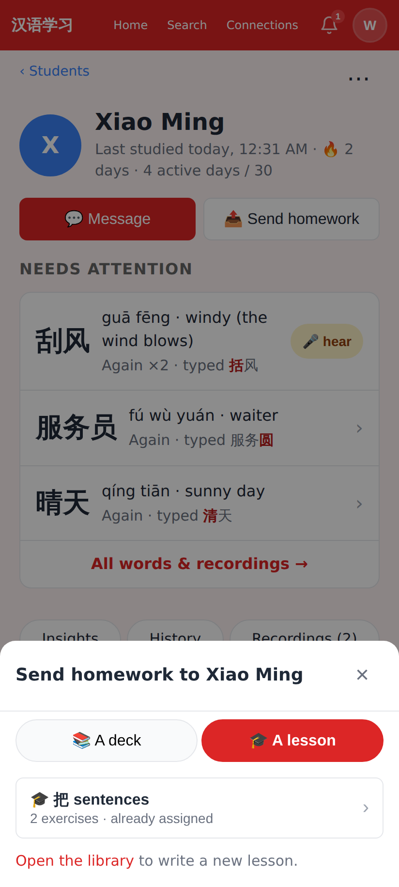
Send homework sheet, lesson tab: assign a library lesson to this student.

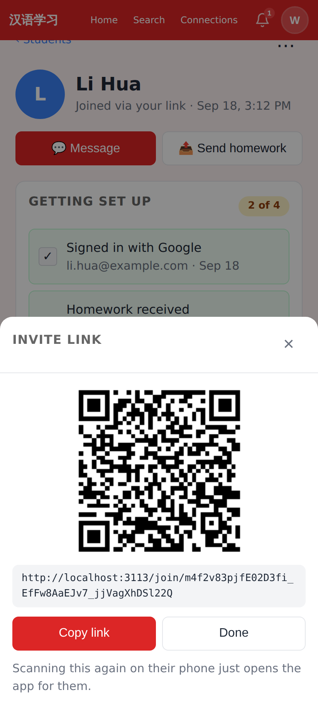
"Show QR again" re-renders the invite that created the student, with Copy link.

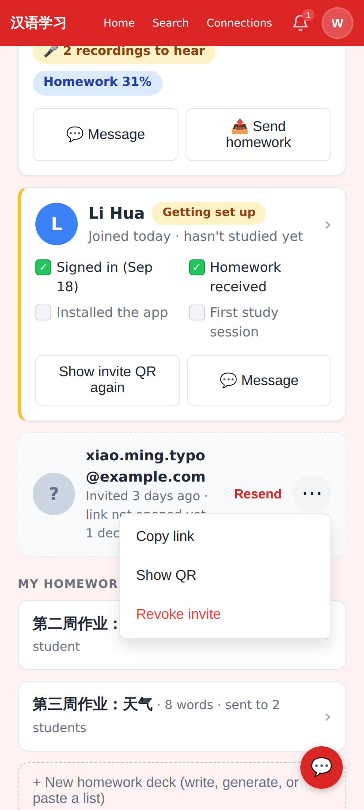
Pending invite row: Resend (QR) and ⋯ with Copy link / Show QR / Revoke.

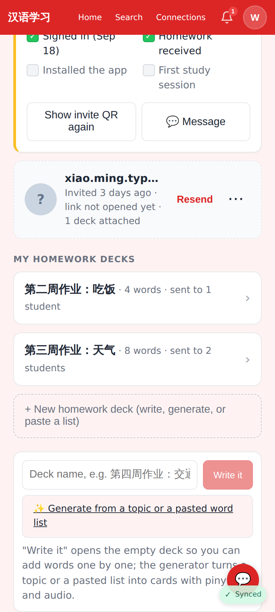
"+ New homework deck": name it and write it yourself, or hand a topic / pasted word list to the generator.

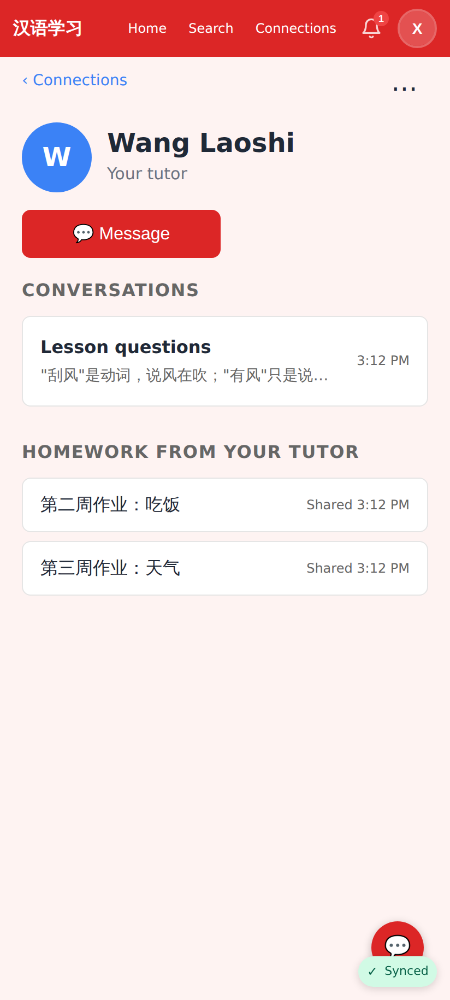
The student's side of the connection: Message opens the most recent conversation; homework from the tutor listed below.

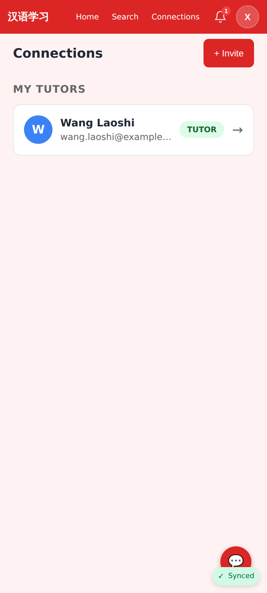
The student's Connections page: no "My Students" empty state any more; only the sections that apply.
