# Video calls (beta) — screenshots

Phone shots at 412×915 @2×, one wide shot at 1280×800. Two real headless Chromium
browsers connected over WebRTC to a local `wrangler dev`; the green shapes are
Chromium's fake camera. The transcript / report were seeded (no AI keys locally) in
the exact shape the queue writes.

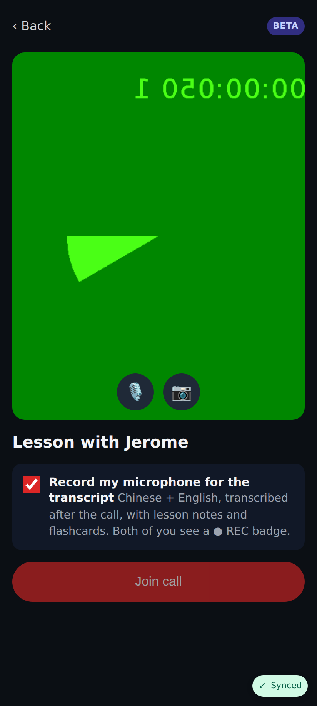
Pre-join: camera preview, mic / camera toggles, "Record my microphone for the transcript".

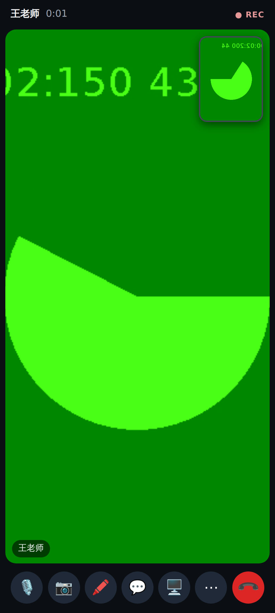
In the call: the other person full screen, you as a thumbnail, ● REC badge, controls.

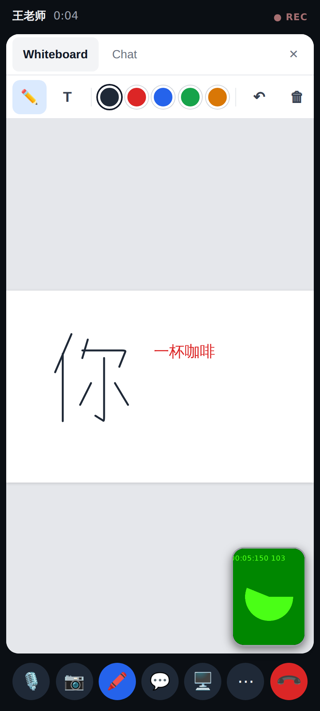
Whiteboard on the student's phone: the tutor's handwritten 你 and typed 一杯咖啡 arrive live; the video shrinks to a thumbnail.

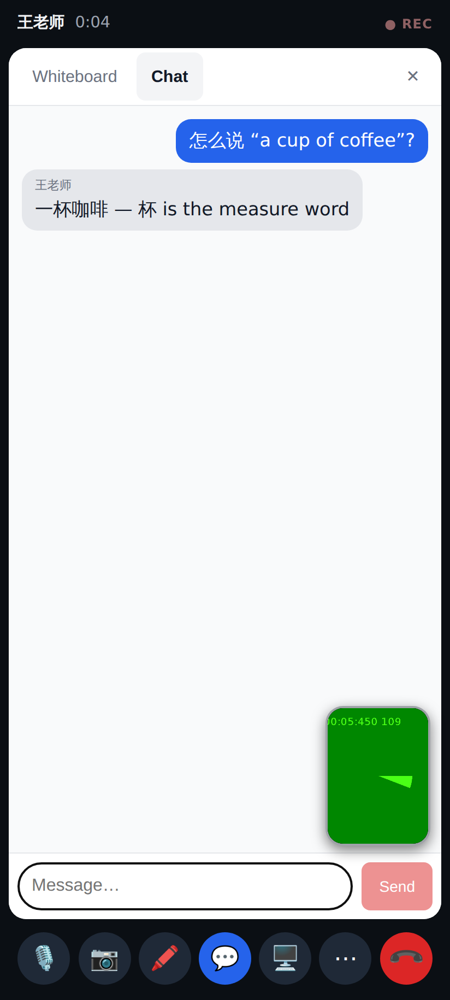
In-call chat (saved with the call, fed to the lesson report).

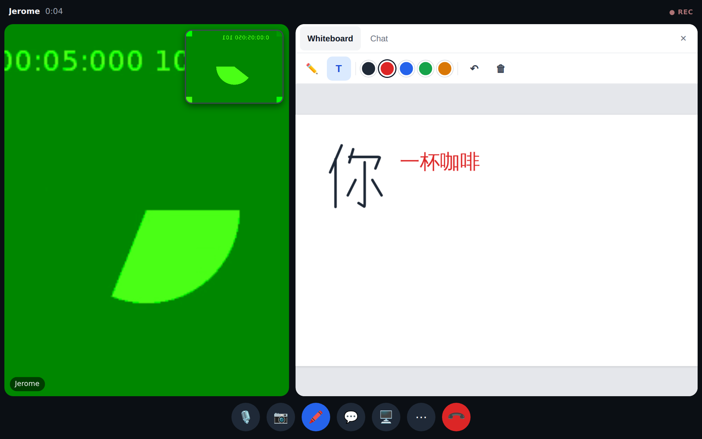
Unfolded / desktop: video and whiteboard side by side; screen-share button where the browser supports it.

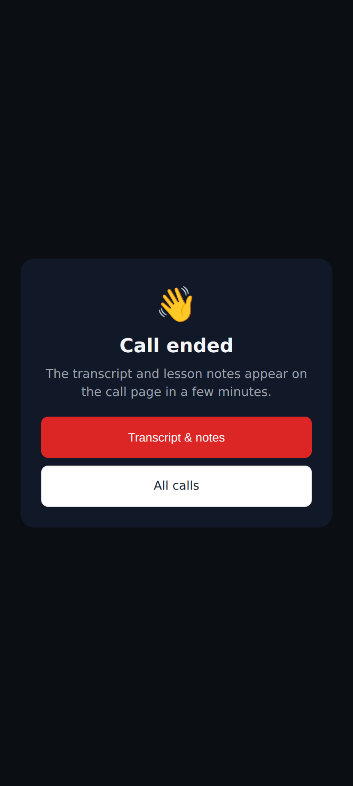
Call ended — recording finishes uploading in the background.

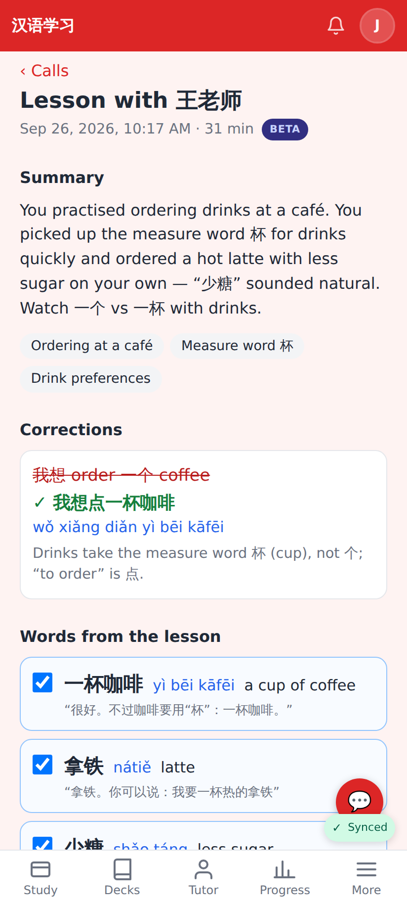
Review page: Claude's summary, topics, corrections and words from the lesson.

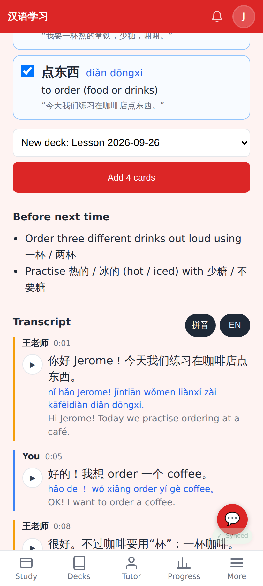
Pick words → "Add 4 cards"; the transcript interleaves both microphones, with ▶ per line, pinyin and English.

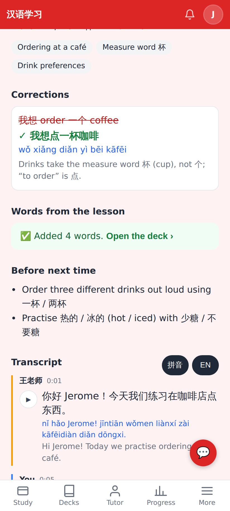
Cards added to a new "Lesson 2026-09-26" deck.

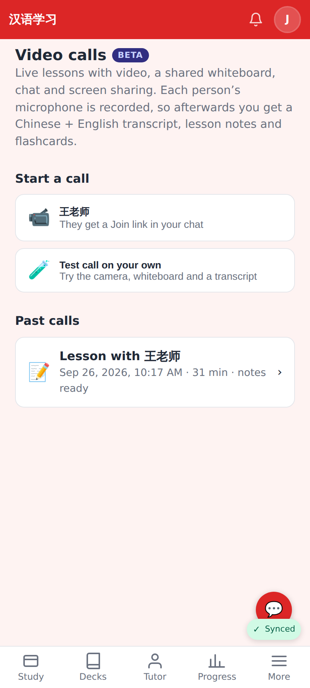
More → Video calls: start a call (or a solo test call) and past calls.

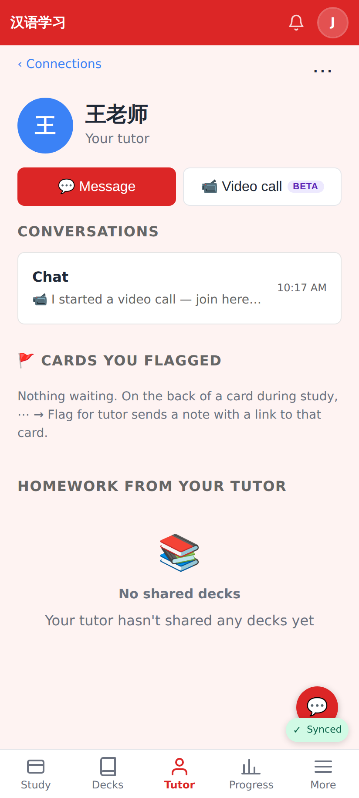
📹 Video call (beta) next to Message on the tutor / student page.

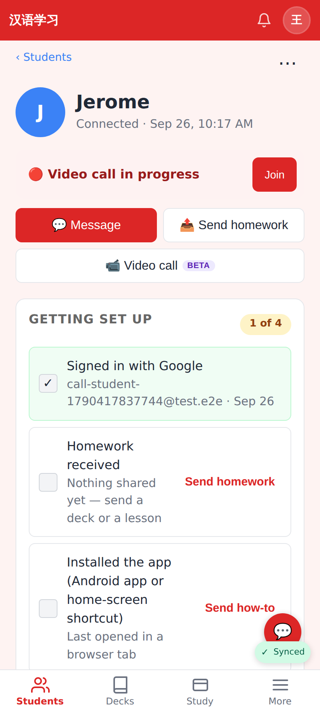
When the other side has started a call: "Video call in progress — Join".

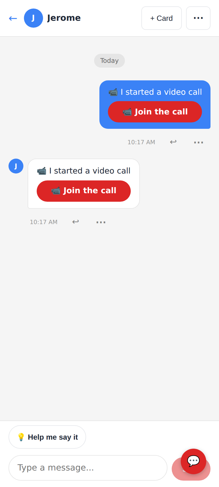
The call invite in the chat becomes a Join button.
