# Voice-first answer row: the read card's button style

The typing cards' question (English → hanzi, audio → hanzi) no longer has a big round 🎤 between
two boxy side buttons. It now has one row of the app's own buttons where the read card's
Show answer / 🎤 Record row sits. **✏️ Type** and **👁 Show answer** are small on the left. The
wide primary **🎤 Say it** is on the right. While listening, the row becomes ✕ Cancel and a red ⏹ Stop.
Phone shots are 412×915.

## Before (PR #581)

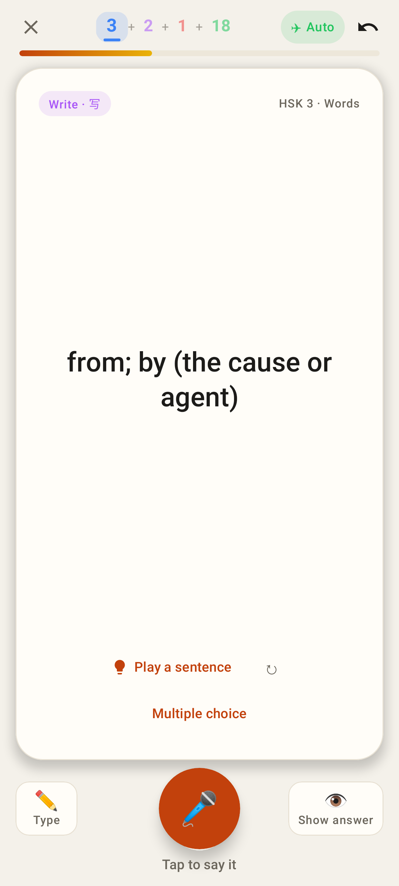
Lab: the big orange circle with the two boxy side buttons.

Lab, dark, listen card.

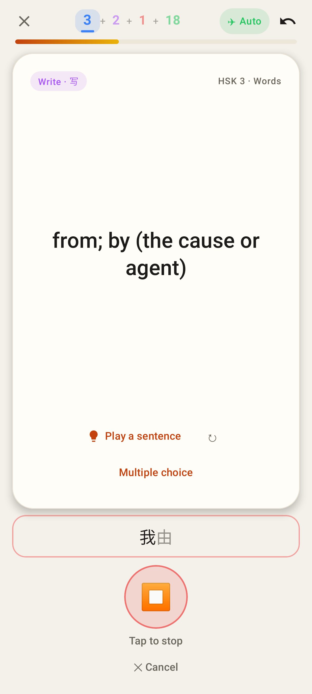
Lab while listening.

Web.

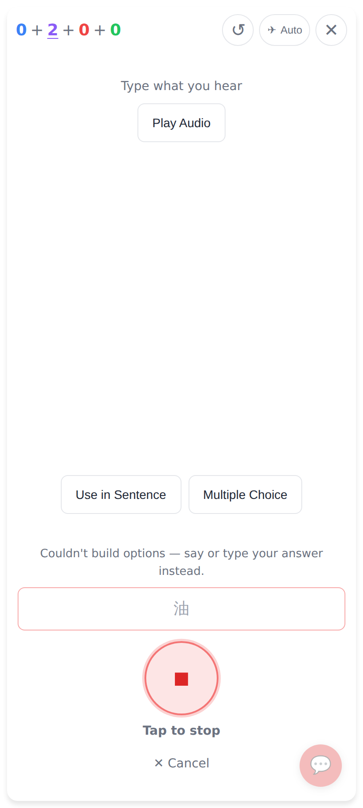
Web while listening.

## After: Lab

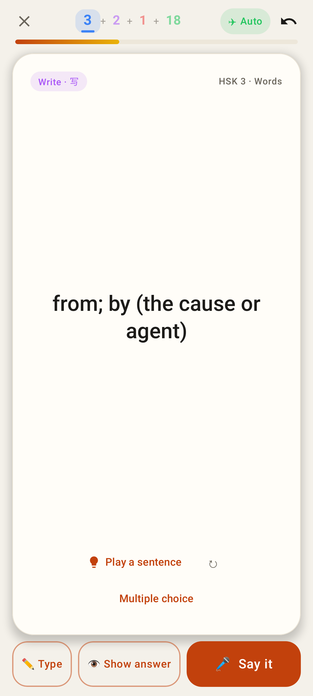
English → hanzi: ✏️ Type · 👁 Show answer · 🎤 Say it. These are the kit's `SecondaryPill` and `PrimaryPill`, 60 dp high like the read card's row.

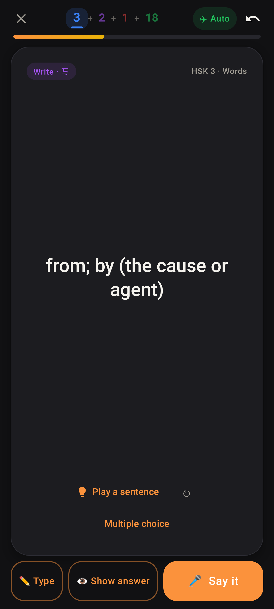
The same card in dark mode.

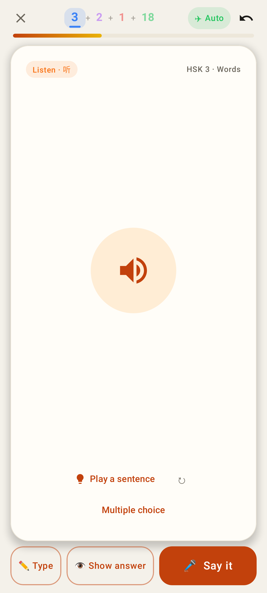
Audio → hanzi (listen card).

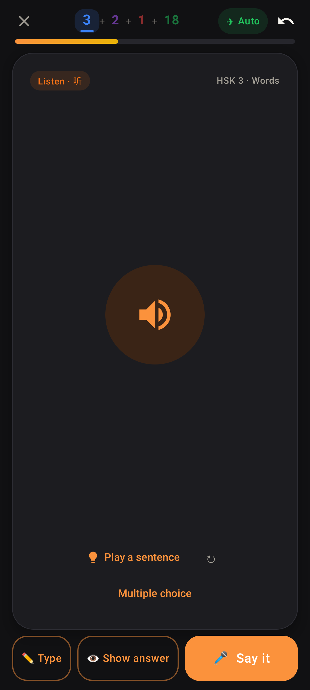
Listen card in dark mode.

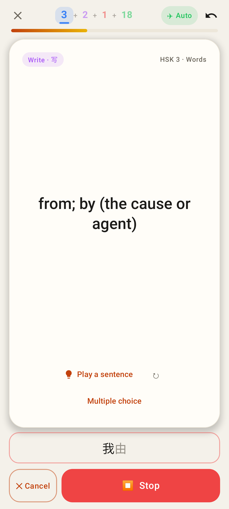
While listening, the live transcript shows above the row, which becomes ✕ Cancel and a red ⏹ Stop.

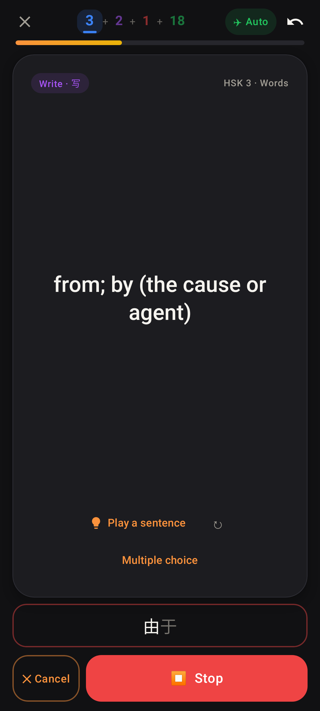
Listening, in dark mode.

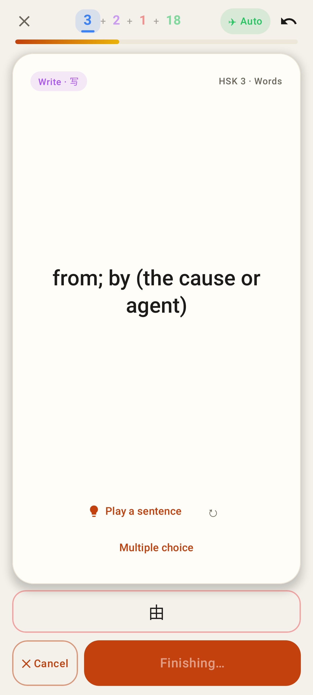
After Stop, the button reads "Finishing…" until the transcript is final.

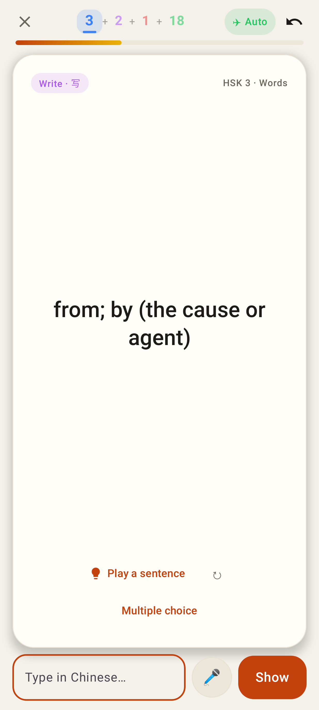
✏️ Type opens the box with the small 🎤 beside it, as before.

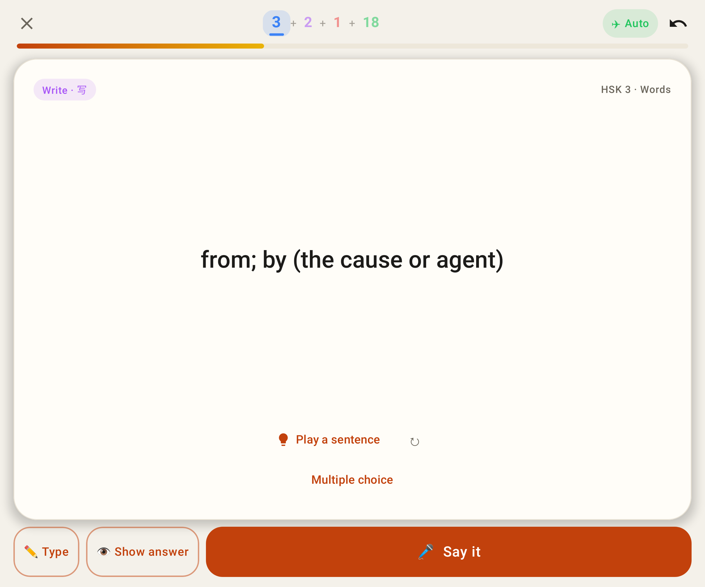
Unfolded (841 dp wide): Say it takes the rest of the row.

## After: web

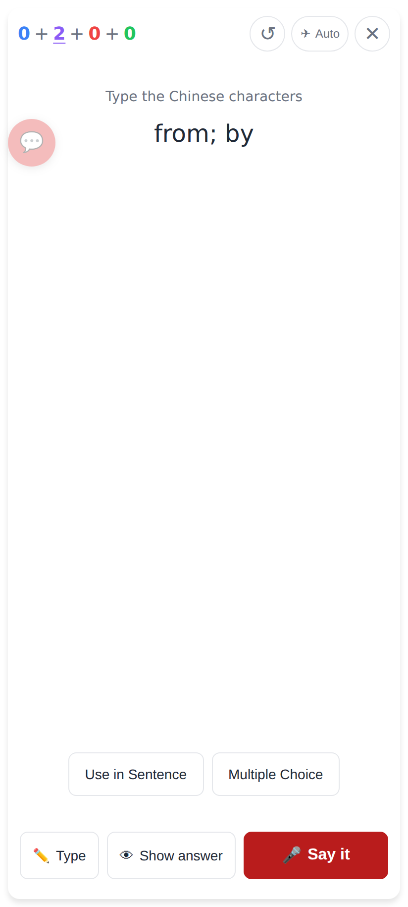
English → hanzi: `.btn .btn-secondary` ✏️ Type and 👁 Show answer, then the wide `.btn .btn-primary` 🎤 Say it.

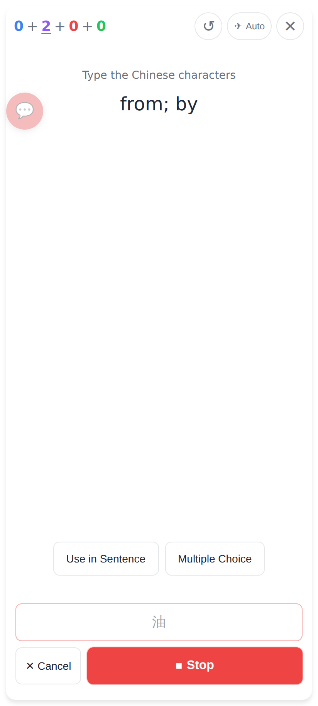
While listening: the live transcript above, then ✕ Cancel and ⏹ Stop (`.btn-error`, the read card's Stop Recording).

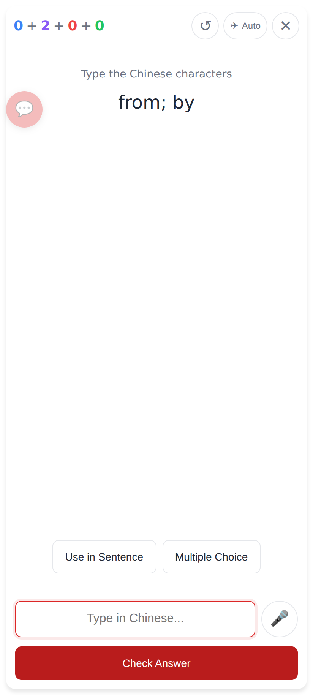
✏️ Type opens the box, unchanged.
