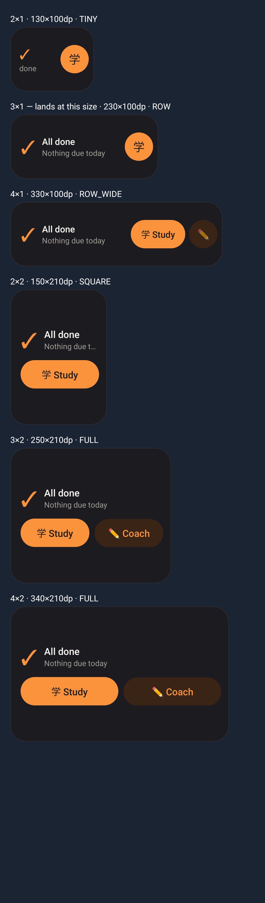
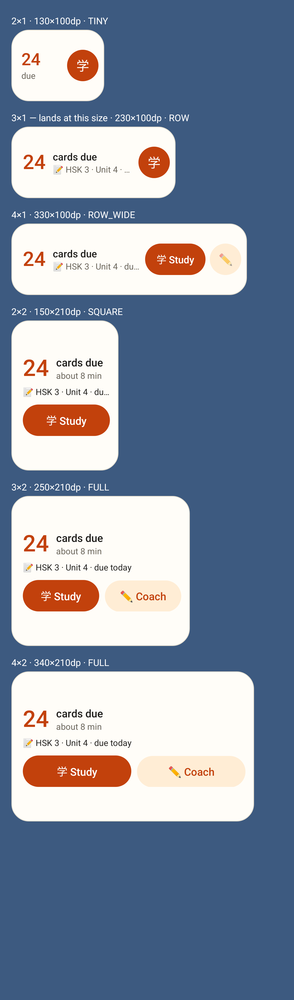
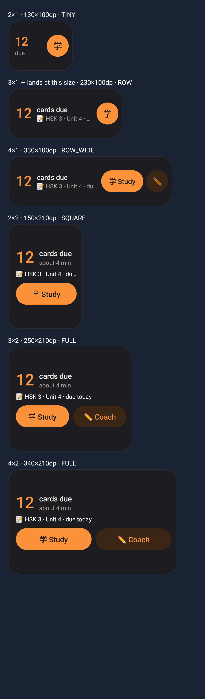
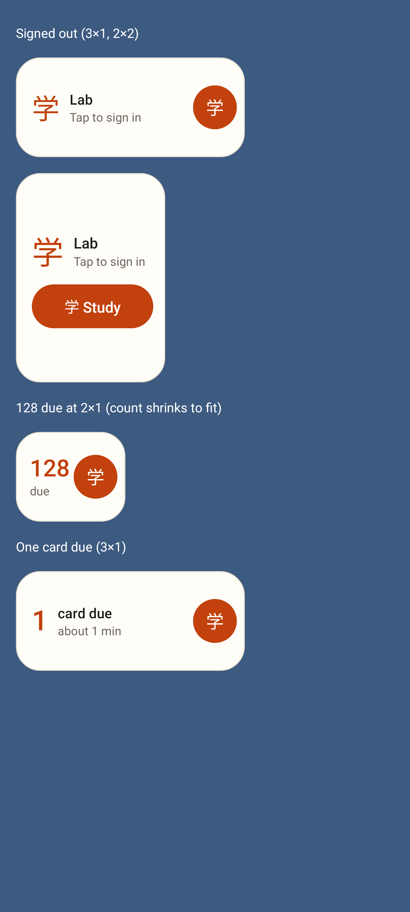

# Lab app widget: resizable, one layout per size

Rendered by Robolectric + Roborazzi from the real `RemoteViews`
(`android-lab/app/src/test/.../shell/NativeShellScreenshots.kt`), each widget at the size a
launcher gives it on the Pixel Fold. It now lands as a compact **3×1** row (was 3×2) and can be
resized from 2×1 up to about 5×3. A widget already on the home screen keeps its old size —
remove it and add it again.

Dark theme, nothing due today (the reported case) — 2×1, 3×1 (default), 4×1, 2×2, 3×2, 4×2.

Light theme, 24 cards due + one homework due today, at every size.

Dark theme, 12 cards due + homework.

Signed out (3×1, 2×2), 128 due at 2×1 (the count shrinks to fit), one card due.
