# UX Review — 汉语学习 (student + tutor)

Reviewed 2026-09-18 against the dev build (`localhost:3000`, E2E test mode, no AI keys) on a 412×915 phone viewport and an 840×1000 folded/unfolded Pixel Fold viewport, driving every route in `frontend/src/App.tsx` as **Xiao Ming** (student), **Wang Laoshi** (tutor) and a brand-new invitee **Li Hua**. Current-state screenshots are in `images/cur-*.png`, mockups in `mockups/*.html` (rendered to `images/mock-*.png` with the app's own colours and type from `frontend/src/index.css`).

The owner's guiding principle, applied throughout:

> "the default happy path is suuuuper easy and obvious, and the off-the-beaten-track is available but hard/hidden, but still possible — with a view to making the simple path simple. Optional complexity hidden in menus is fine."

## Executive summary

1. The **student happy path is already one tap** (Study All) and the study loop itself is solid; the problem is everything around it competing for attention: colour-coded queue arithmetic (`3 + 67 + 14 + 7`), a 15-item avatar menu, and 15 controls on the back of a card.
2. **The tutor has no happy path at all.** A tutor's home is the student home (Study All + "New Deck"), and every tutor task starts three taps deep under *Connections → student → …*. Listening to one pronunciation recording is 6 taps; nothing tells the tutor which words or recordings need them.
3. **Onboarding a student currently fails silently** in at least four places (wrong Google email, undelivered email, "✓ Flashcards done" on an empty account, no install/audio step). The invite-link mechanism now being built removes the first two; this report covers what to build *around* it: a first-open screen and a tutor-side setup checklist.
4. Developer plumbing leaks into the default path: **Debug** buttons on the deck page and study card, *Audio Quality (MiniMax)* and *Playback Quality* sections in Settings, *Copy Debug Dump* in the avatar menu, raw API error strings inside 38 failed "daily reader" cards.
5. Failed AI calls (offline or no key) leave debris or hang: the multiple-choice mode spins on "Generating options…" forever, chat tools report failure through `alert()`, and every session end spawns another failed reader card.
6. Most fixes are **remove / merge / hide**, not build: the ten headline changes below are 6×S, 4×M and one L-ish (bottom-tab navigation), and the mockups reuse existing data.
7. The two genuinely new screens worth building are the **tutor dashboard** (students, status, what needs attention) and the **student first-open** screen; both are small once the invite link lands.

---

## The 10 highest-leverage changes

| # | Change | Effort | Principle served |
|---|--------|--------|------------------|
| 1 | Student home: one plain-language Study button, tutor homework card, decks demoted | M | simple path simple |
| 2 | Tutor landing: a students dashboard instead of the learner home | M | happy path obvious (tutor) |
| 3 | Onboarding around the invite link: first-open screen + tutor setup checklist | M | happy path obvious (new student) |
| 4 | Card back: 15 controls → 9, plumbing under ⋯ | S | hide optional complexity |
| 5 | Tutor insights: "needs attention" words + recordings replace day→card drill-down | M | happy path (tutor) |
| 6 | Navigation: 5 tabs + grouped "More" replace 3 header links + 15-item dropdown | M/L | hide optional complexity |
| 7 | Failed AI work must not leave debris or hang (readers, multiple choice, alerts) | S | no dead ends |
| 8 | Connection page reorganised around chat + homework; danger/rarely-used under ⋯ | S | simple path simple |
| 9 | Deck page: Study + ⋯ instead of six buttons; remove Debug; fix SRS copy; note-list legibility | S | hide optional complexity |
| 10 | Settings: maintenance sections under "Advanced"; audio download automatic | S | hide optional complexity |

### 1. Student home — say "study", not `3 + 67 + 14 + 7`

**Problem.** The home screen's one important action is there, but it is dressed as arithmetic. The Study All button reads `Study All 3 + 67 + 14 + 7` with four colours whose meaning is explained only in the guide; every deck card repeats the four-colour sum, a `12n` note count, a 4px mastery bar, a 20×17px pin and its own Study button — four near-identical red buttons on one screen. Below the decks sit *New Deck · Generate · Analyze*, three creation actions a student who receives homework from a tutor rarely needs. On a fresh device the button shows `78 + 0 + 0 + 0` and no streak until sync finishes (`cur-student-home.png`), then jumps to `3 + 67 + 14 + 7` (`cur-study-setup.png`). Task count: *start studying* = 1 tap (good). *See what the tutor sent me* = home → deck (2), but nothing on the home says a deck came from a tutor except a `(from tutor)` suffix.

**Evidence.** `images/cur-student-home.png`, `images/cur-study-setup.png` (same screen after sync), `images/fold-student-home.png`.

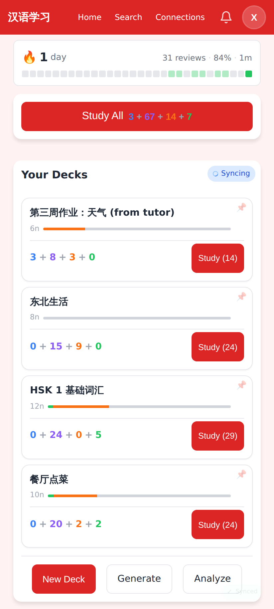 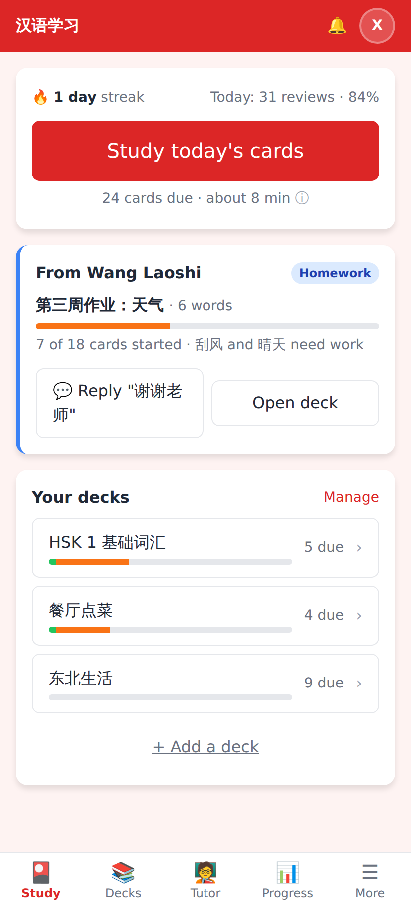

**Proposed change.**
- One button: **Study today's cards**, subtitle "24 cards due · about 8 min"; the four-way breakdown moves into an ⓘ tooltip and the in-session header (where it already is).
- A **"From Wang Laoshi"** card when a shared deck exists or an unread tutor message is waiting: deck name, progress bar in words ("7 of 18 cards started · 刮风 and 晴天 need work"), *Reply* and *Open deck*.
- Decks become a compact list with "n due" and a bar; per-deck Study buttons go into the deck page (a deck-only session is the off-track path). Pin/collapse stays as is.
- *New Deck · Generate · Analyze* collapse to one **+ Add a deck** link; Analyze moves to More.
- Show the streak card and last-known counts from cache before sync; never show "✓ Flashcards done" while `isSyncing` is true.

**Effort.** M (HomePage.tsx only; the homework card needs `shared_decks` + last unread message, both already queried elsewhere).

### 2. A tutor landing page

**Problem.** Wang Laoshi's home (`cur-tutor-home.png`) is Xiao Ming's home: *Study All 18*, his own homework deck as a study deck, *New Deck · Generate · Analyze*. Nothing on it mentions students. Every tutor task is: header *Connections* → tap student → then *New Chat* / *Share Deck* / *View Progress*. Tap counts measured: send a message 4, share a deck 4, hear a recording 6, see whether the student studied this week 3. The Connections page itself (`cur-tutor-connections.png`) spends its top third on "My Tutors — No tutors yet — Invite someone to be your tutor" for a person who will never have a tutor.

**Evidence.** `images/cur-tutor-home.png`, `images/cur-tutor-connections.png`, `images/cur-tutor-connection-detail.png`.

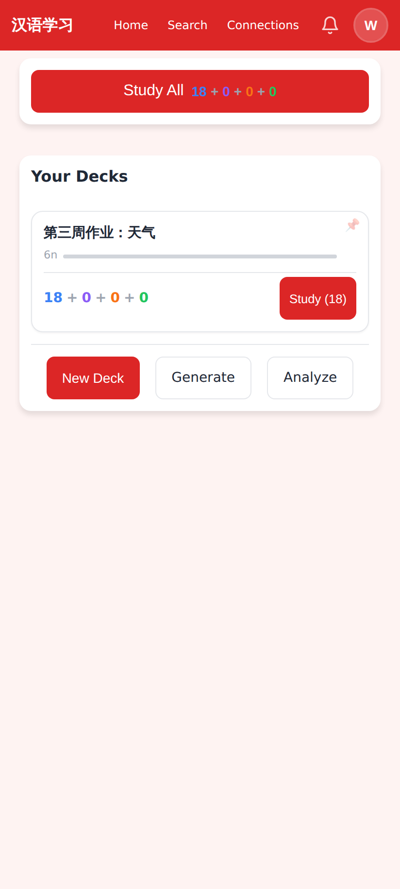 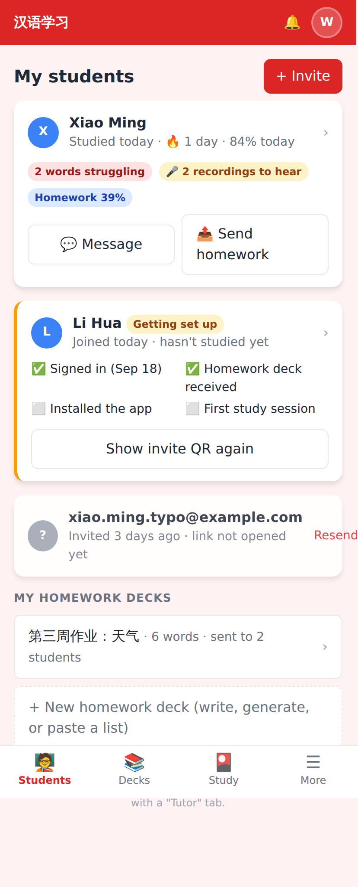

**Proposed change.** When an account has ≥1 active student (and, to keep Jerome's own account unchanged, no cards due or an explicit "Students" tab), the home is a **students dashboard**: one card per student with last-studied, streak, today's accuracy, three status pills (words struggling, recordings to hear, homework %) and two buttons (*Message*, *Send homework*); a "getting set up" card for new invitees with the checklist from #3; pending invitations as a muted row with *Resend*; the tutor's homework decks below. "My Tutors" is hidden for accounts with no tutor.

**Effort.** M — the data exists (`/api/relationships`, `/api/relationships/:id/progress`, `shared_decks`, review events with `rating=0`/`recording_url`); one new aggregated endpoint and one page.

### 3. Onboarding around the invite link (see the full section below)

**Problem.** A new student who signs in lands on `✓ Flashcards done · No decks yet · Create Deck / Generate / Analyze` (`cur-onb-first-home.png`) — a page that tells them they are finished and invites them to create decks. Nothing in-app mentions installing as an app or downloading audio (Settings shows "0 of 0 clips"). The tutor, meanwhile, sees `0 reviews · 0 days · 0% · No activity yet` (`cur-onb-tutor-progress-empty.png`), which cannot distinguish "never opened the link" from "opened, no audio, gave up".

**Evidence.** `images/cur-onb-first-home.png`, `images/cur-onb-tutor-progress-empty.png`, `images/cur-onb-invite-sent.png`.

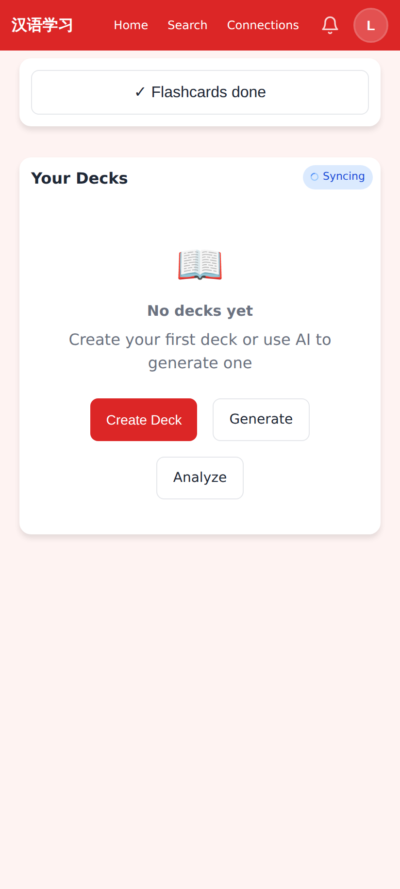 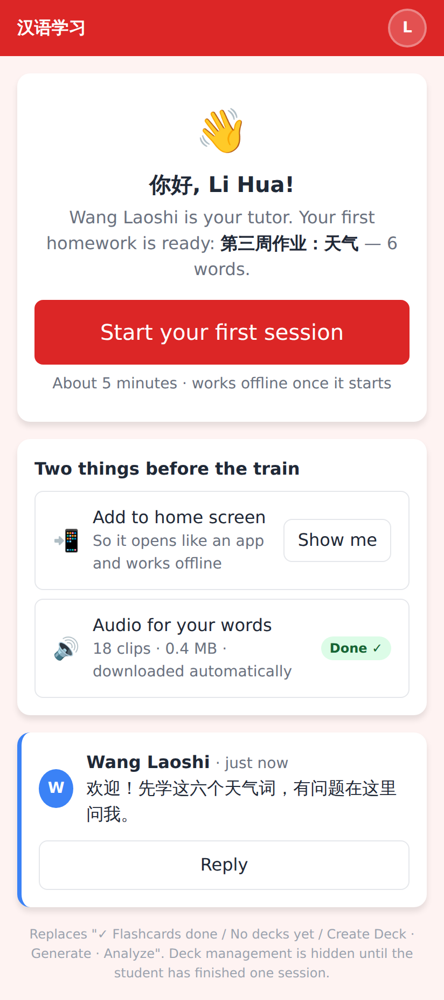

**Proposed change.** A first-open screen ("你好, Li Hua! Wang Laoshi is your tutor. Your first homework is ready: 第三周作业：天气 — 6 words. **Start your first session**"), a two-item checklist (Add to home screen; audio — done automatically), the tutor's welcome message; deck-management UI hidden until one session is complete. On the tutor side, the empty progress page becomes a 4-step checklist (signed in / homework received / installed / first session) with *Show QR again* and *Message*. Details and the failure analysis are in the Onboarding section.

**Effort.** M.

### 4. Card back — 15 controls to 9

**Problem.** On the back of a Hanzi→Meaning card (`cur-study-back-full.png`) there are 15 tappable things: 4 queue numbers, ↺, ✈, ✕, *Record Again*, *Generate Fun Fact*, *✨ Generate sentences*, *Play Audio*, *Ask Claude*, 🔊↻ (regenerate voice with MiniMax), ✏️ (edit), 🔍 (**Show debug info**), and the four ratings. *Generate Fun Fact* sits between the meaning and the rating buttons as a grey pill the student has to read past on every card; the three AI buttons all fail offline (the train). The ✈ toggle ("Offline mode OFF: tap when your connection is spotty") asks the learner to manage connectivity manually.

**Evidence.** `images/cur-study-back-full.png`, `images/cur-study-typing-result.png`, `images/fold-study-back.png`.

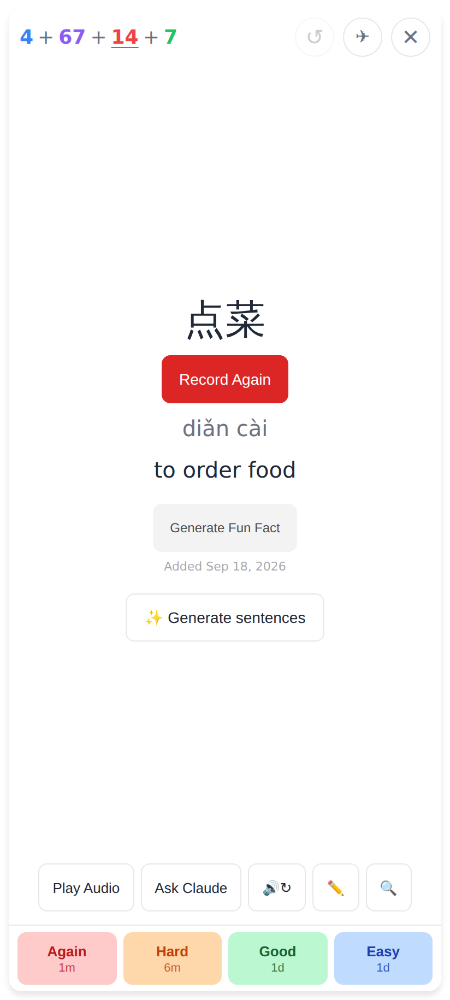 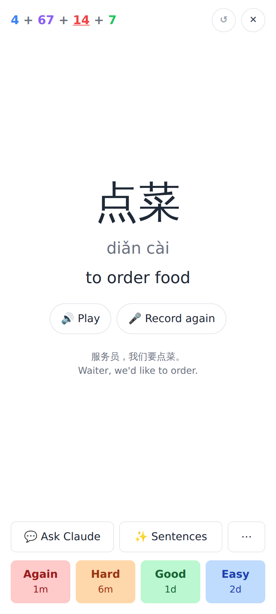

**Proposed change.** Keep hanzi · pinyin · meaning · *Play* · *Record again* · the card's sentence clue (already stored) · one action row (*Ask Claude*, *Sentences*, **⋯**) · ratings. Under ⋯: edit card, fun fact, regenerate audio, roleplay, debug. The ✈ toggle becomes automatic (`NetworkContext` already knows) with a manual override in Settings. Ratings get 64px height; in the unfolded view cap the card column at 640px so the ratings are not 380px-wide strips (`fold-study-back.png`).

**Effort.** S (StudyPage.tsx layout; no data changes).

### 5. Tutor insights instead of the day → card → recording drill-down

**Problem.** The tutor's question is "what is Xiao Ming getting wrong, and do his tones sound right?" The current answer is: *View Progress* (4 stat tiles + a day list, `cur-student-progress.png`) → a day → a 28-row list sorted "most difficult first" where 25 rows are `1 review ●` Good (`cur-student-day.png`, 3,608px tall) → a card page → *Play Recording* (`cur-student-card-reviews.png`). Six taps, and the 📝/🎤 icons that mark the interesting rows are 12px glyphs. The typed answers (括风 for 刮风, 清天 for 晴天) — the single most useful thing a tutor can see — are only visible on the last page.

**Evidence.** `images/cur-student-progress.png`, `images/cur-student-day.png`, `images/cur-student-card-reviews.png`.

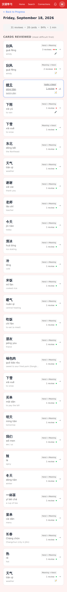 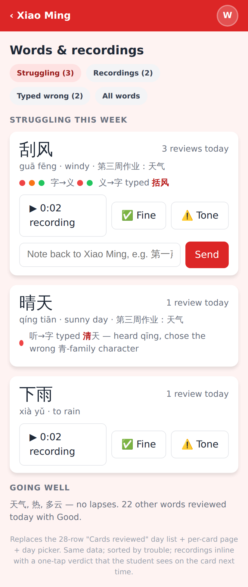

**Proposed change.** One page per student, **Words & recordings**, with filter chips (Struggling · Recordings · Typed wrong · All). Each struggling word shows the rating dots per card type, the wrong characters typed inline, the recording with a play button *and a one-tap verdict* (✅ Fine / ⚠️ Tone) plus an optional one-line note that the student sees the next time the card comes up. "Going well" is a single sentence. The existing day/card pages stay reachable from "All words" for the off-track case.

**Effort.** M — a query over `review_events` (rating 0/1, `user_answer != hanzi`, `recording_url IS NOT NULL`) for the last 7 days; the verdict/note needs one small table.

### 6. Navigation: tabs + grouped "More"

**Problem.** On a phone the header holds three 12px text links (*Home · Search · Connections*, 51–90×34px), a bell and an avatar. The avatar opens a 15-item dropdown (`cur-profile-menu.png`) mixing a student's daily tools (Readers, Coach), account items (Settings, Sign out) and developer plumbing (*Full Sync, Update App, Debug Console: Off, Copy Debug Dump*) in one 40px-row list. *Progress* — the "am I doing well?" answer Jerome asked for — is the ninth item. The 9 tools have no hierarchy and no descriptions.

**Evidence.** `images/cur-profile-menu.png`, `images/cur-tutor-profile-menu.png` (identical for a tutor).

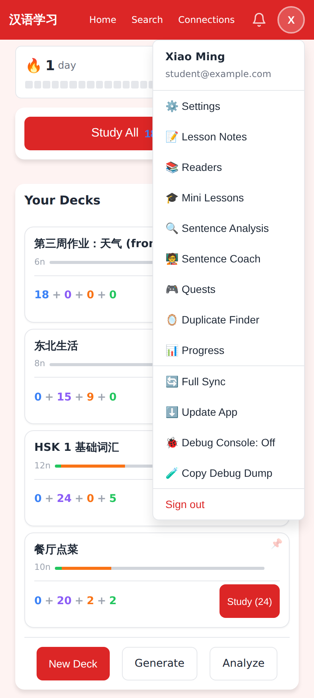 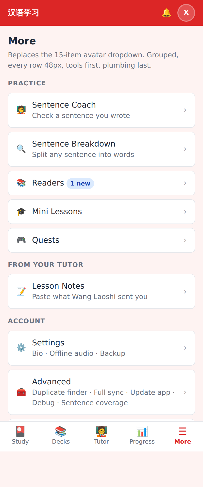

**Proposed change.** Bottom tab bar: **Study · Decks · Tutor · Progress · More** (for a tutor account: Students · Decks · Study · More). *Search* becomes the field at the top of Decks. *More* is a grouped page: Practice (Coach, Breakdown, Readers, Lessons, Quests) / From your tutor (Lesson Notes) / Account (Settings, **Advanced** — duplicate finder, full sync, update app, debug, sentence coverage —, Sign out). The full before/after tree is in the IA section.

**Effort.** M for the tab bar and More page, L if every page's back-link and header is also retouched. Can be shipped incrementally (More page first, tabs second).

### 7. Failed AI work must not leave debris or hang

**Problem.** Without AI keys (which is also what "offline on the train" looks like):
- Every study session end queues a daily reader; each failure stays as a card titled `生成中…` with the raw error *"Could not resolve authentication method. Expected either apiKey or authToken to be set…"* — 38 of them after my test runs, each with only a *Delete* button (`cur-readers.png`, 10,846px tall).
- Tapping *Multiple Choice* on a typing card shows "Generating options…" with a spinner that never resolves; the mode persists to the next card, and every subsequent typing card shows a permanent grey **Loading…** button (`cur-study-other-23.png`, `cur-study-multiple-choice.png`).
- Chat tools fail via browser `alert()` ("Failed to translate message", "Failed to generate flashcard. Make sure the conversation has Chinese vocabulary discussed") and the *+ Card* button turns into "…" while it works (`cur-tutor-chat-card-tool.png`).
- *Generate sentences*, *Generate Fun Fact*, quests and deck generation all fail with different styles of message; the Sentence Coach's inline pink error (`cur-coach-error.png`) is the one to copy.

**Evidence.** `images/cur-readers.png`, `images/cur-study-other-23.png`, `images/cur-study-multiple-choice.png`, `images/cur-coach-error.png`.

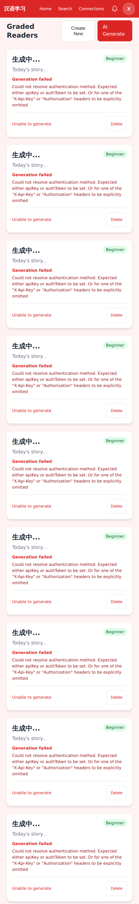 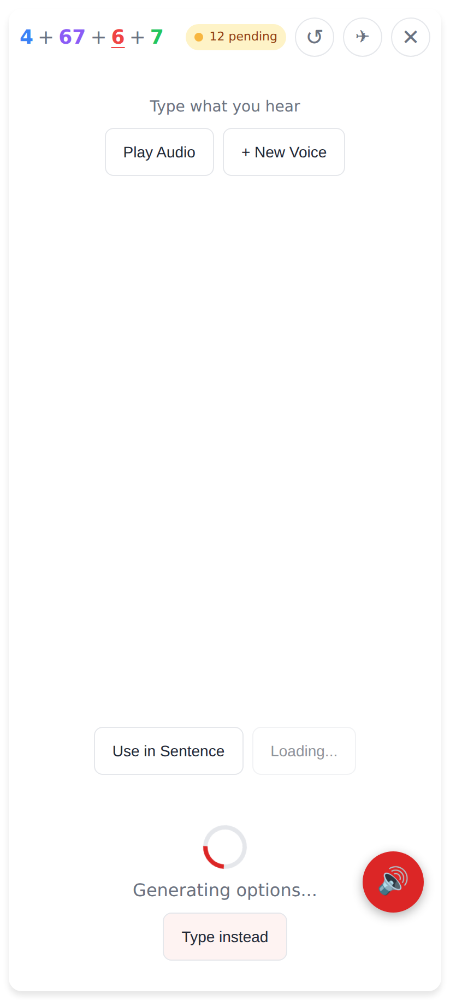

**Proposed change.** Failed daily readers are not shown (retry next session, one row at most); reader/quest cards never show raw API text. Multiple choice: time out at 8s, fall back to typing with a one-line note, and don't pre-load options on every typing card offline. Replace every `alert()` with the Coach's inline error style. Disable AI buttons (with "needs internet") when `NetworkContext` says offline.

**Effort.** S each; S–M in total.

### 8. Connection page reorganised around what tutors do

**Problem.** The tutor's student page (`cur-tutor-connection-detail.png`) is a stack of equal-weight sections: *New Chat · Share Deck · View Progress*, CONVERSATIONS, DECKS YOU SHARED, STUDENT'S SHARED DECKS (an empty state with a book emoji — 220px of "no decks shared by student"), DANGER ZONE — Remove Connection. Starting a chat first asks for a title in a modal whose *Cancel* sits above *Start Chat* (`cur-new-chat-modal.png`), the opposite order to every other modal in the app. The Share Deck modal's deck rows *are* the share action — there is no confirm, and sharing the same deck twice silently creates a second `(from tutor)` copy for the student.

**Evidence.** `images/cur-tutor-connection-detail.png`, `images/cur-new-chat-modal.png`, `images/cur-share-deck-modal.png`, `images/cur-student-connection-detail.png` (student side).

 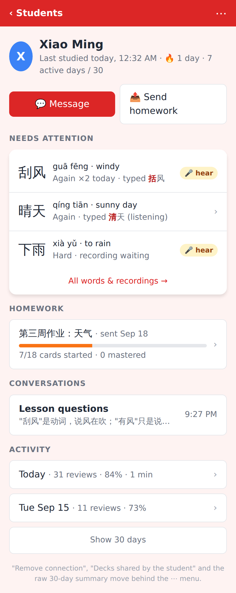

**Proposed change.** Header with the student's status line; two actions (*Message*, *Send homework*); **Needs attention** (top 3 from #5); Homework (shared decks with progress bars); Conversations; Activity (last two days, "Show 30 days"). *Remove connection* and *Decks the student shared with you* live under ⋯. *Message* opens the most recent conversation directly; "New conversation" is a link inside chat. Share Deck: confirm row, and if the deck was already shared offer *Update their copy* (new words only) rather than a duplicate.

**Effort.** S for the reorder and ⋯ menu; the "update copy" option is M and optional.

### 9. Deck page — one primary action, no Debug

**Problem.** `cur-deck-detail.png` opens with six full-width buttons: *Study (26 due)*, *Generate All Audio (12)*, *Share with Tutor*, *Settings*, **🔍 Debug**, *Delete*. Below: three stat tiles, a Completion block, a Progress-by-card-type block and a Recent Activity block — four ways of saying "33% seen" before the word list starts 1,150px down. The note list uses 10–11px text for pinyin, the `字→义` card-type labels and the rating dots (43 text nodes ≤11px on one screen). The Deck Settings modal (`cur-deck-settings.png`) explains "How Spaced Repetition Works" in terms of *ease factor* and learning steps — the SM-2 model the app no longer uses (it is FSRS per CLAUDE.md) — and scrolls 2,000px.

**Evidence.** `images/cur-deck-detail.png`, `images/cur-deck-settings.png`, `images/cur-tutor-deck.png`.

**Proposed change.** *Study* + ⋯ (share, settings, generate missing audio, export, delete); Debug removed from the UI (keep it behind the Debug Console flag). Merge the three progress blocks into one (mastery bar + per-type row). Notes list: 14px minimum for pinyin/meaning, dots 12px, and the row itself opens the editor (it currently isn't obviously tappable — the automated click on `.note-progress-item` timed out because the row is not a button). Delete the SRS explainer from the settings modal or replace it with two FSRS sentences.

**Effort.** S.

### 10. Settings — maintenance under "Advanced", audio automatic

**Problem.** `cur-settings.png` (1,720px) shows the student: *Personal Bio*, *Offline Audio* ("0 of 0 clips stored" plus a *Download All Audio* button), **Audio Quality** ("Clips are normally generated by MiniMax. When it was rate-limited, some fell back to Google…" with *Check 0 Unchecked Clips* / *Regenerate 0 Clips*), **Playback Quality** ("copy the report and paste it into the Claude chat"), *Example Sentences → Sentence Coverage* (a job-queue monitoring page, `cur-sentence-coverage.png`, 2,540px), *Export Data*, *Feature Requests*. Two of the six sections are addressed to the developer, and the one thing a student must do (download audio) is a manual button.

**Evidence.** `images/cur-settings.png`, `images/cur-sentence-coverage.png`.

**Proposed change.** Settings = Bio · Offline audio (status line + auto-download on Wi-Fi, manual button as fallback) · Backup · Sign out. *Audio Quality, Playback Quality, Sentence Coverage, Duplicate Finder, Full Sync, Update App, Debug Console, Debug Dump* move to **Advanced** (one collapsed section or a sub-page). The offline banner already exists; audio download should be triggered from sync, which the Settings copy says it is — the status just needs to be surfaced ("18/18 clips on this device").

**Effort.** S.

---

## Onboarding

Two flows were walked: (a) a tutor onboarding themselves and (b) a tutor onboarding a student. The invite-link mechanism (`/join/<token>` with QR, admin-controlled "can invite", auto-copied decks, access-request queue for uninvited sign-ins) is taken as given; this section covers the current path for reference, then everything **around** the link.

### (a) Tutor self-onboarding — current path

1. Open the site → *Sign in with Google* (`cur-onb-splash.png`; one button, fine).
2. Land on the learner home (`cur-tutor-home.png`): *Study All*, "No decks yet — Create your first deck or use AI to generate one". Nothing says "you can teach with this".
3. Discover *Connections* in the header → *+ Invite* → email → role picker ("Tutor — I'll teach them" / "Student — They'll teach me") → *Send Invite* (`cur-onb-invite-form.png`). 5 taps, clear enough once found.
4. Build a homework deck: home → *New Deck* / *Generate* → deck page → *Add Note* ×N (each note = modal, 4 fields, save) or generate.
5. Share it: Connections → student → *Share Deck* → tap deck row.

This does not need to be streamlined, but it needs to be **findable**: the only pointer to any of it is the word "Connections" in the header. The tutor dashboard (#2) makes steps 2–5 one screen (*+ Invite*, *Send homework*, *+ New homework deck*). The role picker can be dropped once invite links exist (a link created from "Students" is by definition a tutor invite).

### (b) Tutor onboarding a student — current path, counted

| Step | Who | Screen | Taps | Can fail silently? |
|------|-----|--------|------|--------------------|
| 1 | Tutor | Connections → + Invite → email, role, Send | 5 | Typo in the email → invitation waits 30 days, tutor sees "Not signed up yet" forever (`cur-onb-tutor-connections-pending.png`). |
| 2 | System | Invitation email | 0 | Only sent if `SENDGRID_API_KEY` is set; no UI shows whether it was sent or delivered. |
| 3 | Student | Open email → *Sign Up Now* → Google sign-in | 3 | Signs in with a **different Google account** than the invited address → no relationship is created and nothing tells either side. Opens the link inside Gmail/WeChat's in-app browser → Google sign-in may be blocked; PWA install impossible there. |
| 4 | Student | Home: `✓ Flashcards done · No decks yet · Create Deck / Generate / Analyze` (`cur-onb-first-home.png`) | — | Looks finished. The relationship *is* active (auto-accepted on login) but the home never mentions the tutor. A curious student taps *Create Deck* or *Generate* and starts building their own vocabulary. |
| 5 | Tutor | Notices the pending row turned into a student row; opens student → *Share Deck* → deck | 4 | Tutor has to check back manually; no notification that the student signed in. |
| 6 | Student | Reload home → deck `(from tutor)` appears → *Study All* (`cur-onb-student-home-deck.png`) | 1–2 | Only after sync; on a slow connection the home still says "Flashcards done" for a few seconds. Bell shows "deck shared" notification. |
| 7 | Student | First card: "Say this word/phrase aloud 热" with *Record Your Pronunciation* (`cur-onb-first-card.png`) | — | Mic permission prompt on the very first card; no explanation of the three card types or the four ratings. Audio streams — nothing is cached yet. |
| 8 | Student | Install as app; Settings → Download All Audio | 4+ | Not mentioned anywhere in the app. Settings shows "0 of 0 clips". Without it the train session has no audio. |

Total for the student before the first useful card: 3 taps + waiting for the tutor + 1–2 taps; **four silent failure points** (wrong email, no email, empty home, no install/audio).

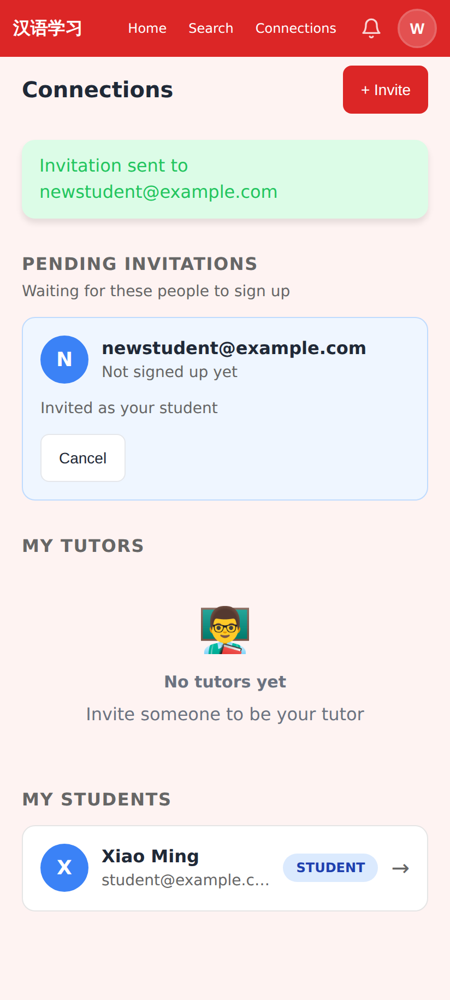  

### With the invite link: what still needs designing

The link removes the wrong-email and no-email failures and step 5 (auto-copied decks). What remains:

**Invite screen (tutor).** One screen: QR + link + *Copy* / *Share…*, "Start them with" deck checkboxes (defaulting to the most recent homework deck), and an optional welcome message that becomes the first chat message. No email field, no role picker, no "pending invitations" list — pending links show as muted rows on the dashboard with *Resend*.

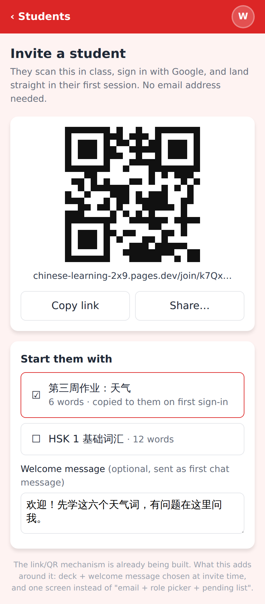

**First open (student).** The join token should carry the tutor's name and the deck, so the very first render (before sync) can say: "你好, Li Hua! Wang Laoshi is your tutor. Your first homework is ready: 第三周作业：天气 — 6 words. **Start your first session**". Below it a two-item checklist — *Add to home screen* (opens the OS install sheet via `beforeinstallprompt` on Android; a two-line illustrated hint on iOS) and *Audio for your words* (kicked off automatically; shows "18 clips · 0.4 MB · Done ✓"). The tutor's welcome message with a *Reply* button. Deck creation (*New Deck / Generate / Analyze*) is not rendered until the first session is complete. The first session itself: a one-time 3-line explainer before the first card ("You'll see each word three ways… rate yourself honestly — Again is fine"), and mic permission requested on the first *Record* tap with a "you can skip recording" note.

**Tutor's onboarding-status view.** The student page for a brand-new student replaces the empty progress page with a checklist: *Signed in* (`users.last_login_at`), *Homework deck received* (`shared_decks`), *Installed the app* (client reports `display-mode: standalone` during sync — one boolean on the user row), *First study session* (first `review_event`). Plus "Audio: 18/18 clips on their device" (client reports the cached count) and "Last opened: 2 hours ago". Actions: *Show QR again*, *Copy invite link*, *Send how-to*, *Message*. The same four states drive the "Getting set up" pill on the dashboard, so the tutor sees at a glance who is stuck.

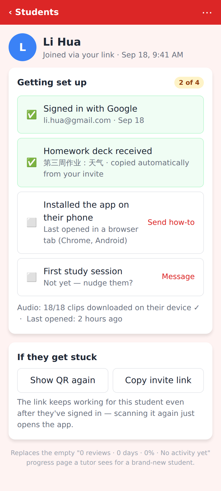

**Remaining silent-failure points to close explicitly.**
1. Link opened in an in-app browser (WeChat, Gmail): detect via UA and show "Open in Chrome/Safari to install" before Google sign-in; the tutor sees "Opened link, not signed in".
2. Student signs in on a laptop first, then on the phone: the link must stay valid for the *same account* indefinitely (re-scanning just opens the app); the status view says "Signed in on 2 devices; phone not installed".
3. Uninvited sign-in (student typed the URL instead of scanning): the access-request queue is the safety net, but the student needs a screen that says "Ask your tutor for their invite link" rather than a generic wait message.
4. Home rendered before first sync: never show "✓ Flashcards done" until `isSyncing` is false and at least one sync has completed; show "Getting your words…" instead.
5. Audio: download is triggered from sync today but its result is invisible; the first-open screen must show it finishing, and the study page should show a small "audio not downloaded" note instead of silently streaming.

Ranking: this is #3 in the top ten. The first-open screen and the tutor checklist are the difference between "the link worked" and "the student actually studied".

---

## Student journey walkthrough

Each entry: what the obvious next action is, the tap count for the common task, what competes, and issues found. Screenshot names refer to `images/`.

**Splash** (`cur-onb-splash.png`). One button. Fine. Missing: a line for invitees ("Got a link from your tutor? Just tap it.") once links exist.

**Home** (`cur-student-home.png`, `cur-study-setup.png`, `fold-student-home.png`). Obvious action: *Study All* — 1 tap. Competing: 4 deck cards × (title, `12n`, bar, four-colour sum, Study button, pin), then *New Deck · Generate · Analyze*. 14 sub-44px targets (pins 20×17, header links). The first render on a fresh device shows `78 + 0 + 0 + 0` and no streak card; after sync `3 + 67 + 14 + 7` and the streak. Deck cards are `<a>` with a 42px tall link area. Unfolded (840px) the grid goes two columns and works well.

**Profile menu** (`cur-profile-menu.png`). 15 rows, 40px each, 14px text, no grouping beyond two dividers; *Progress* is 9th. The menu is the only route to 9 features. Full analysis in #6.

**Notifications** (`cur-notifications.png`). Dropdown works; items are the only place a shared deck is announced. Fine.

**Search** (`cur-search.png`). A 233×40px centred input on an otherwise empty page; `/search?q=饭` is not honoured (input stays empty). Typed searches work (see the guide). Proposed: merge into the Decks tab as a top field with "recent words" underneath.

**Deck detail** (`cur-deck-detail.png`, `fold-deck-detail.png`). Six action buttons including *Debug*; three progress blocks; word list 1,150px down with 10–11px text. Tapping a word row is not discoverable (no chevron, not a button). See #9.

**Deck settings modal** (`cur-deck-settings.png`). 2,000px modal; SM-2 explainer in an FSRS app; the two numbers a tutor might change (new cards per day, secondary) are below the explainer.

**Edit card modal** (`cur-study-edit-card.png`, opened from the study card). Hanzi/pinyin/English/fun facts/alternatives/sentence clue+pinyin+translation+Generate/sentence set/Delete Note — 12 controls; 28px-tall inputs for sentence pinyin/translation (below the 44px minimum). The *Delete Note* button sits in the same footer as *Save*.

**Study — front** (`cur-study-front.png`, `cur-onb-first-card.png`). Clean: word, *Use in Sentence*, *Record Your Pronunciation*, *Skip recording* (99×31px link — the most-tapped control for a student who does not record, under-sized). Header: ↺ ✈ ✕ at 36px. ✕ ends the session and goes straight home with **no recap and no confirmation** (`cur-study-ended.png` is the home page), so the celebratory *All Done* screen is skipped for anyone who leaves early.

**Study — back** (`cur-study-back-full.png`). 15 controls; see #4. The "Added Sep 18, 2026" line and *Generate Fun Fact* pill are noise on every card.

**Ask Claude** (`cur-study-ask-claude.png`, `cur-study-ask-claude-error.png`). Seven suggestion chips (two of them — *Check my answer* / *Verify my answer* — read as duplicates); the failure state after sending is silence — the question stays in the box, no error shown (the sheet in `cur-study-ask-claude-error.png` is unchanged after 4s).

**Typing cards** (`cur-study-typing.png`, `cur-study-typing-result.png`, `cur-study-multiple-choice.png`). The character-by-character diff (括风 → 下雪, red vs grey tiles) is excellent. Competing: a permanent grey *Loading…* button next to *Use in Sentence* on every typing card (multiple-choice options pre-loading). Multiple choice never resolved offline (#7). The audio card (`cur-study-other-23.png`) shows "Type what you hear" + *Play Audio* + *+ New Voice* — the voice picker is a maintenance action placed next to the primary one.

**Session end.** Not reachable in this environment without AI keys because the daily-reader step is queued first; the guide's *All Done* screen is good. Recommend keeping it and also showing it on ✕.

**My Progress → day → card** (`cur-my-progress.png`, `cur-my-day.png`, `cur-my-card.png`). Same three-level drill as the tutor's; the student's own "what did I get wrong today" is 4 taps from home and the day list is 30+ rows of Good. Recommend the same "struggling words" summary at the top of Progress.

**Settings** (`cur-settings.png`) and **Sentence Coverage** (`cur-sentence-coverage.png`). See #10. Sentence Coverage is a queue monitor (queued/done/failed/stuck, failing words with errors) — Advanced.

**Connections / connection / chat** (`cur-student-connections.png`, `cur-student-connection-detail.png`, `cur-student-chat.png`). The student page is clean: *New Chat*, Conversations, Shared decks, Danger zone. Chat: each message carries 5 tool icons at 20–34×24px (Reply, React, Play, Check my Chinese / Translate, Discuss), 26 sub-44px targets on one screen; *+ Card* in the header, ❓ ("I don't know what to say", `cur-chat-suggest.png` — a genuinely good tool with a bad name) by the composer. The Discuss modal (`cur-chat-discuss.png`) has a 12×28px close "x". *Check my Chinese* and *Translate* fail with `alert()`s. Proposed: long-press/⋯ on a message for tools; keep Play inline; rename ❓ to "Help me say it".

**Sentence Coach / Sentence Breakdown / Generate** (`cur-coach.png`, `cur-coach-error.png`, `cur-analyze.png`, `cur-analyze-error.png`, `cur-generate.png`, `cur-generate-error.png`). All three are one-field forms with good examples. Coach's inline error is the model. Coach and Breakdown overlap conceptually ("type a sentence, get it explained") — one entry point ("Sentences") with two tabs would remove a menu item.

**Readers / generate / create** (`cur-readers.png`, `cur-reader-generate.png`, `cur-reader-editor.png`). List polluted by failed daily readers (#7). *Create New* opens a modal (title, English title, level, topic) rather than an editor; the editor route `/readers/:id/edit` was not reachable without a successful creation. The generate form's radio inputs are 13–20px.

**Quests** (`cur-quests.png`, `cur-quest-error.png`). Self-contained dark card, six 32px-tall topic chips (below 44px), *Build the level* fails with an inline message. Fine as an off-track feature under More.

**Mini Lessons / Lesson Notes / Duplicate Finder** (`cur-mini-lessons.png`, `cur-lesson-notes.png`, `cur-duplicate-finder.png`). Empty states are clear. Lesson Notes' "When" input is 380×24px. Duplicate Finder is a maintenance tool → Advanced.

## Tutor journey walkthrough

**Home** (`cur-tutor-home.png`, `fold-tutor-home.png`). The learner home; the tutor's own homework deck shows as `Study (18)`. Nothing about students. See #2.

**Profile menu** (`cur-tutor-profile-menu.png`). Identical to the student's, including Lesson Notes, Readers, Quests — none of which a tutor uses.

**Connections** (`cur-tutor-connections.png`, `cur-onb-invite-form.png`, `cur-onb-invite-sent.png`). "My Tutors — No tutors yet" occupies the top; the student row is a 36px-avatar card with a STUDENT pill and → — fine. Invite: email + role radio + Send; the success banner and "Pending invitations — Waiting for these people to sign up" are clear but give no delivery status.

**Student page** (`cur-tutor-connection-detail.png`, `fold-tutor-connection-detail.png`). See #8. On the fold width it is a single centred column with large empty margins — fine.

**Share deck** (`cur-share-deck-modal.png`). Deck rows share on tap, no confirm; re-sharing creates a duplicate copy for the student.

**View Progress** (`cur-student-progress.png`, `fold-student-progress.png`). Four tiles (97 reviews · 7 days · 64% · 7m) then a day list. The tiles answer "is he studying" but not "what should I teach next".

**Day → card → recording** (`cur-student-day.png`, `cur-student-card-reviews.png`). See #5. The card page is good once you get there: word, *Play Audio* (reference), each review with rating, seconds, the typed answer (with a correct/incorrect mark) and *Play Recording*. The page is good; the problem is only that it is six taps away and reached via a list that hides which rows have anything to show.

**Shared deck progress** (`cur-shared-deck-progress.png`). Completion, per-type bars, all words with per-type dots (8px text for the `字→义` labels — 15 nodes at 8px, the smallest text in the app) and a mastery %. Useful; needs the dots enlarged and "0%" words sorted to the top.

**Chat as tutor** (`cur-tutor-chat.png`, `cur-tutor-chat-sent.png`, `cur-tutor-chat-card-tool.png`, `fold-tutor-chat.png`). The tools are role-blind: the tutor's own messages get *Check my Chinese* (✓?) and the student's messages get *Translate & make flashcard* — for a native-speaker tutor both are noise. *+ Card* is the one tool a tutor wants (make a card from what we just discussed) and it needs AI; without it, an `alert()`. Proposed: tutor side shows Reply/React/Play + "Make a card from this" only.

**Tutor's deck page** (`cur-tutor-deck.png`). Same as the student's including *Share with Tutor* (meaningless for a tutor) and *Debug*.

**Settings** (`cur-tutor-settings.png`). Same as the student's, including Personal Bio ("used to personalise example sentences") and Offline Audio — irrelevant to a tutor who only builds decks.

---

## Information architecture proposal

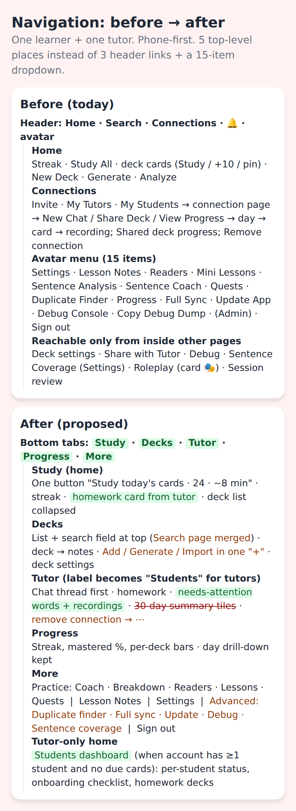 

**Before.** Header: *Home · Search · Connections · 🔔 · avatar(15 items)*. Tutor features live under Connections, three levels deep. Nine tools plus four maintenance items share one dropdown. Deck settings, share, debug and sentence coverage are only reachable from inside other pages.

**After.**
- **Study** (home): one button, streak, the tutor's homework card, decks collapsed.
- **Decks**: list with search at the top (absorbs the Search page); one "+" for add/generate/import.
- **Tutor** (student account) / **Students** (tutor account): chat first, homework, needs-attention words and recordings; danger and rarely-used actions under ⋯. For a tutor with no due cards this tab is the landing page (the dashboard in #2).
- **Progress**: streak, mastered %, per-deck bars, struggling words; the day/card drill-down kept underneath.
- **More**: Practice (Coach, Breakdown, Readers, Lessons, Quests) · Lesson Notes · Settings · **Advanced** (duplicate finder, full sync, update app, debug console/dump, sentence coverage, audio quality) · Sign out.

Role-awareness is cheap: `relationships.students.length > 0` and `tutors.length > 0` are already loaded by the header for the bell. A student-only account never sees "Students"; a tutor-only account never sees Lesson Notes, Readers or Personal Bio.

---

## Consistency & polish backlog

| Screen | Issue | Fix | Effort |
|--------|-------|-----|--------|
| Header (all pages) | Nav links 12px text, 34px tall; five targets in 412px | Tabs (#6) or at least 44px targets and 14px | S |
| Home | `✓ Flashcards done` shown while the first sync is still running | Gate on sync completion; show "Getting your words…" | S |
| Home | Pin buttons 20×17px, opacity .3 | 44px hit area or move pin into deck page | S |
| Home | `12n` note count is cryptic | "12 words" | S |
| Study front | *Skip recording* 99×31px underlined link is the most-used control | Button, 44px | S |
| Study header | ✕ ends the session with no recap or confirm | Show the All Done recap on exit; confirm if >0 reviews | S |
| Study header | ✈ toggle title "Offline mode OFF: tap when your connection is spotty" | Automatic; override in Settings | S |
| Study back | "Added Sep 18, 2026" on every card | Move into ⋯/edit | S |
| Study back | 🔍 *Show debug info* visible to learners | Behind Debug Console flag | S |
| Study typing | Permanent grey *Loading…* button (MC pre-load) | Load lazily on tap; hide offline | S |
| Study typing | Multiple-choice mode sticks across cards and hangs offline | Per-card mode; 8s timeout → typing | S |
| Audio card | *+ New Voice* next to *Play Audio* | Under ⋯ | S |
| Ask Claude | *Check my answer* and *Verify my answer* chips read as duplicates; no error state on failure | Merge chips; inline error | S |
| Edit card modal | Sentence pinyin/translation inputs 28px tall; *Delete Note* in the Save footer | 44px inputs; delete under ⋯ | S |
| Deck page | *Debug* button; *Share with Tutor* shown to tutors; six buttons | Study + ⋯ (#9) | S |
| Deck page | Word rows not visibly tappable; 10–11px pinyin/labels/dots | Chevron, 14px minimum, 12px dots | S |
| Deck settings | "How Spaced Repetition Works" describes SM-2 ease factor | Two FSRS sentences or remove | S |
| Readers | 38 failed daily readers with raw API error text and only *Delete* | Hide failed daily readers; friendly message; auto-retry | S |
| Readers | *Create New* is a modal, not the editor | Open editor directly with title field on top | S |
| Reader generate | Radio inputs 13–20px | Card-style options, 44px | S |
| Quests | Topic chips 32px tall | 44px | S |
| Chat | Per-message tool row: 5 icons at 20–34×24px | Reply/Play inline; the rest under long-press/⋯ | M |
| Chat | Tools are role-blind (tutor gets *Check my Chinese* on own messages) | Role-aware tool set | S |
| Chat | Failures via `alert()`; *+ Card* label becomes "…" while loading | Inline error; spinner in button | S |
| Chat | ❓ button = "I don't know what to say" | Label "Help me say it" | S |
| Connection page | New chat requires a title modal; *Cancel* above *Start Chat* | Open chat directly; title optional inside | S |
| Connection page | "Student's shared decks" empty state 220px tall; Danger zone always visible | Under ⋯ | S |
| Share deck | Row tap shares immediately; re-share duplicates | Confirm; "update their copy" | S/M |
| Shared deck progress | 8px `字→义` labels, 11px dots | 12–14px | S |
| Student day page | 28 rows, most `1 review ● Good`; 📝/🎤 icons 12px | Struggling-first summary (#5) | M |
| Card review page | *Back to Day* link 101×21px; *Play Recording* 120×36px | 44px targets | S |
| Progress (both) | Four stat tiles with 0m study time while sessions total minutes | Show "1 min" not "0m"; or drop the tile | S |
| Settings | Audio Quality / Playback Quality / Sentence Coverage addressed to the developer | Advanced section (#10) | S |
| Settings | Personal Bio + Offline Audio shown to tutor-only accounts | Role-aware | S |
| Profile menu | *Debug Console: Off*, *Copy Debug Dump*, *Full Sync*, *Update App* alongside daily tools | Advanced group | S |
| Search | `?q=` deep link ignored; empty page | Honour param; recent words | S |
| Fold (840px) study | Rating buttons stretch to 380px each | Max-width 640px column | S |
| All modals | Close "×" 12–14px wide | 44px hit area | S |

## Appendix — screens reviewed

Student (Xiao Ming): `cur-onb-splash`, `cur-student-home`, `cur-study-setup` (home after sync), `fold-student-home`, `cur-profile-menu`, `cur-notifications`, `cur-search`, `cur-deck-detail`, `fold-deck-detail`, `cur-deck-settings`, `cur-deck-debug`, `cur-share-with-tutor`, `cur-study-front`, `fold-study-front`, `cur-study-back`, `cur-study-back-full`, `fold-study-back`, `cur-study-ask-claude`, `cur-study-ask-claude-error`, `cur-study-edit-card`, `cur-study-sentences-error`, `cur-study-typing`, `cur-study-multiple-choice`, `cur-study-typing-result`, `cur-study-other-23` (audio card, MC hang), `cur-study-ended`, `cur-my-progress`, `cur-my-day`, `cur-my-card`, `cur-settings`, `cur-sentence-coverage`, `cur-student-connections`, `cur-student-connection-detail`, `fold-connection-detail`, `cur-new-chat-modal`, `cur-student-chat`, `cur-chat-check-error`, `cur-chat-translate`, `cur-chat-discuss`, `cur-chat-suggest`, `cur-coach`, `cur-coach-error`, `cur-analyze`, `cur-analyze-error`, `cur-generate`, `cur-generate-error`, `cur-readers`, `cur-reader-generate`, `cur-reader-editor` (create modal), `cur-quests`, `cur-quest-error`, `cur-mini-lessons`, `cur-lesson-notes`, `cur-duplicate-finder`.

Tutor (Wang Laoshi): `cur-tutor-home`, `fold-tutor-home`, `cur-tutor-profile-menu`, `cur-tutor-connections`, `cur-onb-invite-form`, `cur-onb-invite-sent`, `cur-onb-tutor-connections-pending`, `cur-tutor-connection-detail`, `fold-tutor-connection-detail`, `cur-share-deck-modal`, `cur-student-progress`, `fold-student-progress`, `cur-student-day`, `cur-student-card-reviews`, `cur-shared-deck-progress`, `cur-tutor-chat`, `fold-tutor-chat`, `cur-tutor-chat-sent`, `cur-tutor-chat-card-tool`, `cur-tutor-deck`, `cur-tutor-settings`, `cur-onb-tutor-new-student`, `cur-onb-tutor-progress-empty`.

New invitee (Li Hua): `cur-onb-first-home`, `cur-onb-first-bell`, `cur-onb-first-connections`, `cur-onb-student-home-deck`, `cur-onb-student-bell-deck`, `cur-onb-first-card`, `cur-onb-first-card-back`, `cur-onb-settings-audio`.

Not reachable in this environment: the *All Done* session recap and reader/quest play pages (both require a successful AI generation), the session review page (`/study/review/:id`), the admin page, and the Android-only PROCESS_TEXT / widget flows.

Mockups (`mockups/*.html` → `images/mock-*.png`): `student-home`, `tutor-dashboard`, `connection-page`, `study-back`, `nav-ia`, `student-insights`, `onb-first-open`, `onb-tutor-status`, `onb-invite`, `ia-diagram`.
